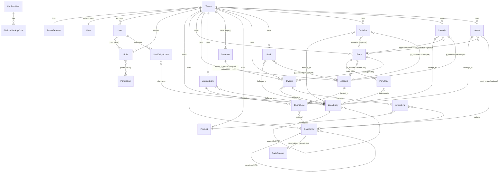

# مراجعة معمارية #1 — بعد سبرنتات 0-3، قبل سبرنت 4 (المحاسبة)

تاريخ المراجعة: 2026-09-22
النطاق: كل الكود في `/opt/cps` كما هو بعد الكوميت `Sprint 3: master data —
parties with roles, treasury entities, assets registry` (111 اختبار،
كلها ناجحة).

**سياسة التعديل في هذه المراجعة:** هذا المستند تحليل فقط. الكود لم
يتغيّر إلا في القسم 6 (التنفيذ الفوري) — ثلاثة تغييرات محدودة تمت
بالفعل وموثّقة هناك مع تفاصيلها الكاملة.

---

## 1) سلامة الـ Schema

### 1.1 مخطط ERD



ملاحظات على المخطط:
- `PartyOrAsset` عقدة رمزية في المخطط فقط — `CostCenter.linked_object`
  GenericFK فعليًا يشير حاليًا لـ `Party` (دور موظف) أو `Asset` (سيارة)،
  لا نموذج حقيقي بهذا الاسم.
- `AuditLog` غير موجود في المخطط عمدًا: لا يحمل أي FK حقيقي (كل الإشارات
  UUID خام بلا `related_name`) — قرار متعمد من سبرنت 2 لإبقائه معزولًا
  تمامًا عن أي علاقة قد تُفسِد ثباته لاحقًا (immutability).
- `Customer`/`Invoice.legacy_customer` باقيان في المخطط لأنهما لا يزالان
  في الـ schema فعليًا (سبرنت 3 قرار: لا حذف بيانات)، لكن لا كود حي
  يكتب فيهما بعد الآن.

### 1.2 التزام القاعدة 3 (`legal_entity` إلزامي + `cost_center` اختياري على مستوى السطر)

| نموذج السطر | `legal_entity` | `cost_center` | ملاحظة |
|---|---|---|---|
| `InvoiceLine` | **على المستند** (`Invoice.legal_entity`) لا السطر | ✅ على السطر، اختياري | استثناء موثّق (Decision Log 2026-09-19، سطر 280) — الفاتورة الواحدة تخص كيانًا قانونيًا واحدًا؛ القرار وُصف بأنه يحتاج قرارًا جديدًا موثّقًا لو ظهرت حاجة لتوزيع فاتورة واحدة على أكثر من كيان |
| `JournalLine` | **على المستند** (`JournalEntry.legal_entity`) لا السطر | ✅ على السطر، اختياري | نفس النمط، نفس الاستثناء |

**لا يوجد أي نموذج سطر معاملة يخالف القاعدة فعليًا** — كلاهما يتبع نفس
النمط الموثّق سلفًا (الكيان القانوني على رأس المستند، لأن قاعدة العمل
الفعلية هي "فاتورة واحدة = كيان قانوني واحد"). هذا استثناء **مُقَرّ ومُوثَّق**
منذ سبرنت 1، ليس سهوًا.

**الثغرة الحقيقية في القاعدة 3 هي جزء آخر منها لم يُطبَّق إطلاقًا:**
القاعدة تنص أيضًا على أن كل سطر معاملة يحمل **"العملة وسعر الصرف"**.
لا `InvoiceLine` ولا `JournalLine` يحملان أي حقل عملة أو سعر صرف على
الإطلاق — ولا حتى على مستوى المستند لـ `JournalEntry` (فقط `Invoice`
عبر `Party.default_currency`/`LegalEntity.base_currency` بشكل غير مباشر
وغير مُلزَم فعليًا في الحساب). كل حساب مالي حاليًا يفترض ضمنيًا عملة
واحدة (SAR) دون أي حقل يفرض أو يسجّل ذلك. **هذه أهم فجوة schema اكتشفتها
في هذه المراجعة** — القسم 3.11 في الوثيقة يطلب "كل مبلغ يُخزَّن بالعملة
الأصلية + سعر الصرف وقت المعاملة"، وهذا غير مبني بعد على أي نموذج سطر.
يجب أن يكون أول تغيير schema في سبرنت 4 (أو سبرنت مخصص للعملات قبله).

### 1.3 دقة حقول Decimal — غير موحّدة فعليًا

| الاستخدام | `max_digits` | `decimal_places` | أين |
|---|---|---|---|
| مبالغ إجمالية (subtotal/tax/total) | 14 | 2 | `Invoice`, `InvoiceLine.line_*` |
| سعر الوحدة | 12 | 2 | `Product.unit_price`, `InvoiceLine.unit_price` |
| نسبة ضريبة | 5 | 2 | `Product.tax_rate`, `InvoiceLine.tax_rate` |
| كمية | 12 | 2 | `InvoiceLine.quantity` |
| مدين/دائن | 14 | 2 | `JournalLine.debit/credit` |
| تكلفة/قيمة أصل | 14 | 2 | `Asset.purchase_cost`, `Asset.salvage_value` |
| سعر صرف | — | — | **غير موجود بعد** (انظر 1.2) |

**المشكلة الفعلية ليست عدم اتساق بين الملفات** (كل استخدامات "المبالغ"
فعليًا متسقة على 14,2، وكل استخدامات "الأسعار" على 12,2) — **المشكلة
أن هذه الأرقام مكتوبة حرفيًا (magic numbers) في 8 حقول عبر 4 ملفات
مختلفة (`sales/models.py`, `accounting/models.py`, `assets/models.py`)
بلا ثابت واحد مُعرَّف مرة**، فأي قرار مستقبلي بتغيير الدقة (مثال: رفع
دقة الكمية لـ 12,3 لدعم كسور الوحدات، أو تحضيرًا لسعر الصرف 18,8) يحتاج
تعديل كل حقل يدويًا بدل تغيير ثابت واحد. **نُفِّذ التوحيد في القسم 6.**

### 1.4 الفهارس (Indexes)

كل `TenantScopedModel` يحمل `tenant` كـ FK، وDjango يُنشئ فهرسًا تلقائيًا
على كل FK (بما فيها `tenant_id`) — إذن **كل استعلام `WHERE tenant=X`
مُفهرَس بالفعل تلقائيًا**، حتى بدون فهرس صريح. القيود الفريدة الموجودة
(`UniqueConstraint(tenant, code)` وأمثالها) تضيف فهارس مركّبة إضافية
تُستخدَم أيضًا لاستعلامات `tenant + code` تحديدًا.

**الناقص فعليًا: فهارس مركّبة للفلاتر الشائعة غير المغطاة بقيد فريد:**

| جدول | الفلتر الشائع | مُفهرَس؟ |
|---|---|---|
| `Invoice` | `(tenant, status)` — قوائم "المسودات"/"المعتمدة" | ❌ لا |
| `Invoice` | `(tenant, legal_entity, status)` — نفس الفلتر مع نطاق الكيانات | ❌ لا |
| `JournalEntry` | `(tenant, date)` — تقارير بفترة | ❌ لا |
| كل نموذج فيه `is_active` (Party/LegalEntity/CostCenter/Customer/Product/Asset/Bank/...) | `(tenant, is_active)` — `SoftDeleteViewSetMixin` يفلتر بهما معًا في كل `list` | ❌ لا |

غير عاجل عند حجم البيانات الحالي (بيئة تطوير)، لكن يستحق migration واحدة
بسيطة (`AddIndex`) لكل نموذج قبل الإنتاج أو عند أول شكوى أداء حقيقية —
مُدرَج في جدول الديون التقنية (القسم 4) بخطورة **منخفضة** حاليًا.

---

## 2) عزل المستأجر — فحص بنيوي شامل

الجدول التالي أُنتِج عبر استبطان (introspection) فعلي لكل الـ URLs
المسجّلة (`django.urls.get_resolver()`)، لا قراءة يدوية — نفس الآلية
المُستخدَمة في اختبار القسم 6.

| الـ View | المسار | يرث `TenantScopedViewSet`؟ | `permission_classes` صريحة؟ | `permission_map`؟ | ملاحظة |
|---|---|---|---|---|---|
| `sales.CustomerViewSet` | `/api/customers/` | ✅ | ✅ | ✅ | سليم |
| `sales.ProductViewSet` | `/api/products/` | ✅ | ✅ | ✅ | سليم |
| `sales.InvoiceViewSet` | `/api/invoices/` | ❌ | ✅ | ✅ | يفلتر يدويًا (`get_queryset`) بـ tenant + نطاق الكيانات — تحقّقت وسليم فعليًا، لكن لا يستفيد من الحارس البنيوي لو نُسي مستقبلًا |
| `accounting.AccountViewSet` | `/api/accounts/` | ❌ | ✅ | ✅ | نفس النمط — فلترة يدوية سليمة، لكن خارج المِكسِن |
| `accounting.JournalEntryViewSet` | `/api/journal-entries/` | ❌ | ✅ | ✅ | نفس النمط |
| `organization.LegalEntityViewSet` | `/api/legal-entities/` | ✅ | ✅ | ✅ | سليم، + فلترة إضافية بنطاق الكيانات |
| `organization.CostCenterViewSet` | `/api/cost-centers/` | ✅ | ✅ | ✅ | سليم |
| `access.RoleViewSet` | `/api/roles/` | ✅ | ✅ | ✅ | سليم |
| `access.PermissionViewSet` | `/api/permissions/` | ❌ | ✅ | ✅ | **استثناء صحيح** — `Permission` كتالوج عالمي بلا حقل tenant أصلًا |
| `access.UserViewSet` | `/api/users/` | ❌ | ✅ | ✅ | فلترة يدوية سليمة، خارج المِكسِن |
| `parties.PartyViewSet` | `/api/parties/` | ✅ | ✅ (بعد الإصلاح) | ✅ | **كانت الثغرة الفعلية المكتشفة في سبرنت 3**: `permission_classes` كانت غائبة تمامًا رغم وجود `permission_map` — يعني أي مستخدم مسجّل دخول (بغض النظر عن دوره) كان يقدر يُنشئ/يعدّل/يحذف أطرافًا. أُصلحت فورًا قبل كوميت سبرنت 3 (`permission_classes = [IsAuthenticated, HasModulePermission]` أُضيفت). عزل المستأجر نفسه لم يكن مخروقًا (الوراثة من `TenantScopedViewSet` كانت صحيحة) — الخرق كان في RBAC فقط، لا في تسرّب بيانات بين مستأجرين |
| `treasury.BankViewSet` | `/api/banks/` | ✅ | ✅ | ✅ | سليم |
| `treasury.CashBoxViewSet` | `/api/cash-boxes/` | ✅ | ✅ | ✅ | سليم |
| `treasury.CustodyViewSet` | `/api/custodies/` | ✅ | ✅ | ✅ | سليم |
| `assets.AssetViewSet` | `/api/assets/` | ✅ | ✅ | ✅ | سليم |
| `accounts.RegisterView`/`LoginView` | `/api/auth/register,login/` | لا ينطبق | ✅ (`AllowAny`) | — | صحيح ومقصود — قبل وجود مستخدم مُصادَق |
| `accounts.MeView` | `/api/auth/me/` | لا ينطبق | ✅ (`IsAuthenticated`) | — | يعرض بيانات `request.user` فقط، لا queryset عابر للمستأجرين |
| `TokenRefreshView` (simplejwt) | `/api/auth/refresh/` | لا ينطبق | `AllowAny` ضمنيًا (مكتبة خارجية) | — | لا يتحقق من `Tenant.status`؛ التوكن المُجدَّد يُرفَض لاحقًا على أول طلب فعلي عبر `TenantAwareJWTAuthentication` — ليس خرقًا، لكنه يسمح لمستأجر SUSPENDED/ARCHIVED بتجديد توكن لا فائدة منه. أثر عملي صفري تقريبًا |
| `platform.PlatformLoginView`/`PlatformMeView` | `/api/platform/auth/*` | لا ينطبق (منصة لا مستأجر) | ✅ | — | مسار مصادقة منفصل بالكامل، سليم |
| `platform.TenantAdminViewSet`/`PlanViewSet`/`AuditLogViewSet` | `/api/platform/*` | لا ينطبق (عابر للمستأجرين **عمدًا**، لوحة منصة) | ✅ (`IsAuthenticated` فقط، بلا `HasModulePermission`) | ❌ | **مقصود وموثّق**: أدوار المنصة غير متمايزة بعد (دَين تقني من سبرنت 2) — أي `PlatformUser` نشط يرى كل شيء. هذا **ليس** خرق عزل مستأجر (لا عزل مستأجر ينطبق على شاشات المنصة أصلًا)، لكنه فعليًا "بلا RBAC" داخل نطاق المنصة نفسها |

### 2.1 التصنيف النهائي

- **صفوف "لا" الحقيقية عند وقت كتابة هذه المراجعة: صفر.** الثغرة
  الوحيدة المكتشفة (`PartyViewSet`) كانت مُصلَحة بالفعل ضمن نفس كوميت
  سبرنت 3 قبل أن تصل لهذه المراجعة — لكنها **بالضبط** نوع الخطأ الذي لا
  يُكتشَف إلا يدويًا حاليًا، وهو ما يبرر القسم التالي.
- 4 ViewSets (`InvoiceViewSet`, `AccountViewSet`, `JournalEntryViewSet`,
  `UserViewSet`) تفلتر يدويًا بدل وراثة `TenantScopedViewSet` — سليمة
  الآن، لكنها **خارج الحارس البنيوي**: لو مبرمج مستقبلي حذف سطر الفلترة
  اليدوية بالخطأ أثناء إعادة هيكلة، لا شيء غير الاختبارات اليدوية
  الموجودة (لو وُجدت) سيمسك الخطأ فورًا.
- شاشات المنصة (`platform.*`) بلا RBAC داخلي — مقصود وموثّق، ليس عيبًا
  في هذه المراجعة، لكنه مُدرَج في جدول الديون التقنية.

### 2.2 الآلية البنيوية المقترحة (ونُفِّذت في القسم 6)

اختبار واحد يمشي على `get_resolver()` فعليًا (لا قائمة يدوية) عند كل
تشغيل لـ `pytest`، ويفشل تلقائيًا لو:
1. ظهر `ViewSet` جديد لا يرث `TenantScopedViewSet` ولا هو مُدرَج صراحة
   في قاموس استثناءات (كل استثناء يحمل **سببًا مكتوبًا** يُراجَع بشريًا
   عند إضافته — تمامًا مثل الأربعة أعلاه).
2. ظهر `View` يحمل `permission_map` لكن `HasModulePermission` غائبة عن
   `permission_classes` الخاصة به — **هذا يمسك خطأ `PartyViewSet` تحديدًا**
   لو تكرر مستقبلاً.

هذا يحوّل "المراجعة اليدوية كل 3 سبرنتات" (كما تطلب الوثيقة) من الاعتماد
الكامل على مراجعة بشرية إلى حارس آلي يعمل في كل push عبر CI، مع إبقاء
المراجعة البشرية لما لا يمكن أتمتته (صحة منطق الفلترة نفسه، لا مجرد
وجودها).

---

## 3) الجاهزية للمحاسبة (سبرنت 4-6)

### 3.1 `Account` كأساس لدليل شجري

**الوضع الحالي:** `Account` مسطّح بالكامل — `code`, `name`, `type`
(ASSET/LIABILITY/EQUITY/REVENUE/EXPENSE), `is_system`. **لا `parent`،
لا `level`، لا `is_leaf`، ولا طبيعة الرصيد الطبيعية (مدين/دائن) كحقل
صريح** (طبيعة الرصيد مُشتقة ضمنيًا من `type` في كود العرض فقط، لا كحقل
DB).

**الحكم: يحتاج إعادة بناء جزئي، لا بناء من الصفر.** الحقول الموجودة
(`code`, `name`, `type`, `is_system`) تبقى كما هي وتُستخدَم كما هي.
التغييرات المطلوبة فعليًا لسبرنت 4:

| التغيير | لماذا |
|---|---|
| `parent = FK("self", null=True, on_delete=PROTECT)` | نفس نمط `LegalEntity`/`CostCenter` self-FK الموجود بالفعل — لا حاجة لتصميم جديد، فقط تكرار نمط مُختبَر |
| `is_leaf` (أو محسوبة ديناميكيًا عبر `children.exists()`) | القيود يجب أن تُرحَّل فقط على حسابات أوراق (leaf)، لا حسابات تجميعية — قاعدة محاسبية أساسية غير مفروضة حاليًا بأي شكل |
| `normal_balance` (CharField: `debit`/`credit`) صريح | بدل اشتقاقه من `type` في كل مكان بالعرض (تكرار منطق)؛ يُبسِّط أيضًا حساب الأرصدة لاحقًا |
| قوالب دليل حسب النشاط (3.4: "خدمي/تجاري/صناعي/قابضة") | `seed_chart_of_accounts` حاليًا **قالب واحد ثابت** (6 حسابات) لكل مستأجر جديد بلا تمييز نوع النشاط — يحتاج بارامتر `template` واختيار وقت التسجيل |

### 3.2 `JournalEntry`/`JournalLine` — الجاهزية الفعلية

| المطلوب (من الطلب) | موجود؟ | التفصيل |
|---|---|---|
| عملة + سعر صرف على السطر | ❌ | **الفجوة الأهم** — انظر 1.2. لا حقل واحد لأي منهما على `JournalLine` ولا `JournalEntry` |
| مركز التكلفة على السطر | ✅ | `JournalLine.cost_center` موجود واختياري، مُستخدَم فعليًا للقيود اليدوية — **لكن** `post_invoice_journal_entry` لا يوزّعه من بنود الفاتورة (دَين تقني موثّق مسبقًا) |
| ربط بالمستند المصدر | ⚠️ جزئي | `source_type` (CharField حر) + `source_id` (UUID) — **ليس GenericFK حقيقي** (لا `ContentType` FK، فقط نص حر). يعمل فعليًا (`post_invoice_journal_entry`/`void_invoice_journal_entry` يستخدمانه بثبات: `"invoice"`/`"invoice_void"`) لكنه غير قابل لـ `JOIN` مباشر ولا يمنع أخطاء إملائية في `source_type` على مستوى DB |
| حالة (DRAFT/POSTED/REVERSED) | ❌ | **غير موجودة إطلاقًا.** كل قيد يُنشأ "مُرحَّل" فعليًا فور الإنشاء (`JournalEntry.objects.create` مباشرة، لا حالة وسيطة). هذا متّسق مع تصميم الفاتورة الحالي (القيد يُرحَّل فقط عند `issue()`، لا يوجد "قيد مسودة" منفصل)، لكنه يمنع أي دورة اعتماد مستقبلية للقيود اليدوية (سيحتاجها سبرنت السندات) |
| الفترة المالية (FK nullable) | ❌ | لا يوجد نموذج `FiscalPeriod` أصلًا بعد (مؤجَّل صراحة لسبرنت 6 في الخارطة) — لا حقل على `JournalEntry` بعد لأن لا شيء يشير إليه |

### 3.3 قائمة تغييرات مطلوبة في سبرنت 4 (تلخيص 3.1+3.2)

بترتيب الأولوية:
1. **عملة + سعر صرف على `InvoiceLine` و`JournalLine`** (وربما `Invoice`/`JournalEntry` على مستوى المستند كعملة افتراضية) — أعمق تغيير، يمس كل مسار ترحيل قيد موجود.
2. `Account.parent`/`is_leaf`/`normal_balance` + قوالب دليل حسب النشاط.
3. `JournalEntry.status` (DRAFT/POSTED/REVERSED) — تمهيدًا لسندات سبرنت 5 التي ستحتاج دورة اعتماد حقيقية، ليس فقط "أُنشئ = تم".
4. `JournalEntry.source_type`/`source_id` → GenericFK حقيقي (`ContentType` + `object_id`) بدل النص الحر — تحسين سلامة، ليس كسرًا وظيفيًا.
5. `JournalEntry.period` (FK nullable) — فقط بعد وجود `FiscalPeriod` (سبرنت 6)، لا حاجة له قبل ذلك.
6. توزيع `cost_center` من بنود الفاتورة على سطور القيد في `post_invoice_journal_entry` (دَين مؤجَّل مسبقًا لسبرنت 10 — يمكن تقديمه لسبرنت 4 لو الوقت سمح، بما أن البنية التحتية لمركز التكلفة على السطر جاهزة بالفعل).

### 3.4 عدّاد أرقام المستندات

**لا يزال COUNT-based بالكامل** في كل موضع توليد رقم تسلسلي:
- `apps.sales.services.generate_invoice_number` — `Invoice.objects.filter(tenant=tenant).count() + 1`
- `apps.parties.services.generate_party_code` — نفس النمط تمامًا

كلاهما موثّق كدَين تقني صراحة في الكود وREADME منذ سبرنت 0/3 على
التوالي. **قبل بناء السندات (سبرنت 5)، هذا يجب أن يُحَل** — ثلاثة أرقام
تسلسلية إضافية (سند قبض/صرف/تسوية) على نفس النمط الهش سيُضاعف احتمال
تصادم الأرقام تحت الكتابة المتزامنة.

**الاقتراح المطلوب: sequence ذرّي لكل `(tenant, doc_type, legal_entity, year)`.**
التصميم المقترح تحديدًا:

```python
class DocumentSequence(models.Model):
    tenant = models.ForeignKey("tenants.Tenant", on_delete=models.CASCADE)
    doc_type = models.CharField(max_length=20)   # "invoice", "receipt_voucher", ...
    legal_entity = models.ForeignKey("organization.LegalEntity", on_delete=models.CASCADE)
    year = models.PositiveIntegerField()
    last_number = models.PositiveIntegerField(default=0)

    class Meta:
        constraints = [
            models.UniqueConstraint(
                fields=["tenant", "doc_type", "legal_entity", "year"],
                name="unique_sequence_scope",
            )
        ]


def next_document_number(tenant, doc_type, legal_entity, year, prefix):
    with transaction.atomic():
        seq, _ = DocumentSequence.objects.select_for_update().get_or_create(
            tenant=tenant, doc_type=doc_type, legal_entity=legal_entity, year=year,
        )
        seq.last_number += 1
        seq.save(update_fields=["last_number"])
        return f"{prefix}-{year}-{seq.last_number:04d}"
```

`select_for_update()` داخل `transaction.atomic()` يقفل صف الـ sequence
تحديدًا (لا الجدول كله) أثناء الزيادة، فيحل تصادم الكتابة المتزامنة لكل
نوع مستند/كيان قانوني/سنة على حدة دون قفل عريض يُبطئ كل الكتابات. هذا
أبسط من DB sequence خام (لا يحتاج SQL خاص بـ Postgres، ويبقى محمولًا)،
وأبسط للتراجع (rollback) من `SELECT MAX() + 1` الخام.

---

## 4) الديون التقنية — جدول موحّد

مُجمَّعة من README "ديون تقنية" + Decision Log بالكامل.

| # | البند | السبرنت | الخطورة | يُحل متى | ملاحظة هذه المراجعة |
|---|---|---|---|---|---|
| 1 | ترقيم الفواتير COUNT-based، غير آمن تحت الكتابة المتزامنة | 0 | **عالية** | قبل سبرنت 5 (السندات) | انظر 3.4 — التصميم المقترح جاهز للتنفيذ |
| 2 | `generate_party_code` نفس مشكلة #1 | 3 | **عالية** | مع #1، نفس الحل | — |
| 3 | لا عملة/سعر صرف على سطر أي معاملة | 1 (ضمنيًا) | **عالية** | سبرنت 4 أو سبرنت عملات مخصص قبله | أهم فجوة schema، انظر 1.2/3.2 |
| 4 | `JournalEntry` بلا حالة (DRAFT/POSTED/REVERSED) | 1 (ضمنيًا) | متوسطة | سبرنت 5 (السندات تحتاجها فعليًا) | انظر 3.2 |
| 5 | `post_invoice_journal_entry` لا يوزّع `cost_center` من البنود | 1.5 | متوسطة | سبرنت 10 (مؤجَّل صراحة) أو سبرنت 4 لو بقي وقت | — |
| 6 | `source_type`/`source_id` نص حر لا GenericFK حقيقي | 1 (ضمنيًا) | منخفضة | سبرنت 4 (تحسين، ليس كسرًا) | — |
| 7 | لا فهارس مركّبة (`tenant, status`)، (`tenant, is_active`)، إلخ | — (هذه المراجعة) | منخفضة | عند أول شكوى أداء أو قبل الإنتاج | انظر 1.4 |
| 8 | `TenantEmailBackend` مسار الدخول بلا subdomain (superuser) غير مُختبَر بالكامل | 0 | متوسطة | قبل تغيير أي منطق مصادقة | انظر 5.3 — تغطية اختبار جزئية على أهم ملف أمني في المشروع |
| 9 | لا rate limiting على `/api/auth/login/`/`register/` | 0 | **عالية** (أمنيًا) | قبل الإنتاج | خارج نطاق التنفيذ الفوري (يحتاج قرار أداة: `django-ratelimit`؟ nginx `limit_req`؟) |
| 10 | ترجمة i18n تحتاج خطوة يدوية لكل نص جديد (`makemessages`+ترجمة+`compilemessages`) | 0-3 | منخفضة | متى تيسّر أتمتته | — |
| 11 | شجرة العرض والجدول في Organization/CostCenters لا يتزامنان فوريًا | 1.5 | منخفضة | تحسين تجربة مستخدم لاحقًا | — |
| 12 | Celery worker بلا مهام مُعرّفة بعد | 0 | منخفضة | عند الحاجة الفعلية (PDF/إشعارات/فوترة إلكترونية) | — |
| 13 | `frontend` container يرث كل متغيرات `.env` عبر `env_file` كاملة | 0 | منخفضة | قبل الإنتاج | — |
| 14 | Bootstrap شهادة SSL الأولى يدوي | 0 | منخفضة | عند نشر إنتاج فعلي | — |
| 15 | إعداد 2FA لمنصة عبر الترمينال فقط، بلا شاشة ويب/استرجاع | 2 | متوسطة | قبل نمو فريق المنصة | — |
| 16 | صلاحيات أدوار المنصة (SUPER_ADMIN/SUPPORT/BILLING) غير متمايزة | 2 | متوسطة | عند تحديد المتطلبات الدقيقة | يشمل أيضًا: لا `permission_map`/`HasModulePermission` على شاشات المنصة أصلًا (انظر 2.1) |
| 17 | `Plan.storage_mb` غير مُطبَّق (لا قياس، لا فرض) | 2 | منخفضة | عند بناء أي رفع/تخزين ملفات | — |
| 18 | لا واجهة لإدارة الباقات نفسها (قراءة فقط عمدًا) | 2 | منخفضة | خارج نطاق "الشاشات الأساسية" أصلًا | — |
| 19 | لا إهلاك للأصول الثابتة | 3 | منخفضة (مؤجَّل صراحة بالمواصفة) | بعد الدليل الشجري (4) والفترات المالية (6) | — |
| 20 | `gl_account` على Party/Bank/CashBox/Custody غير مُستخدَمة | 3 | منخفضة (مؤجَّل صراحة بالمواصفة) | سبرنت 4 | يُحل تلقائيًا ضمن بند #2 في خطة سبرنت 4 (3.3) |
| 21 | `sales.Customer`/`/api/customers/` باقيان بلا استخدام فعلي (طريق مسدود مقصود) | 3 | منخفضة | لا حاجة — تاريخي فقط | — |
| 22 | `InvoiceViewSet`/`AccountViewSet`/`JournalEntryViewSet`/`UserViewSet` تفلتر تينانت يدويًا خارج `TenantScopedViewSet` | — (هذه المراجعة) | متوسطة | مُخفَّف الآن عبر اختبار القسم 6، لا يحتاج تغيير بنية الكود نفسه فورًا | انظر 2.1/2.2 |
| 23 | 4 حقول Decimal مكرّرة بلا ثوابت موحّدة | — (هذه المراجعة) | منخفضة | **حُلّت في القسم 6** | انظر 1.3 |

**البنود عالية الخطورة (3):** #1/#2 (ترقيم غير آمن)، #3 (لا عملة/سعر
صرف على السطر)، #9 (لا rate limiting). **لا واحد منها قابل للحل في أقل
من ساعة** (كلها تغييرات schema أو تكامل بنية تحتية)، لذا لم يُنفَّذ أي
منها في القسم 6 — البند المنفَّذ هناك (#23) هو الوحيد الذي كان فعليًا
تحت الساعة.

---

## 5) الأداء والجودة

### 5.1 أبطأ 5 استعلامات محتملة

1. **`platform.TenantAdminSerializer` — 3N+1 على شاشة قائمة المستأجرين
   (`/api/platform/tenants/`).** `get_user_count`/`get_invoice_count`/
   `get_last_activity` كل واحدة تستعلم القاعدة **منفصلة لكل صف مستأجر**
   (`tenant.users.filter(...).count()`, `tenant.invoices.count()`,
   استعلام ترتيب لآخر دخول) — و`TenantAdminViewSet.get_queryset()`
   لا يحمل أي `prefetch_related`/`annotate` على الإطلاق. لصفحة بها 25
   مستأجرًا (حجم الصفحة الافتراضي) هذا يعني حتى **75 استعلامًا إضافيًا**
   لتحميل شاشة واحدة. **الأسوأ في المشروع.** الحل: `annotate()` بـ
   `Count`/`Max` بدل `SerializerMethodField`.
2. **`access.UserListSerializer` — N+1 على `/api/users/`.**
   `role_names`/`legal_entity_ids` كل واحدة تستعلم منفصلة لكل مستخدم؛
   `UserViewSet.get_queryset()` بلا `prefetch_related("roles",
   "entity_access")`.
3. **`access.RoleSerializer.permission_codes` — N+1 على `/api/roles/`.**
   `SlugRelatedField(many=True)` على `permissions` (M2M) بلا
   `prefetch_related("permissions")` في `RoleViewSet`.
4. **إعادة حساب `get_accessible_entity_ids()` من الصفر في كل طلب** —
   تُستدعى من `InvoiceViewSet`، `JournalEntryViewSet`،
   `LegalEntityViewSet` (list/retrieve/create/tree، أي طلب تقريبًا)،
   وفي كل مرة تجلب **كل** الكيانات القانونية للمستأجر من القاعدة
   وتبني شجرة BFS في الذاكرة من الصفر — حتى لطلب `retrieve` على سجل
   واحد. رخيص عند العدد الحالي للكيانات (عشرات)، لكنه نمط "يعيد نفس
   الحساب كل مرة" بلا أي تخزين مؤقت (caching) حتى على مستوى الطلب
   الواحد إن استُدعيت أكثر من مرة.
5. **أشجار `LegalEntityTreeSerializer`/`CostCenterTreeSerializer`** —
   N+1 متأصّل في تصميم القائمة المجاورة (adjacency list): كل مستوى في
   الشجرة يستدعي `obj.children.all()` منفصلة. متوقَّع وصعب الحل بدون
   Recursive CTE أو جلب الشجرة كاملة ثم بناؤها في بايثون؛ غير عاجل عند
   العمق الحالي (عادة ≤ 4 مستويات).

*(بالمقابل: `InvoiceViewSet`، `PartyViewSet`، `JournalEntryViewSet` في
`get_queryset` نفسها تستخدم `select_related`/`prefetch_related` بشكل
صحيح ومتعمَّد — أمثلة جيدة موجودة بالفعل في نفس الكودبيز.)*

### 5.2 تغطية الاختبارات (`pytest --cov`)

**النسبة الكلية: 88%** (2493 سطر قابل للتنفيذ، 302 غير مُغطّى، باستثناء
ملفات الـ migrations من الحساب الفعلي حيث تغطيتها الجزئية متوقَّعة
ومقبولة — أفرع `reverse()` نادرًا ما تُختبَر).

**أقل 5 ملفات غير-migration تغطيةً:**

| الملف | التغطية | السبب |
|---|---|---|
| `apps/platform/management/commands/create_platform_user.py` | 0% | يتطلب طرفية تفاعلية حقيقية (`getpass`/`input()`) — صعب اختباره بدون mocking كبير؛ مقبول لأمر إداري واحد نادر التنفيذ |
| `apps/platform/managers.py` | 36% | `PlatformUserManager.create_superuser` غير مُستخدَم في أي مسار كود فعلي (الاختبارات تستخدم `PlatformUserFactory` مباشرة) |
| `apps/accounts/backends.py` | 64% | **الأهم في هذه القائمة** — `TenantEmailBackend` هو نفس الملف الذي سبّب الثغرة الأمنية الحرجة الأصلية (ModelBackend). المسار غير المُختبَر تحديدًا: **مسار الدخول بلا subdomain (تفويض superuser)** (الأسطر 35-38) — وهو بالضبط المسار الأكثر حساسية في الملف، ومطابق تصميميًا لفئة الثغرة الأصلية (بحث عالمي بالبريد). لا اختبار حاليًا يتحقق أن هذا المسار مقصور فعليًا على `is_superuser=True` ويرفض أي حساب آخر |
| `apps/accounts/managers.py` | 55% | `UserManager.create_superuser` غير مُستخدَم في مسار فعلي (التسجيل العادي يستخدم `create_user`) |
| `apps/tenants/services.py` | 72% | **`check_branch_limit`/`check_invoice_limit` غير مُختبَرين إطلاقًا** — فقط `check_user_limit` له اختبار (`test_platform_admin.py`)، رغم أن الثلاثة مطلوبة بنفس القوة من مواصفة سبرنت 2 ("حدود مستخدمين/فروع/فواتير") ومُستخدَمة فعليًا في `LegalEntityViewSet.create()`/`InvoiceViewSet.create()` |

كذلك: فلاتر `AuditLogViewSet.get_queryset()` (السبعة: `tenant_id`،
`actor_id`، `actor_type`، `action`، `date_from`، `date_to`) غير
مُختبَرة عبر الـ API إطلاقًا — الاختبارات الحالية تتحقق من وجود سجلات
`AuditLog` مباشرة عبر ORM، لا عبر استدعاء `/api/platform/audit-log/?...`
فعليًا.

### 5.3 حجم حزمة JS للفرونت

البناء الحالي (`next build`، Turbopack) ينتج **≈800 كيلوبايت** إجمالي
لمجلد `.next/static` — صغير جدًا لهذا الحجم من الشاشات (20 مسارًا).
أكبر 3 chunks (224K/160K/112K) هي React/Next الأساسية المشتركة بين كل
الصفحات، لا كود خاص بشاشة معيّنة. **لا مكوّن يستحق تقسيمًا (code
splitting) عند هذا الحجم.** ملاحظة بسيطة فقط: `lib/i18n.tsx` (379 سطرًا)
يحمّل قاموسي الترجمة (ar+en) كليهما دائمًا حتى لو اللغة النشطة واحدة
فقط — تكلفته بضع كيلوبايتات، غير مبرِّر لتحسينه الآن.

---

## 6) تنفيذ فوري (التغييرات الوحيدة المسموح بها في هذه المراجعة)

### 6.1 اختبار العزل البنيوي (من البند 2)

ملف جديد: `backend/tests/test_structural_isolation.py`. يستبطن كل
الـ URLs المسجّلة فعليًا (`django.urls.get_resolver()`) ويفشل لو:
- ظهر `ViewSet` تينانت-بيانات جديد لا يرث `TenantScopedViewSet` ولا هو
  مُدرَج في `TENANT_FILTER_EXEMPTIONS` (قاموس، كل مفتاح يحمل سببًا
  مكتوبًا) أو `NOT_TENANT_DATA` (مجموعة الشاشات العابرة للمستأجرين
  عمدًا: منصة + مصادقة).
- ظهر أي `View` يحمل `permission_map` لكن `HasModulePermission` غائبة
  عن `permission_classes` — **يمسك خطأ `PartyViewSet` بالضبط لو تكرر**.

### 6.2 توحيد ثوابت Decimal (من البند 1)

ملف جديد: `backend/apps/common/constants.py` — أربعة أزواج ثوابت
(`MONEY_MAX_DIGITS`/`MONEY_DECIMAL_PLACES`، `PRICE_MAX_DIGITS`/
`PRICE_DECIMAL_PLACES`، `QUANTITY_*`، `PERCENTAGE_*`) تحل محل الأرقام
الحرفية المكرّرة في `sales/models.py`، `accounting/models.py`،
`assets/models.py`. **القيم نفسها لم تتغيّر** (لا migration مطلوبة —
`max_digits=14, decimal_places=2` يبقى `14, 2` بالضبط، فقط عبر اسم
بدل رقم حرفي)، لذا **صفر تأثير على الـ schema أو البيانات الموجودة**.

### 6.3 بند الخطورة العالية القابل للحل في أقل من ساعة

**لا يوجد.** كل الثلاثة بنود عالية الخطورة في جدول القسم 4 (#1/#2 ترقيم
المستندات، #3 عملة/سعر الصرف، #9 rate limiting) تغييرات schema أو بنية
تحتية حقيقية تتجاوز ساعة عمل بكثير ولا يصح استعجالها هنا. **لم يُنفَّذ
أي تغيير إضافي بهذا الشرط** — القرار موثّق صراحة بدل تجاهله.

### 6.4 الكوميت

`Arch review 1: structural isolation test, decimal constants`

---

## 7) الملخص

### أهم 3 مخاطر

1. **لا عملة/سعر صرف على أي سطر معاملة** (`InvoiceLine`/`JournalLine`) —
   فجوة schema حقيقية بين ما تطلبه الوثيقة (3.11) وما هو مبني فعليًا.
   يجب حلها **قبل** أو **ضمن** أول خطوة في سبرنت 4، لأن كل نموذج قيد
   يُبنى بعدها سيرث نفس الفجوة إن لم تُحَل أولًا.
2. **ترقيم المستندات لا يزال COUNT-based** في موضعين (فواتير، أطراف)
   وسيتضاعف لثلاثة مواضع إضافية مع السندات (سبرنت 5) إن لم يُحَل قبلها
   عبر sequence ذرّي حقيقي (التصميم جاهز في القسم 3.4).
3. **أربعة ViewSets تفلتر عزل المستأجر يدويًا خارج `TenantScopedViewSet`**
   (`Invoice`/`Account`/`JournalEntry`/`User`) — سليمة اليوم لكن خارج
   الحارس البنيوي حتى الآن؛ اختبار القسم 6 يغلق هذه الفجوة آليًا من
   الآن فصاعدًا، لكن يستحق أن يُذكر كخطر لأن **هذا بالضبط** نوع الخطأ
   الذي أنتج ثغرة `PartyViewSet` الفعلية في سبرنت 3.

### أهم 3 تغييرات لازم تدخل في prompt سبرنت 4

1. **اطلب صراحة حقل عملة + سعر صرف على `JournalLine` (وربما
   `InvoiceLine`)** كجزء لا يتجزأ من بناء الدليل الشجري — لا تتركها
   ضمنية أو "لاحقًا"، لأن القسم 3.2/3.3 هنا يوضح أنها الفجوة الأهم في
   كل الـ schema الحالي.
2. **اطلب صراحة حل ترقيم المستندات (sequence ذرّي) كخطوة تأسيسية ضمن
   سبرنت 4 نفسه**، لا كديون مؤجَّلة أخرى — بما أن سبرنت 5 (السندات)
   سيبني فوق نفس الآلية مباشرة، وتأخير الحل يعني ترقيعًا لاحقًا لعدة
   مواضع دفعة واحدة بدل موضع واحد الآن.
3. **اطلب إضافة `JournalEntry.status` (DRAFT/POSTED/REVERSED)** كجزء من
   إعادة بناء `Account`/`JournalEntry` في سبرنت 4، حتى لو لم يُستخدَم
   فعليًا إلا في سبرنت 5 — إضافته لاحقًا بعد وجود قيود حقيقية بالآلاف
   يحتاج migration بقيمة افتراضية وتحقّقًا يدويًا من كل قيد قديم؛
   إضافتها الآن (والقيود لا تزال قليلة) بلا تكلفة تقريبًا.
