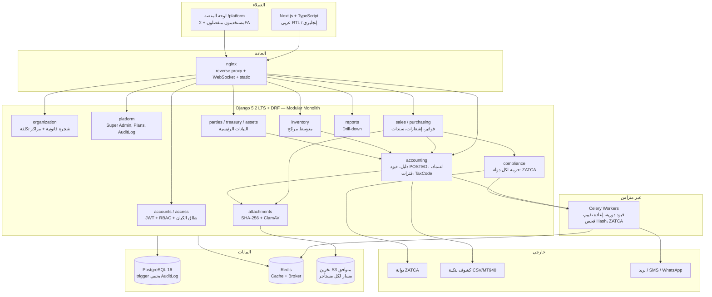
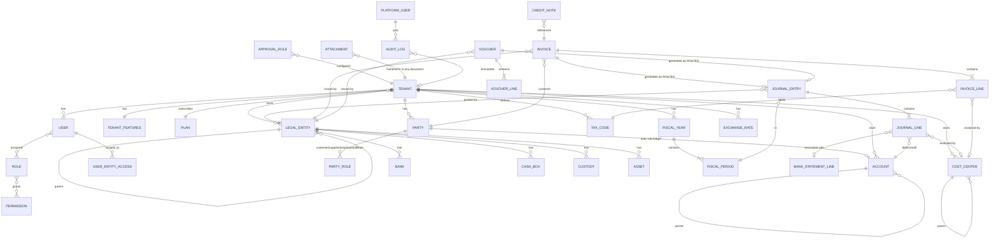

# دراسة تقنية معمارية لبناء منتج CPS
### نظام SaaS مالي وإداري متكامل (ERP) — الإصدار 2.0

| البند | التفاصيل |
|---|---|
| نوع الدراسة | دراسة تقنية (Architecture + خطة تنفيذ) |
| السوق المستهدف | سعودي/خليجي أولًا، ببنية عالمية (عملات، لغات، أنظمة ضريبية قابلة للتوصيل) |
| نطاق النسخة الأولى | النواة المحاسبية والمخزنية الكاملة بضوابط رقابية (15 سبرنت) — HR وPOS والتصنيع مؤجلة |
| الإصدار | **2.0** (18 سبتمبر 2026 v1.0 → 22 سبتمبر 2026 v2.0) |
| الحالة | **معتمدة** — متوائمة مع `SYSTEM_ANALYSIS.md` v1.4 |
| الوثيقة الملزمة للتنفيذ | `docs/SYSTEM_ANALYSIS.md` (قرارات التصميم والقواعد الثابتة وخارطة السبرنتات) — هذه الدراسة هي الخلفية المعمارية والبنية التحتية، وعند أي تعارض تحكم `SYSTEM_ANALYSIS.md` |

> **ما تغيّر في v2.0:** المكدس التقني (Django بدل NestJS/Prisma بعد تجربة فعلية)، نموذج البيانات الفعلي المبني، معمارية الضوابط المالية (اعتماد، تسوية بنكية، أكواد ضريبة، مرفقات كدليل)، خارطة 15 سبرنتًا بحالتها الحقيقية، بيئة التطوير الفعلية (Oracle Linux، `/opt/cps`، منفذ 3000)، والمخاطر التي ثبت وقوعها فعليًا.

---

## 1. الملخص التنفيذي

CPS منصة SaaS متعددة المستأجرين لإدارة الأعمال، مستوحاة من نجاح **دفترة** في السوق العربي، لكنها تختلف في ثلاث نقاط جوهرية:

1. **العمق المحاسبي والرقابي أولًا:** النسخة الأولى نظام محاسبي يقبله مدير مالي ومدقق خارجي (دورة اعتماد، فصل واجبات، تسوية بنكية، أكواد ضريبة، مرفقات كدليل إثبات، تتبّع كل رقم لمصدره) — لا برنامج فواتير بشاشات كثيرة.
2. **المجموعات والشركات القابضة:** شجرة قانونية بعمق غير محدود (قابضة ← شقيقة ← فرع) + شجرة مراكز تكلفة مستقلة، مع تقارير فردية ومجمّعة باستبعاد المعاملات البينية.
3. **العميل الصغير هو التصميم الافتراضي:** ERP كامل يظهر كبرنامج فواتير بسيط (وضع مبسّط + وحدات مفعّلة بالباقة)، والقدرات الكبيرة "تُفتح" فوقه دون ترحيل بيانات.

القرارات المعمارية الحاكمة (تعدد المستأجرين، محرك الضرائب القابل للتوصيل، العملات، i18n/RTL، حالة المستند الموحّدة) بُنيت كطبقات **قابلة للتوصيل منذ اليوم الأول**.

**الحالة عند إصدار v2.0:** 5 سبرنتات مكتملة (0، 1، 1.5، 2، 3)، 111 اختبارًا آليًا ناجحًا على Postgres حقيقي، النظام يعمل على سيرفر التطوير، والمحاسبة الفعلية تبدأ من سبرنت 4 بعد مراجعة معمارية.

---

## 2. تحليل المنتج المرجعي: دفترة (Daftra)

### 2.1 نظرة عامة
دفترة منصة SaaS سحابية لإدارة الأعمال موجهة للشركات الصغيرة والمتوسطة، "عربية أولًا" مع تخصيص قوي للمستندات وقواعد الضرائب في الخليج ومصر والأردن.

### 2.2 خريطة الوحدات في دفترة

| الفئة | الوحدات الفرعية |
|---|---|
| المبيعات | الفوترة، نقاط البيع، العروض، التقسيط، عمولات المبيعات، الفوترة الإلكترونية (السعودية، مصر، الأردن) |
| العملاء (CRM) | إدارة العملاء، المتابعة، نقاط الولاء، الأرصدة الائتمانية، العضويات |
| المخزون | المنتجات، المشتريات، دورة الشراء، الموردون، طلبات الشراء، الجرد، التصنيع |
| المحاسبة | المصروفات، الحسابات العامة، دليل الحسابات، الأصول، مراكز التكلفة، دورة الشيكات، VAT الإمارات |
| الموارد البشرية | الهيكل التنظيمي، شؤون الموظفين، الحضور، العقود، الرواتب، الطلبات |
| العمليات | أوامر العمل، الحجوزات، التأجير، تتبع الوقت، دورة العمل، عقود الإيجار، التصنيع |
| الجوال | تطبيق الأعمال، POS، ماسح المصروفات، بوابة الموظف، قارئ الفاتورة الإلكترونية، الجرد |

### 2.3 منصة الامتثال الضريبي المحلي
دفترة تُدمج أنظمة الفوترة الإلكترونية الحكومية كوحدات منفصلة لكل دولة. الدرس: **الامتثال الضريبي ليس ميزة عامة بل مجموعة تكاملات محلية** — يُعمَّم كنمط معماري (حزمة امتثال لكل دولة) لا كحالات خاصة.

### 2.4 منصة المطورين ومتجر التطبيقات
REST API عام + بوابة مطورين (Entity Builder، Webhooks، متجر تطبيقات). دفترة لا تغطي كل قطاع بنفسها بل تفتح المنصة كـ PaaS داخلي. يُحتفظ به في رؤية CPS كمرحلة لاحقة بعد استقرار النواة.

### 2.5 نموذج التخصيص حسب القطاع
نواة واحدة + "تجربة مخصصة" حسب القطاع عند التسجيل. CPS يطبّق المبدأ نفسه عبر **قوالب دليل الحسابات حسب النشاط** والوحدات المفعّلة.

### 2.6 الدروس المستفادة لصالح CPS
1. النواة عامة والتخصيص القطاعي طبقة قوالب فوقها.
2. الامتثال الضريبي محرك قابل للتوصيل لكل دولة منذ التصميم.
3. API + منصة تطبيقات لاحقًا لتغطية ما لا يبنيه الفريق.
4. تطبيقات جوال متخصصة لاحقًا (POS، ماسح مصروفات) بدل تطبيق واحد.
5. **ما لا تفعله دفترة ويميّز CPS:** ضوابط رقابية على مستوى المدقق، وتقارير مجمّعة للقابضة.

---

## 3. رؤية ونطاق CPS

### 3.1 رؤية المنتج
منصة واحدة تدير المحاسبة والخزينة والمبيعات والمشتريات والمخزون والأصول لأي شركة — من مكتب خدمي بموظف واحد إلى مجموعة قابضة بعشر شركات — بواجهة تتكلم لغة المحاسب، وضوابط يقبلها المدقق، وامتثال ضريبي قابل للتوصيل حسب الدولة.

### 3.2 تحديات السوق العالمي والأثر المعماري

| التحدي | الأثر المعماري (مطبَّق) |
|---|---|
| تعدد اللغات + RTL | i18n على مستوى Django gettext والفرونت؛ عربي افتراضي، إنجليزي؛ RTL في كل مكوّن |
| تعدد العملات | كل مبلغ: عملة + سعر صرف وقت المعاملة؛ جدول `ExchangeRate` مركزي؛ فرق عملة محقق عند السداد + إعادة تقييم نهاية الفترة |
| تعدد الأنظمة الضريبية | `TaxCode` بنوعه (قياسي/صفري/معفى/خارج النطاق/عكسي) وقابلية خصمه؛ حزمة امتثال لكل دولة (ZATCA أولًا) |
| بوابات الدفع المحلية | طبقة تجريد `PaymentProvider` (لاحقًا، بعد سبرنت 9) |
| حماية البيانات وإقامتها | مسار تخزين مفصول لكل مستأجر؛ سيرفر إنتاج منفصل؛ Data Residency خيار لاحق |
| المناطق الزمنية | كل الطوابع UTC، تُعرض بمنطقة المستخدم |

### 3.3 عوامل التمايز عن دفترة
- **ضوابط مالية على مستوى المدقق:** دورة اعتماد وفصل واجبات، تسوية بنكية، مرفقات كدليل بـ SHA-256، سجل تدقيق محمي على مستوى قاعدة البيانات، تتبّع كل رقم في كل تقرير حتى المستند.
- **الشركات القابضة:** شجرة قانونية بعمق غير محدود + استبعاد بيني + تقارير مجمّعة.
- **مراكز تكلفة كمراكز ربحية** على مستوى السطر (سيارة، مستودع، موظف، مشروع) بقائمة دخل لكل مركز.
- امتثال ضريبي قابل للتوصيل، وAPI-first منذ البداية.

---

## 4. المستخدمون المستهدفون

| الشخصية | الاحتياج | كيف يخدمه CPS |
|---|---|---|
| صاحب عمل صغير (خدمي) | فواتير وسندات قبض وتقارير بسيطة | الوضع المبسّط: لا هيكل، لا مخزون، لا مصطلحات تقنية |
| محاسب | دليل حسابات، قيود، سندات، كشف حساب | شاشات بأسماء محاسبية مألوفة، تعديل/إلغاء بقيد عكسي |
| مدير مالي / مراقب مالي | اعتماد، تسوية بنكية، ميزانية تقديرية، فترات | صندوق الاعتماد، قواعد الاعتماد، التسوية، الانحراف عن الميزانية، قفل الفترات |
| مدقق خارجي | إثبات أي رقم لمصدره | Drill-down، مرفقات بـ Hash، AuditLog غير قابل للتعديل، مصفوفة الرقابة الداخلية |
| مدير مجموعة قابضة | رؤية موحدة ومجمّعة | الشجرة القانونية، الجاري البيني، التقارير المجمّعة |
| فريق تشغيل المنصة | إدارة العملاء والباقات والدعم | Super Admin منفصل + 2FA، الباقات، سجل التدقيق، الانتحال (لاحقًا) |

---

## 5. نطاق النسخة الأولى (محدَّث)

النطاق الأول **مركّز على النواة المالية** بترتيب يجعل النظام قابلًا للاستخدام مبكرًا:

| الوحدة | المحتوى في النسخة الأولى | السبرنت |
|---|---|---|
| الأساس والأمان | تعدد مستأجرين، RBAC، اختبارات عزل بنيوية، حاويات non-root، CI | 0 ✅ |
| الهيكل التنظيمي | شجرة قانونية + شجرة مراكز تكلفة + وضع مبسّط | 1 ✅ |
| إدارة المنصة | Super Admin + 2FA، باقات ووحدات مفعّلة، AuditLog محمي بـ trigger | 2 ✅ |
| البيانات الرئيسية | عملاء، موردون، موظفون، شقيقة (Party موحّد في القاعدة)، بنوك، صناديق، عُهد، أصول | 3 ✅ / 3.5 |
| المحاسبة العامة | دليل شجري بقوالب، محرك قيود بحالة POSTED، محرك اعتماد، TaxCode، عدّاد مستندات ذري | 4 |
| الخزينة | سندات قبض/صرف/تسوية، أسعار صرف، فرق عملة محقق، مرفقات كدليل | 5 |
| التسوية البنكية | استيراد كشف، مطابقة تلقائية ويدوية، تقرير تسوية | 5.5 |
| الفترات والافتتاح | سنة مالية مرنة، فترات بحالات، افتتاح باعتماد مرحلتين، قيود دورية | 6 |
| المخزون | أصناف مخزني/خدمي، مستودعات، متوسط مرجّح متحرك | 7 |
| المشتريات | دورة ثلاثية + فاتورة مباشرة على محرك واحد | 8 |
| المبيعات والامتثال | فواتير مختلطة، إشعارات دائن/مدين، ZATCA مرحلة 1 | 9 |
| التقارير | ميزان، ميزانية، دخل، كشف حساب، أعمار ذمم، مركز تكلفة، ضريبة على TaxPeriod، عملات، Budget وانحراف — كلها Drill-down | 10 |
| ZATCA 2 | ربط فعلي وتوقيع وClearance | 11 |
| المجموعات | تقارير مجمّعة باستبعاد بيني، إهلاك الأصول | 12 |

**مؤجل صراحة** (البنية تسمح به كوحدات لاحقة): الموارد البشرية الكاملة، نقاط البيع Offline، التصنيع، دورة العمل، منصة المطورين، تطبيقات الجوال المتخصصة، الاشتراكات المدفوعة والانتحال والمراقبة المتقدمة.

---

## 6. الهيكلة التقنية (Architecture)

### 6.1 مبدأ الهيكلة
**Modular Monolith** على Django: كل مجال (organization, access, platform, parties, treasury, assets, accounting, sales, purchasing, inventory, reports) تطبيق Django مستقل بحدود واضحة. الفصل لخدمات مستقلة لاحقًا فقط عند مبرر حقيقي (أول المرشحين: الفوترة الإلكترونية، التقارير الثقيلة، الإشعارات).

### 6.2 تعدد المستأجرين
- **قاعدة بيانات مشتركة + `tenant` FK على كل جدول أعمال** مع فهرس مركّب `(tenant, ...)`.
- **العزل صريح في الكود**: `TenantScopedViewSetMixin` يفلتر كل queryset بـ `request.user.tenant`؛ لا مسار يقبل `tenant_id` من العميل؛ الوصول لسجل مستأجر آخر يُرجع 404.
- **طبقة ثانية:** اختبار بنيوي يمشي على كل URL مسجّل ويفشل لو أي view بلا mixin أو بلا permissions (مراجعة #1)؛ Postgres RLS كطبقة ثالثة قبل الإنتاج.
- **الترقية لقاعدة مخصصة** لمستأجر كبير ممكنة عبر طبقة الاتصال دون تغيير الكود.

### 6.3 مخطط المعمارية (كما تُبنى فعليًا)

### 6.4 نموذج البيانات المفاهيمي (كما بُني ويُبنى)

**قواعد النموذج الثابتة:** كل سطر معاملة يحمل `legal_entity` (إلزامي) + `cost_center` (اختياري) + العملة وسعر الصرف؛ كل بند ضريبي يحمل `tax_code` FK؛ كل مستند مالي له حالة موحّدة `DRAFT → PENDING_APPROVAL → APPROVED → POSTED → REVERSED`؛ القيد يُرحَّل عند POSTED فقط؛ الحذف ناعم دائمًا.

### 6.5 المكدس التقني المعتمد

| الطبقة | القرار | المبرر |
|---|---|---|
| Backend | **Django 5.2 LTS + Django REST Framework + SimpleJWT** | ORM ناضج بلا تبعيات ثنائية، Admin جاهز، i18n مدمج؛ Django 6.x رُفض بعد مشكلة توافق فعلية مع DRF |
| Frontend | **Next.js + TypeScript** (App Router) | SSR، i18n/RTL، مكوّن `DataTable` و`AttachmentPanel` موحّدان |
| قاعدة البيانات | **PostgreSQL 16** | Decimal دقيق، RLS، triggers لحماية AuditLog، JSONB لحقول الأدوار |
| Cache/Broker | **Redis 7** | جلسات، Cache، وسيط Celery |
| مهام خلفية | **Celery** | قيود دورية، إعادة تقييم، فحص Hash، إرسال ZATCA، إشعارات |
| ملفات | **S3-متوافق** (MinIO محليًا) + **ClamAV** | مرفقات كدليل إثبات، روابط موقّعة مؤقتة |
| الحافة | **nginx** | reverse proxy، WebSocket (HMR في التطوير)، static |
| الحاويات | **Docker Compose** (dev/prod overrides) | Kubernetes لاحقًا عند التوسع |
| الاختبارات | **pytest + factory-boy** على Postgres حقيقي، **ruff** | 111 اختبارًا عند v2.0 |

**قرار موثّق:** المحاولة الأولى بـ NestJS + Prisma أُوقفت بعد تعذّر تحميل محرك Prisma الثنائي في بيئة مقيّدة الشبكة؛ Django أثبت استقرارًا فوريًا. (Decision Log 2026-09-18)

### 6.6 طبقة الـ API
- REST عبر DRF Routers لكل وحدة، مع `/api/auth/me/` يُرجع الصلاحيات والوحدات المفعّلة والوضع المبسّط — الفرونت يبني القوائم منه.
- مسار منفصل `/api/platform/` بمفتاح JWT مختلف؛ توكن منصة مرفوض في مسارات العملاء والعكس.
- Webhooks ومنصة المطورين: مؤجلة لما بعد سبرنت 12.

### 6.7 الأمان والصلاحيات والتدقيق (مطبَّق)
- **RBAC** بأدوار وصلاحيات نصية `module.action` + نطاق الكيان القانوني (`UserEntityAccess` يشمل الأبناء).
- **Super Admin** بجدول مستخدمين منفصل + TOTP 2FA إلزامي + رموز احتياطية.
- **AuditLog** غير قابل للتعديل: DRF قراءة فقط + **trigger PL/pgSQL** يمنع UPDATE/DELETE حتى لمالك الجدول.
- **حاويات non-root** (entrypoint يعمل chown ثم gosu).
- **حماية آخر Owner**، تسجيل دخول بـ subdomain + email (البريد فريد داخل المستأجر فقط).
- **ثغرة اكتُشفت وأُصلحت:** `ModelBackend` كان يسمح بتجاوز عزل المستأجر عند الدخول → أُزيل، مع regression test دائم.
- **المخطط للإنتاج:** Postgres RLS، Sentry، Rate limiting، HTTPS، Bastion/VPN للإدارة.

### 6.8 التدويل والامتثال
- Django gettext (≈170 نصًا مترجمًا عند v2.0) + قاموس فرونت؛ عربي افتراضي.
- كل مبلغ بعملته وسعر صرفه؛ `ExchangeRate` مركزي.
- **حزمة امتثال لكل دولة** (`compliance/<country>/`): أكواد ضريبة افتراضية، صيغة XML/QR، جهة الإرسال، قواعد الأرشفة. السعودية أولًا (ZATCA مرحلة 1 ثم 2).

### 6.9 التكاملات الخارجية

| النوع | الحالة |
|---|---|
| ZATCA | سبرنت 9 (مرحلة 1) و11 (مرحلة 2) — يحتاج شهادة وSandbox من الهيئة (إجراء إداري بدأ؟ انظر SYSTEM_ANALYSIS §9) |
| كشوف بنكية | استيراد CSV/Excel/MT940/CAMT.053 — سبرنت 5.5 |
| بوابات دفع (لاشتراكات CPS) | بوابة محلية (Moyasar/Tap/HyperPay) عبر طبقة تجريد — بعد سبرنت 9 |
| بريد/SMS/WhatsApp | إشعارات الاعتماد والتذكير — تدريجيًا من سبرنت 4 |

### 6.10 الأداء وقابلية التوسع
- فهارس مركّبة `(tenant, ...)` على كل جدول؛ `select_related/prefetch_related` في كل serializer (مراجعة #1 تجرد N+1).
- التقارير الثقيلة والقيود الدورية وإعادة التقييم كمهام Celery.
- Read Replica لتقارير المحاسبة عند النمو؛ ترقية المستأجر الكبير لقاعدة مخصصة.
- Redis cache للوحة التحكم والتقارير المتكررة.

### 6.11 DevOps والمراقبة
- CI (GitHub Actions): ruff + pytest على Postgres + `next build` — يفشل عند أي اختبار فاشل.
- `docker-compose.yml` أساسي + `dev.yml` (hot-reload) + `prod.yml` (build ثابت، 80/443، Let's Encrypt).
- Makefile: `make dev-up / dev-down / test / lint`.
- المخطط: Sentry + Uptime Kuma بعد أول عميل؛ Grafana/Prometheus عند النمو؛ لوحة "صحة الأعمال" داخل Super Admin (تسرّب العملاء، فشل ZATCA، أكبر المستهلكين).

### 6.12 معمارية الضوابط المالية (جديد في v2.0)

| الضابط | التصميم | المرجع |
|---|---|---|
| حالة المستند الموحّدة | `DocumentStateMixin` على كل مستند مالي؛ الترحيل عند POSTED فقط؛ `REVERSED` بقيد عكسي | SYSTEM_ANALYSIS 3.15.1 |
| محرك الاعتماد | `ApprovalRule` (نوع مستند + حد مبلغ → دور)؛ فصل الواجبات (المنشئ لا يعتمد لنفسه)؛ صندوق اعتماد | 3.15.1 |
| التسوية البنكية | `reconciled_at` + `bank_statement_line` على JournalLine من سبرنت 4؛ `BankStatement` واستيراد ومطابقة في 5.5 | 3.15.2 |
| العملات | `ExchangeRate` مركزي؛ فرق محقق عند السداد؛ إعادة تقييم بقيد عكسي تلقائي | 3.15.3 |
| القيود الدورية | `RecurringEntry` → مهمة Celery شهرية؛ محرك المقدمات/المؤجلات/الإهلاك | 3.15.4 |
| الضرائب | `TaxCode` (نوع، نسبة، قابلية خصم، حساب) + `TaxPeriod` مستقل عن الفترة المالية؛ ضريبة عكسية بقيد مزدوج | 3.16.2 |
| المرفقات كدليل | `Attachment` GenericFK + SHA-256 + ClamAV + عدم الحذف بعد POSTED + تصنيف + حد أدنى إلزامي + احتفاظ 6 سنوات | 3.17 |
| التتبّع | كل تقرير يُرجع `drill` مع كل رقم حتى المستند والمرفق | 3.16.1 |
| الافتتاح | تقرير جاهزية + اعتماد كتابي على مرحلتين + قفل | 3.16.3 |
| الميزانية التقديرية | `Budget` (سنة × كيان × حساب/مركز × فترة) + تقرير انحراف | 3.15.6 |

---

## 7. خارطة طريق التنفيذ (الفعلية)

| # | السبرنت | الحالة |
|---|---|---|
| 0 | التحصين: pytest على Postgres، عزل المستأجر، non-root، CI | ✅ 18 اختبارًا |
| 1 | الشجرة القانونية + مراكز التكلفة + RBAC + وضع مبسّط | ✅ 36 |
| 1.5 | تعديل/حذف ناعم على كل الشاشات + DataTable | ✅ 68 |
| 2 | Super Admin + 2FA + الباقات + AuditLog محمي | ✅ 86 |
| 3 | Party/PartyRole + بنوك/صناديق/عُهد + أصول | ✅ 111 |
| 3.5 | شاشات مستقلة لكل كيان باسمه المحاسبي (تصحيح UAT) | ⏳ التالي |
| مراجعة #1 | ERD، جرد عزل بنيوي، جاهزية المحاسبة، ديون | بعد 3.5 |
| 4 | الدليل الشجري + محرك القيود POSTED + اعتماد + TaxCode + عدّاد ذري | |
| 5 | السندات + ExchangeRate + فرق عملة + Attachment/ClamAV | |
| 5.5 | التسوية البنكية | |
| 6 | الفترات + الافتتاح باعتماد مرحلتين + RecurringEntry | |
| 7 | الأصناف + المستودعات + متوسط مرجّح | |
| 8 | المشتريات (مسارين) | |
| 9 | الفوترة + إشعارات دائن/مدين + ZATCA 1 | |
| 10 | التقارير + Budget + Drill-down + إقرار ضريبي | |
| 11 | ZATCA 2 | |
| 12 | التقارير المجمّعة + الإهلاك | |

**نقاط التسليم:** بعد 6 → نظام محاسبي بضوابط لأول عميل خدمي؛ بعد 9 → نظام تجاري بفوترة إلكترونية؛ بعد 12 → ERP للمجموعات. **المدة المتبقية ≈ 5.5 أشهر** بإيقاع سبرنت كل أسبوعين.

**المنهجية:** كل سبرنت = prompt واحد لـ Claude Code يشير إلى `SYSTEM_ANALYSIS.md`؛ مراجعة مشتركة قبل التالي؛ مراجعة معمارية كل 3 سبرنتات؛ **UAT بمحاسب بشري شرط إغلاق كل سبرنت محاسبي** من سبرنت 4.

---

## 8. نموذج الفريق

**النموذج الفعلي الحالي:**

| الدور | من يقوم به |
|---|---|
| مالك المنتج + مدير مالي + محلل نظم | صاحب المشروع (القرارات، UAT، الأولويات) |
| المعماري + كاتب الـ prompts + المراجع | Claude (هذه الجلسات) |
| التنفيذ (كود، اختبارات، migrations، توثيق) | Claude Code على سيرفر التطوير |
| اختبار القبول المحاسبي | محاسب بشري (ساعتان أسبوعيًا من سبرنت 4) |
| الإجراءات الإدارية (ZATCA، GitHub، الإنتاج) | صاحب المشروع |

**عند التوسع التجاري** (بعد أول 10 عملاء) يُضاف تدريجيًا: مهندس DevOps/SRE، مهندس دعم فني، مصمم UX، واستشاري ضريبي لكل دولة جديدة.

---

## 9. الوقت والجهد

| البند | التقدير |
|---|---|
| منجَز (5 سبرنتات) | ≈ 4 أيام عمل فعلية (18–22 سبتمبر 2026) |
| المتبقي (10 سبرنتات + مراجعتان) | ≈ 5.5 أشهر بإيقاع أسبوعين/سبرنت، أو أسرع بحسب توفر وقت المراجعة وUAT |
| ZATCA مرحلة 2 | مرهونة بإجراء الهيئة (شهادة + Sandbox) — يُبدأ الآن |

> الإيقاع الفعلي لسبرنتات 0–3 كان أسرع بكثير من التقدير الأصلي (10–13 شهرًا بفريق تقليدي)؛ العامل المحدِّد الآن هو **وقت المراجعة البشرية والـ UAT** لا وقت الكتابة.

---

## 10. المخاطر (محدَّثة بما وقع فعليًا)

| المخاطرة | الحالة | التخفيف |
|---|---|---|
| تسرّب بيانات بين المستأجرين | **وقع مرة** (ModelBackend) وأُصلح | اختبار عزل لكل endpoint + اختبار بنيوي على كل URL + RLS قبل الإنتاج |
| view بلا فحص صلاحيات | **وقع مرة** (PartyViewSet) وأُصلح | نفس الاختبار البنيوي (مراجعة #1) |
| هجوم SSH على سيرفر التطوير | **293,742 محاولة** رُصدت | fail2ban مفعّل؛ **مطلوب:** مفاتيح SSH فقط + تقييد منفذ 22 من OCI |
| سيرفر تطوير مشترك مع Oracle/ORDS | قائم | منفذ 3000 فقط؛ سيرفر إنتاج منفصل قبل أول عميل |
| رفض المحاسب للواجهة | **وقع** (شاشة "الأطراف") | سبرنت 3.5 + القاعدة 19 + UAT بمحاسب كل سبرنت |
| فقدان الكود (لا نسخة خارج السيرفر) | **قائم** — 9 كوميتات محلية | **Push إلى GitHub فورًا** |
| تأخر شهادة ZATCA | قائم | بدء الإجراء الإداري الآن |
| أرصدة افتتاحية خاطئة عند أول عميل | متوقع | تقرير جاهزية + اعتماد كتابي (3.16.3) |
| تراكم ديون تقنية | مُدار | توثيق إلزامي + مراجعة كل 3 سبرنتات |

---

## 11. التوصيات والخطوات التالية

1. **فورًا:** Push إلى GitHub خاص؛ مفاتيح SSH وقفل الدخول بكلمة سر؛ تقييد منفذ 22.
2. **فورًا:** بدء التسجيل مع ZATCA للحصول على الشهادة وبيئة Sandbox.
3. **هذا الأسبوع:** سبرنت 3.5 → المراجعة المعمارية #1 → سبرنت 4.
4. **من سبرنت 4:** محاسب بشري للـ UAT كل سبرنت، وتدوين النتائج في `docs/UAT_LOG.md`.
5. **قبل سبرنت 6:** تحديد أول عميل تجريبي حقيقي (خدمي) وتجهيز سيرفر إنتاج منفصل بدومين وHTTPS.
6. **بعد سبرنت 9:** الاشتراكات المدفوعة عبر بوابة محلية (CPS أول عميل لـ CPS في الفوترة الإلكترونية).

---

## 12. البنية التحتية وبيئات التشغيل

### 12.1 بيئة التطوير الفعلية

| العنصر | الحالة |
|---|---|
| السيرفر | Oracle Linux 8.10 (عائلة RHEL — `dnf`)، 16 GB RAM، مشترك مع Oracle DB/ORDS/Java |
| المسار | `/opt/cps` — `backend/`, `frontend/`, `infra/`, `docs/` |
| المنافذ | **3000** لـ CPS (nginx الحاوية)؛ محجوزة: 80/443 nginx نظامي، 8080 ORDS، 1521 Oracle listener، 8081 |
| SELinux | Enforcing — كل volume بـ `:Z` |
| الحاويات | postgres:16, redis:7, backend (gunicorn، non-root), celery_worker, frontend (Next.js dev/prod), nginx |
| الأدوات | Docker CE + Compose، Git، Claude Code (`claude --continue` من `/opt/cps`)، `tmux` للجلسات الطويلة |
| الوصول | `http://154.41.209.222:3000` (Security List مفتوح على 3000) — **يُقيَّد بـ IP الفريق حتى الإنتاج** |
| الأمان | fail2ban (sshd + recidive)؛ **مطلوب:** مفاتيح SSH فقط، تقييد 22 من OCI |

### 12.2 بيئة المطوّر المحلية (لأي عضو جديد)
- Linux/macOS أو Windows + WSL2، 16 GB RAM، Docker Compose.
- Python 3.12، Node 24 LTS (داخل الحاويات؛ لا حاجة لتثبيتهما على الـ host).
- `git clone` → `cp .env.example .env` → `make dev-up` → `make test`.

### 12.3 بيئات التشغيل

| البيئة | الحالة | الملاحظات |
|---|---|---|
| Development | قائمة (`/opt/cps`، منفذ 3000) | hot-reload للفرونت؛ بيانات تجريبية |
| Staging | غير قائمة | تُنشأ مع سيرفر الإنتاج كـ clone بنفس `prod.yml` |
| Production | مخطط قبل سبرنت 6 | سيرفر منفصل، دومين، 80/443 + Let's Encrypt، `docker-compose.prod.yml`، Postgres RLS، Sentry، نسخ احتياطي يومي + اختبار استعادة |

### 12.4 مواصفات سيرفر الإنتاج المقترحة (حتى ~300–500 مستأجر نشط)

| المكوّن | المواصفة |
|---|---|
| التطبيق | نسختان (gunicorn) 2–4 vCPU / 4–8 GB لكل نسخة |
| PostgreSQL 16 | 4 vCPU / 16 GB / 200 GB SSD + Read Replica |
| Redis | 1–2 vCPU / 2–4 GB |
| Celery | نسختان على سيرفر التطبيق |
| MinIO/S3 + ClamAV | حسب حجم المرفقات (تقدير أولي 100 GB) |
| نظام التشغيل | Ubuntu Server 24.04 LTS أو Oracle Linux 9؛ Kubernetes مُدار عند التوسع |
| التكلفة التقريبية | 300–800 دولار/شهر على سحابة عامة (استرشادي) |

### 12.5 النسخ الاحتياطي والاستمرارية
- نسخ احتياطي يومي لـ Postgres + المرفقات، احتفاظ 30 يومًا على الأقل، **اختبار استعادة شهري موثّق**.
- المرفقات المحاسبية تُحفظ 6 سنوات حتى بعد أرشفة المستأجر (متطلب نظامي سعودي).
- الكود على GitHub؛ `.env` والأسرار خارج الريبو.

### 12.6 الأدوات المساندة

| الفئة | الأداة |
|---|---|
| الكود وCI | GitHub + GitHub Actions |
| الأخطاء والمراقبة | Sentry، Uptime Kuma → Grafana/Prometheus لاحقًا |
| التصميم | Figma (عند إضافة مصمم) |
| بوابة دفع (لاشتراكات CPS) | Moyasar / Tap / HyperPay (Sandbox) |
| الإشعارات | مزود بريد معاملاتي + SMS + WhatsApp Business API |
| الحماية | Cloudflare (WAF/DDoS) أمام الإنتاج |

---

## 13. العلاقة بين وثائق المشروع

| الوثيقة | الدور | من يقرأها |
|---|---|---|
| `docs/SYSTEM_ANALYSIS.md` | **المرجع الملزم:** قرارات التصميم التفصيلية، 19 قاعدة ثابتة، خريطة الشاشات، خارطة السبرنتات، سجل القرارات | Claude Code في كل سبرنت؛ الفريق يوميًا |
| `docs/CPS_Technical_Architecture_Study.md` (هذه) | **الخلفية المعمارية والبنية التحتية:** لماذا هذا المكدس، كيف تُبنى الطبقات، البيئات، المخاطر | القرارات الكبيرة؛ أي عضو جديد؛ المستثمرون/الشركاء التقنيون |
| `docs/ARCH_REVIEW_n.md` | تقارير المراجعات المعمارية الدورية | قبل كل مرحلة كبيرة |
| `docs/UAT_LOG.md` | ملاحظات اختبار القبول بمحاسب | كل سبرنت محاسبي |
| `README.md` | التشغيل، الاختبارات، الديون التقنية، البورتات المحجوزة | المطوّر |

---

## المصادر
- دفترة — الميزات: https://www.daftra.com/en/features/all_features
- دفترة — بوابة المطورين: https://docs.daftara.dev
- Django 5.2 LTS: https://docs.djangoproject.com/en/5.2/
- Django REST Framework: https://www.django-rest-framework.org
- PostgreSQL: https://www.postgresql.org
- ZATCA e-Invoicing: https://zatca.gov.sa/en/E-Invoicing
- Claude Code: https://docs.claude.com/en/docs/claude-code/overview
