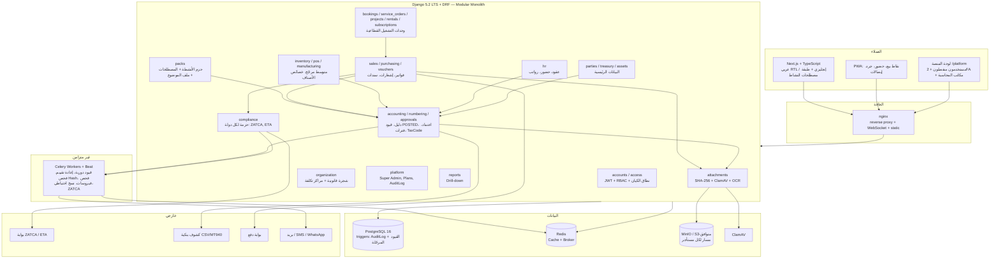

# دراسة تقنية معمارية لبناء منتج CPS
### نظام SaaS مالي وإداري متكامل (ERP) — الإصدار 2.1

| البند | التفاصيل |
|---|---|
| نوع الدراسة | دراسة تقنية (Architecture + خطة تنفيذ + استراتيجية منتج) |
| السوق المستهدف | سعودي/خليجي أولًا، **مصر سوقًا ثانيًا رسميًا (v2.1)**، ببنية عالمية (عملات، لغات، أنظمة ضريبية قابلة للتوصيل) |
| نطاق النسخة الأولى | النواة المحاسبية والمخزنية الكاملة بضوابط رقابية (سبرنتات 0–12) |
| **المرحلة الثانية (v2.1)** | الوحدات الرأسية العشر + "حزم الأنشطة" لتغطية قطاعات دفترة الـ 12 وأنشطتها الـ 60 (سبرنتات 13–26) |
| الإصدار | **2.1** (18 سبتمبر 2026 v1.0 → 22 سبتمبر v2.0 → **23 سبتمبر 2026 v2.1**) |
| الحالة | **معتمدة** — متوائمة مع `SYSTEM_ANALYSIS.md` v1.5، `CFO_REVIEW_1.md`، `CPS_PARITY_PLAN.md` |
| الوثيقة الملزمة للتنفيذ | `docs/SYSTEM_ANALYSIS.md` — هذه الدراسة هي الخلفية المعمارية والاستراتيجية، وعند أي تعارض تحكم `SYSTEM_ANALYSIS.md` |

> **ما تغيّر في v2.1:** (1) تحليل دفترة أُعيد من زيارة فعلية للموقع (الوحدات السبع، التسعير، القطاعات الـ 12 والأنشطة الـ 60) مع مصفوفة تكافؤ وحدة بوحدة؛ (2) **نموذج "حزم الأنشطة" (Industry Packs)** كطبقة تهيئة فوق نواة واحدة — القرار الذي يحوّل "60 نشاطًا" إلى ≈ 10 وحدات؛ (3) خارطة **المرحلة الثانية** (سبرنتات 13–26) وتعديلات على المرحلة الأولى (قوائم مالية في 6، إهلاك في 6.5، خصائص الأصناف في 7، شيكات ونقاط بيع في 7.5)؛ (4) معمارية الضوابط تشمل نتائج المراجعة المالية #1 (حماية على مستوى Postgres، حسابات رقابة، دفتر أستاذ)؛ (5) الحالة الفعلية: سبرنتات 3.5 و4 و4.8 مكتملة (229 اختبارًا)، سبرنت 5 قيد التنفيذ، نسخ احتياطي مختبَر.

---

## 1. الملخص التنفيذي

CPS منصة SaaS متعددة المستأجرين لإدارة الأعمال، مستوحاة من نجاح **دفترة** في السوق العربي، لكنها تختلف في ثلاث نقاط جوهرية:

1. **العمق المحاسبي والرقابي أولًا:** النسخة الأولى نظام محاسبي يقبله مدير مالي ومدقق خارجي (دورة اعتماد، فصل واجبات، تسوية بنكية، أكواد ضريبة، مرفقات كدليل إثبات، تتبّع كل رقم لمصدره) — لا برنامج فواتير بشاشات كثيرة.
2. **المجموعات والشركات القابضة:** شجرة قانونية بعمق غير محدود (قابضة ← شقيقة ← فرع) + شجرة مراكز تكلفة مستقلة، مع تقارير فردية ومجمّعة باستبعاد المعاملات البينية.
3. **العميل الصغير هو التصميم الافتراضي:** ERP كامل يظهر كبرنامج فواتير بسيط (وضع مبسّط + وحدات مفعّلة بالباقة)، والقدرات الكبيرة "تُفتح" فوقه دون ترحيل بيانات.

**الإضافة الاستراتيجية في v2.1 — التغطية القطاعية بنفس النواة:** دفترة تعرض ≈ 60 "برنامج إدارة" لكنها منتج واحد بتهيئة مختلفة. CPS يتبنّى المبدأ ذاته صراحةً: **وحدة تُبنى مرة، ونشاط يُفعَّل بحزمة تهيئة** (وحدات + قالب دليل + مصطلحات + ملف موضوع + قوالب طباعة). بذلك تصبح تغطية القطاعات الـ 12 مسألة ≈ 10 وحدات رأسية في مرحلة ثانية، لا 60 مشروعًا — مع الحفاظ على الفارق التنافسي (الضوابط) الذي لا تملكه دفترة.

**الحالة عند إصدار v2.1 (23 سبتمبر 2026):** سبرنتات 0، 1، 1.5، 2، 3، 3.5، مراجعة معمارية #1، 4، 4.8 مكتملة — 229+ اختبارًا آليًا على Postgres حقيقي؛ المحاسبة الفعلية مبنية (دليل شجري، قيود بحالة، اعتماد وفصل واجبات، عملات على كل سطر، أكواد ضريبة، ترقيم ذرّي)؛ سبرنت 5 (السندات + المرفقات + ضوابط المراجعة المالية #1) قيد التنفيذ؛ نسخ احتياطي يومي **مختبَر الاستعادة**.

---

## 2. تحليل المنتج المرجعي: دفترة (Daftra) — محدَّث بزيارة الموقع في 23 سبتمبر 2026

### 2.1 نظرة عامة
دفترة منصة SaaS سحابية لإدارة الأعمال موجهة للشركات الصغيرة والمتوسطة، "عربية أولًا"، بتخصيص قوي للمستندات وامتثال ضريبي محلي (السعودية، مصر، الأردن، الإمارات)، وتطبيقات جوال متخصصة، وتسعير بثلاث خطط مع إضافات.

### 2.2 خريطة الوحدات كما تظهر على الموقع (7 مجموعات)

| المجموعة | الوحدات |
|---|---|
| المبيعات | الفواتير وعروض الأسعار · نقاط البيع · العروض · الأقساط · المبيعات المستهدفة والعمولات · الفاتورة الإلكترونية (السعودية، مصر، الأردن، الإمارات) |
| العملاء | متابعة العملاء (CRM) · نقاط الولاء · الاشتراكات والعضويات · النقاط والأرصدة · التأمينات |
| المخزون | إدارة المنتجات · المشتريات · إدارة الموردين · دورة المشتريات · الأذون المخزنية · إدارة الجرد · إدارة التصنيع |
| الحسابات | دليل الحسابات · المصروفات · إدارة الأصول · مراكز التكلفة · دورة الشيكات · قيود اليومية · ضريبة القيمة المضافة |
| الموارد البشرية | الهيكل التنظيمي · العقود · الحضور والانصراف · إدارة المرتبات · الطلبات · شؤون الموظفين |
| التشغيل | أوامر الشغل · الحجوزات · تتبع الوقت · دورة العمل (+ إدارة الإيجارات والوحدات وعقود الإيجار في صفحات القطاعات) |
| تطبيقات الجوال | ERP شامل · نقاط بيع (جوال + سطح مكتب Offline) · الحضور · تسجيل المصروفات بالذكاء الاصطناعي · قارئ الفاتورة الإلكترونية · جرد المخزون |

### 2.3 التسعير ونموذج الحدود

| الخطة | الشهري (سنوي) | الحدود |
|---|---|---|
| Basic | 20$ (240$/سنة) | 100 فاتورة/شهر، 100 عميل، 5GB، صندوقان، مستودع واحد، موظف HR واحد |
| Advanced | 41.25$ (495$) | 500 فاتورة، 300 عميل، 10GB، 5 صناديق، 3 مستودعات، موظفا HR |
| Comprehensive | 50$ (600$) | بلا حدود فواتير/عملاء، 20GB، 5 مستودعات، 3 موظفي HR |
| إضافات | مستخدم 7–9.33$ · فرع 41–52$ · POS Offline 10–13$ · تخزين 0.5$/GB · رصيد ذكاء اصطناعي 2.5$/1000 | تجربة 14 يومًا بلا بطاقة |

**الاستنتاج البنيوي لـ CPS:** أبعاد الحدود عندهم = فواتير، عملاء، تخزين، صناديق، مستودعات، موظفو HR، نقاط بيع. نموذج `Plan` (سبرنت 2) يحمل مستخدمين/فروع/فواتير/تخزين، ويُوسَّع بالأبعاد الباقية (سبرنت 6/7).

### 2.4 القطاعات الـ 12 والأنشطة الـ 60 = منتج واحد بتهيئة

القطاعات: المحلات التجارية · الخدمات اللوجستية · السيارات · الحِرَف والخدمات المهنية · السياحة والضيافة · النقل · المكاتب وخدمات الأعمال · التجميل واللياقة · المقاولات والعقارات · الرعاية الطبية · التعليم · (كل المجالات ≈ 60 نشاطًا: من عيادات الأسنان إلى مزارع الخضروات).

**الحقيقة البنيوية:** كل صفحة "برنامج إدارة X" هي **نفس المنتج** بوحدات مفعّلة ومصطلحات وقوالب مختلفة. لا 60 منتجًا. هذا هو الأساس الذي يُبنى عليه القسم 3.4 (حزم الأنشطة).

### 2.5 منصة الامتثال الضريبي المحلي
أنظمة الفوترة الإلكترونية الحكومية مدمجة كوحدة لكل دولة (4 دول). الدرس (مطبَّق في CPS منذ v1.0): **حزمة امتثال لكل دولة** (`compliance/<country>/`) لا حالات خاصة في الكود — السعودية أولًا، ثم مصر (v2.1).

### 2.6 منصة المطورين ومتجر التطبيقات
REST API عام + بوابة مطورين (Entity Builder، Webhooks، متجر تطبيقات). يُحتفظ به في رؤية CPS كمرحلة لاحقة بعد استقرار النواة والمرحلة الثانية.

### 2.7 مصفوفة التكافؤ الموجزة (التفصيل وحدة بوحدة في `docs/CPS_PARITY_PLAN.md` §2)

| مجموعة دفترة | CPS اليوم | الفجوة | القرار |
|---|---|---|---|
| الحسابات | **أعمق**: دليل شجري بقوالب، قيود بحالة واعتماد، مراكز تكلفة على السطر، أكواد ضريبة، ترقيم ذرّي؛ + ما ليس عندهم (اعتماد وفصل واجبات، مرفقات بـ Hash، قابضة/تجميع، فترات بحالات، تسوية بنكية بمطابقة) | دورة الشيكات؛ الإهلاك (مجدول) | الشيكات في 7.5؛ الإهلاك يُقدَّم إلى 6.5 |
| المبيعات | فواتير أعمق؛ ZATCA مجدولة (9، 11) | نقاط البيع، العروض، الأقساط، العمولات، فوترة مصر/الأردن/الإمارات | POS (7.5، 13)، الأقساط مع الاشتراكات (17)، مصر ETA (14) |
| العملاء | أطراف بأدوار وشاشات محاسبية | CRM، ولاء، اشتراكات/عضويات، تأمينات، بوابة عميل | الاشتراكات (17)، CRM-lite وعمولات (بعد 18)، بوابة العميل (21) |
| المخزون | مجدول 7/8 | خصائص الأصناف الرأسية، التصنيع | **خصائص الأصناف داخل سبرنت 7** (قرار schema)؛ تصنيع خفيف (25) |
| الموارد البشرية | هيكل تنظيمي أعمق؛ موظفون + عُهد وسلف | عقود، حضور، إجازات، رواتب | HR ورواتب سعودية/مصرية (22–24) |
| التشغيل | **لا شيء** | حجوزات، أوامر شغل، تتبع وقت، تأجير ووحدات | **مفتاح الـ 60 نشاطًا**: حجوزات وأوامر خدمة (15–16)، مشاريع ووقت (18–19)، تأجير (20) |
| الجوال | واجهة responsive | تطبيقات متخصصة، OCR إيصالات | PWA لكل وحدة مع وحدتها؛ OCR الإيصالات (21) — حقوله محجوزة منذ 3.17 |

### 2.8 الدروس المستفادة لصالح CPS (محدَّثة)
1. النواة عامة والتخصيص القطاعي طبقة تهيئة فوقها — **صار قرارًا معماريًا صريحًا** (3.4).
2. الامتثال الضريبي محرك قابل للتوصيل لكل دولة منذ التصميم — مصر التالية.
3. وحدات التشغيل (حجوزات، أوامر خدمة، تأجير) هي ما يحوّل نظامًا محاسبيًا إلى "برنامج إدارة" لكل قطاع — تُبنى بعد النواة لا قبلها.
4. مكاتب المحاسبة ليست قطاعًا فقط بل **قناة بيع** (كل مكتب يجلب عشرات الشركات) — مساحة عمل خاصة بها مبكرًا في المرحلة الثانية.
5. **ما لا تفعله دفترة ويميّز CPS:** ضوابط رقابية على مستوى المدقق، وتقارير مجمّعة للقابضة — تُسوَّق بها من اليوم الأول: "شمول دفترة بضوابط مراقب مالي".

---

## 3. رؤية ونطاق CPS

### 3.1 رؤية المنتج
منصة واحدة تدير المحاسبة والخزينة والمبيعات والمشتريات والمخزون والأصول — ثم التشغيل القطاعي (حجوزات، أوامر خدمة، مشاريع، تأجير، اشتراكات) — لأي شركة من مكتب خدمي بموظف واحد إلى مجموعة قابضة بعشر شركات، بواجهة تتكلم لغة المستخدم في قطاعه، وضوابط يقبلها المدقق، وامتثال ضريبي قابل للتوصيل حسب الدولة.

### 3.2 تحديات السوق العالمي والأثر المعماري

| التحدي | الأثر المعماري (مطبَّق) |
|---|---|
| تعدد اللغات + RTL | i18n على مستوى Django gettext والفرونت؛ عربي افتراضي، إنجليزي؛ RTL في كل مكوّن؛ **طبقة مصطلحات لكل مستأجر حسب النشاط (v2.1)** |
| تعدد العملات | كل مبلغ: عملة + سعر صرف **على مستوى السطر**؛ جدول `ExchangeRate` مركزي؛ فرق عملة محقق عند السداد + إعادة تقييم نهاية الفترة |
| تعدد الأنظمة الضريبية | `TaxCode` بنوعه وقابلية خصمه؛ حزمة امتثال لكل دولة (ZATCA أولًا، ETA ثانيًا) |
| بوابات الدفع المحلية | طبقة تجريد `PaymentProvider` (سبرنت 21) |
| حماية البيانات وإقامتها | مسار تخزين مفصول لكل مستأجر؛ سيرفر إنتاج منفصل؛ Data Residency خيار لاحق |
| المناطق الزمنية | كل الطوابع UTC، تُعرض بمنطقة المستخدم |

### 3.3 عوامل التمايز عن دفترة
- **ضوابط مالية على مستوى المدقق:** دورة اعتماد وفصل واجبات، تسوية بنكية، مرفقات كدليل بـ SHA-256، سجل تدقيق وقيود مرحّلة محمية على مستوى قاعدة البيانات، تتبّع كل رقم في كل تقرير حتى المستند.
- **الشركات القابضة:** شجرة قانونية بعمق غير محدود + استبعاد بيني + تقارير مجمّعة.
- **مراكز تكلفة كمراكز ربحية** على مستوى السطر (سيارة، مستودع، موظف، مشروع، موسم زراعي) بقائمة دخل لكل مركز.
- امتثال ضريبي قابل للتوصيل، وAPI-first منذ البداية.

### 3.4 نموذج "حزم الأنشطة" (Industry Packs) — جديد في v2.1

**التعريف:** حزمة النشاط = سجل تهيئة معلَن (`apps/packs/catalog/<code>.json` + صف في قاعدة البيانات) يُختار عند التسجيل من كتالوج بـ 12 قطاعًا و≈ 60 نشاطًا (يحل محل حقل `business_type` الرباعي)، ويحتوي:

| العنصر | مثال: عيادة أسنان |
|---|---|
| القطاع / النشاط / الأيقونة | الرعاية الطبية / عيادات الأسنان |
| الوحدات المفعّلة | مبيعات، خزينة، محاسبة، حجوزات، أوامر خدمة، اشتراكات (خطط علاج بأقساط) |
| قالب دليل الحسابات | `service` + حسابات إضافية (إيراد علاج، مستلزمات طبية، تأمينات مستحقة) |
| **طبقة المصطلحات** | عميل → مريض · فاتورة → فاتورة علاج · حجز → موعد · أمر خدمة → جلسة · موظف → طبيب |
| أنواع الأصناف الافتراضية | خدمات مسعّرة (كشف، حشو) + مستلزمات مخزنية بسيطة |
| **ملف الموضوع** (`SubjectFile`) | "ملف المريض": حقول معرَّفة في الحزمة (JSON schema) + مرفقات + سجل الجلسات — نفس النموذج يخدم ملف السيارة/الطالب/القضية/الاستقدام |
| قوالب الطباعة | فاتورة علاج، تذكرة موعد |
| أكواد الضريبة الافتراضية | حسب الدولة |
| مؤشرات لوحة التحكم | مواعيد اليوم، إيراد الشهر، المرضى الجدد، الذمم |
| بيانات تجريبية | اختيارية عند التسجيل |
| صفحة الهبوط | تُولَّد من الحزمة؛ حالة **متاح / قريبًا** (تجمع الاهتمام قبل توفر الوحدات) |

**المبادئ الملزمة:**
1. **الوحدة تُبنى مرة وتُفعَّل بحزمة** — لا كود خاص بنشاط داخل أي وحدة (`if industry == X` ممنوع؛ الاختلاف بالتهيئة فقط).
2. **طبقة المصطلحات** امتداد للقاعدة 19 (لغة المحاسب): قاموس للمستأجر يُركَّب فوق القاموس العام (ar/en) ويظهر في القوائم والفورمات والطباعة والتقارير.
3. **كل مستند تشغيلي** (حجز، أمر خدمة، عقد إيجار، أمر إنتاج) يمر بنفس المحرك المالي (حالة موحّدة، اعتماد، قيد عند POSTED، مرفقات) — لا مسار جانبي.
4. **الحزمة قابلة للتبديل بلا ترحيل بيانات** (3.13): أمر "أضف حسابات النظام الناقصة" عند تفعيل وحدة.
5. **الطرف يحمل `extra_fields` (JSONB)** من الآن تحسّبًا لملف الموضوع؛ `SubjectFile` نفسه يُبنى مع وحدة الحجوزات/أوامر الخدمة.

---

## 4. المستخدمون المستهدفون

| الشخصية | الاحتياج | كيف يخدمه CPS |
|---|---|---|
| صاحب عمل صغير (خدمي) | فواتير وسندات قبض وتقارير بسيطة | الوضع المبسّط: لا هيكل، لا مخزون، لا مصطلحات تقنية |
| محاسب | دليل حسابات، قيود، سندات، كشف حساب، دفتر أستاذ | شاشات بأسماء محاسبية مألوفة، تعديل/إلغاء بقيد عكسي، دفتر أستاذ لكل حساب |
| مدير مالي / مراقب مالي | اعتماد، تسوية بنكية، ميزانية تقديرية، فترات، قائمة إقفال | صندوق الاعتماد، قواعد الاعتماد، التسوية، الانحراف، قفل الفترات بقائمة تحقق |
| مدقق خارجي | إثبات أي رقم لمصدره | Drill-down، مرفقات بـ Hash، AuditLog وقيود مرحّلة محمية بقاعدة البيانات، مصفوفة الرقابة الداخلية |
| مدير مجموعة قابضة | رؤية موحدة ومجمّعة | الشجرة القانونية، الجاري البيني، التقارير المجمّعة |
| **مشغّل قطاعي (عيادة، ورشة، مقاول، مؤجّر…) — v2.1** | شاشات بلغة قطاعه تنتهي بفاتورة صحيحة | حزمة النشاط: حجوزات/أوامر خدمة/مشاريع/تأجير + مصطلحاته + ملف موضوعه |
| **مكتب محاسبة — v2.1** | إدارة عشرات الشركات من حساب واحد | مساحة عمل المكتب المحاسبي (متعدد المستأجرين بصلاحيات) |
| فريق تشغيل المنصة | إدارة العملاء والباقات والدعم | Super Admin منفصل + 2FA، الباقات، سجل التدقيق، الانتحال (لاحقًا) |

---

## 5. النطاق: المرحلة الأولى (النواة) والمرحلة الثانية (القطاعات) — محدَّث v2.1

### 5.1 المرحلة الأولى — النواة المالية بضوابط (سبرنتات 0–12)

| الوحدة | المحتوى | السبرنت |
|---|---|---|
| الأساس والأمان | تعدد مستأجرين، RBAC، اختبارات عزل بنيوية، non-root، CI | 0 ✅ |
| الهيكل التنظيمي | شجرة قانونية + مراكز تكلفة + وضع مبسّط | 1 ✅ |
| إدارة المنصة | Super Admin + 2FA، باقات ووحدات مفعّلة، AuditLog محمي بـ trigger | 2 ✅ |
| البيانات الرئيسية | عملاء، موردون، موظفون، شقيقة (Party موحّد في القاعدة، شاشة لكل كيان)، بنوك، صناديق، عُهد، أصول، كشف تكرار ذكي | 3 ✅ / 3.5 ✅ |
| المحاسبة العامة | دليل شجري بقوالب وحسابات نظام بمفتاح، محرك قيود بحالة POSTED وعكس، عملة وسعر على كل سطر، محرك اعتماد وفصل واجبات، TaxCode/TaxPeriod، ترقيم ذرّي متوافق مع الهيئة، ميزان أولي | 4 ✅ (229 اختبارًا) + 4.8 ✅ |
| الخزينة والمرفقات والضوابط | سندات قبض/صرف/تحويل داخلي، دورة العهدة، تخصيص على الفواتير، فرق عملة محقق، Attachment + AttachmentPanel + SHA-256 + ClamAV + روابط موقّعة، كشوف خزينة وأطراف، طباعة سند وفاتورة بالتفقيط، شاشة الشركة، **ضوابط المراجعة المالية #1** (حماية القيود بـ trigger، حسابات رقابة، قفل PENDING، دفتر أستاذ، رقم الفاتورة عند الإصدار)، نسخ احتياطي مختبَر | 5 ⏳ |
| التسوية البنكية والخزينة | استيراد كشف، مطابقة تلقائية ويدوية، تقرير تسوية، جرد الصندوق، اعتماد تغيير IBAN | 5.5 |
| الفترات والافتتاح والقوائم | سنة مالية مرنة، فترات بحالات، قائمة إقفال الفترة، افتتاح باعتماد مرحلتين، RecurringEntry، **قوائم مالية أساسية (دخل، ميزانية عمومية، أعمار ذمم)**، طبقة المصطلحات، حدود الخطط الموسّعة | 6 |
| الإهلاك | على محرك القيود الدورية؛ إضافات/استبعاد جزئي | **6.5** |
| المخزون | أصناف مخزني/خدمي، مستودعات، متوسط مرجّح، **خصائص الأصناف الرأسية: متغيرات، سيريال، دفعات/صلاحية، وحدات قياس، وزن/عيار، باركود متعدد** | 7 |
| الشيكات ونقاط البيع (1/2) | أوراق قبض/دفع بدورة حالة؛ كاشير، ورديات، درج، باركود، مرتجعات | **7.5** |
| المشتريات | دورة ثلاثية + فاتورة مباشرة على محرك واحد، ضريبة الاستقطاع | 8 |
| المبيعات والامتثال | فواتير مختلطة، إشعارات دائن/مدين، عروض أسعار، ZATCA مرحلة 1 | 9 |
| التقارير الكاملة | Drill-down في كل تقرير، Budget وانحراف، إقرار ضريبي على TaxPeriod، عملات، مستندات بلا مرفق، تصدير PDF بختم زمني، دور المدقق | 10 |
| ZATCA 2 | ربط فعلي وتوقيع وClearance | 11 |
| المجموعات | تقارير مجمّعة باستبعاد بيني | 12 |

**سبرنت تحصين قبل أول عميل** (بعد 6.5): Postgres RLS، 2FA لمستخدمي المستأجر، فهارس مركّبة، نسخ احتياطي سحابي مختبَر، RBAC المنصة.

### 5.2 المرحلة الثانية — الوحدات الرأسية وحزم الأنشطة (سبرنتات 13–26)

| # | الوحدة | تغطي من أنشطة دفترة | السبرنت |
|---|---|---|---|
| V2 | نقاط البيع (2/2): عروض، ولاء، PWA، Offline لاحقًا | 13 نشاطًا تجاريًا + مطاعم | 13 |
| — | حزمة امتثال مصر (ETA) + **مساحة عمل المكتب المحاسبي** | كل الأنشطة في مصر؛ قناة البيع | 14 |
| V3 | الحجوزات + أوامر الخدمة + ملف الموضوع | عيادات (4 أنواع)، تحاليل، تجميل، جيم، صيانة ودعم فني، صيانة سيارات، تكييف، مغاسل، ترجمة، ورش، طباعة (≈ 15) | 15–16 |
| V4 | الاشتراكات والعضويات والأقساط والفوترة الدورية | جيم، استضافة، مساحات عمل، عقود صيانة، مدارس، معارض سيارات | 17 |
| V5 | المشاريع والعقود وتكلفة الأعمال + تتبع الوقت (مستخلصات، محتجزات) | مقاولات، عقارات، لاند سكيب، دهانات، تسويق، طباعة، محاماة واستشارات، استقدام، تطوير مواقع | 18–19 |
| V6 | التأجير والوحدات (تقويم توفر، عقد، تأمين، تسليم/استلام) | تأجير سيارات وليموزين، معدات، عقارات، فنادق، مساحات عمل | 20 |
| — | OCR الإيصالات + بوابة العميل + الدفع الإلكتروني | كل الأنشطة | 21 |
| V8 | الموارد البشرية: عقود، حضور، إجازات، رواتب (GOSI/WPS، تأمينات مصر)، بوابة موظف | أفقي | 22–24 |
| V7 / V11 | تصنيع خفيف (BOM، أمر إنتاج) / التعليم (طلاب، رسوم، صفوف) | مصانع، ورش، خياطة، أدوية / مدارس، مراكز | 25–26 |
| V9 / V12 | CRM-lite وعمولات / المطاعم (طاولات، مطبخ) | أفقي / مطاعم، صالات ألعاب | حسب الطلب أو شراكة |

### 5.3 تغطية قطاعات دفترة الـ 12

| القطاع | الوحدات اللازمة | "متاح" بعد |
|---|---|---|
| المحلات التجارية | النواة + خصائص الأصناف + POS | 7.5 / 13 |
| الخدمات اللوجستية | النواة + المشتريات + مراكز تكلفة (سيارات/رحلات) | 8 |
| النقل | النواة + التأجير + مراكز تكلفة | 20 |
| السيارات | خصائص الأصناف + POS + أوامر خدمة + التأجير | 16 / 20 |
| الحِرَف والخدمات المهنية | أوامر الخدمة | 16 |
| المكاتب وخدمات الأعمال | المشاريع والوقت + CRM + مساحة المكتب المحاسبي | 14 / 19 |
| التجميل واللياقة | الحجوزات + الاشتراكات + POS | 17 |
| السياحة والضيافة | التأجير (غرف) + الحجوزات | 20 |
| المقاولات والعقارات | المشاريع + التأجير (وحدات) + المشتريات | 19 / 20 |
| الرعاية الطبية | الحجوزات + ملف المريض (+ التأمين لاحقًا) | 16 |
| التعليم | التعليم (V11) | 26 |
| الصناعة والزراعة | التصنيع الخفيف + مراكز تكلفة (موسم/محصول) | 25 |

**مؤجل صراحة:** التأمين الطبي (مطالبات)، الأردن/الإمارات، منصة المطورين ومتجر التطبيقات، تطبيقات أصلية (PWA أولًا).

---

## 6. الهيكلة التقنية (Architecture)

### 6.1 مبدأ الهيكلة
**Modular Monolith** على Django: كل مجال تطبيق Django مستقل بحدود واضحة — النواة (organization, access, platform, parties, treasury, assets, accounting, numbering, approvals, vouchers, attachments, sales, purchasing, inventory, reports, compliance) ثم الوحدات الرأسية (bookings, service_orders, subscriptions, projects, rentals, manufacturing, hr, pos, packs). الفصل لخدمات مستقلة لاحقًا فقط عند مبرر حقيقي (أول المرشحين: الفوترة الإلكترونية، التقارير الثقيلة، الإشعارات، OCR).

### 6.2 تعدد المستأجرين
- **قاعدة بيانات مشتركة + `tenant` FK على كل جدول أعمال** مع فهرس مركّب `(tenant, ...)`.
- **العزل صريح في الكود**: `TenantScopedViewSetMixin` يفلتر كل queryset بـ `request.user.tenant`؛ لا مسار يقبل `tenant_id` من العميل؛ الوصول لسجل مستأجر آخر يُرجع 404.
- **طبقة ثانية:** اختبار بنيوي يمشي على كل URL مسجّل ويفشل لو أي view بلا mixin أو بلا permissions (مراجعة #1)؛ Postgres RLS كطبقة ثالثة قبل الإنتاج.
- **مساحة عمل المكتب المحاسبي (v2.1):** مستخدم منصة من نوع "مكتب" يحمل وصولًا صريحًا لعدة مستأجرين بصلاحيات لكل منهم — لا يكسر العزل: كل طلب يعمل في سياق مستأجر واحد.
- **الترقية لقاعدة مخصصة** لمستأجر كبير ممكنة عبر طبقة الاتصال دون تغيير الكود.

### 6.3 مخطط المعمارية (كما تُبنى فعليًا)

### 6.4 نموذج البيانات المفاهيمي (كما بُني ويُبنى)

```mermaid
erDiagram
    TENANT ||--o{ USER : has
    TENANT ||--|| TENANT_FEATURES : has
    TENANT }o--|| PLAN : subscribes
    TENANT }o--|| INDUSTRY_PACK : "configured by (v2.1)"
    TENANT ||--o{ LEGAL_ENTITY : owns
    LEGAL_ENTITY ||--o{ LEGAL_ENTITY : parent
    TENANT ||--o{ COST_CENTER : owns
    COST_CENTER ||--o{ COST_CENTER : parent

    USER }o--o{ ROLE : assigned
    ROLE }o--o{ PERMISSION : grants
    USER ||--o{ USER_ENTITY_ACCESS : scoped_to

    TENANT ||--o{ PARTY : has
    PARTY ||--o{ PARTY_ROLE : "customer|supplier|employee|affiliate"
    PARTY ||--o{ ACCOUNT : "auto sub-ledger per role"
    PARTY ||--o{ SUBJECT_FILE : "patient|vehicle|student|case (v2.1)"
    LEGAL_ENTITY ||--o{ BANK : has
    LEGAL_ENTITY ||--o{ CASH_BOX : has
    LEGAL_ENTITY ||--o{ CUSTODY : has
    LEGAL_ENTITY ||--o{ ASSET : has

    TENANT ||--o{ ACCOUNT : chart
    ACCOUNT ||--o{ ACCOUNT : parent
    TENANT ||--o{ TAX_CODE : defines
    TENANT ||--o{ TAX_PERIOD : files
    TENANT ||--o{ FISCAL_YEAR : has
    FISCAL_YEAR ||--|{ FISCAL_PERIOD : contains
    TENANT ||--o{ EXCHANGE_RATE : has
    TENANT ||--o{ DOCUMENT_SEQUENCE : "per doc_type/entity/year"
    TENANT ||--o{ APPROVAL_RULE : configures

    JOURNAL_ENTRY }o--|| LEGAL_ENTITY : "posted for"
    JOURNAL_ENTRY }o--o| FISCAL_PERIOD : "in"
    JOURNAL_ENTRY ||--|{ JOURNAL_LINE : contains
    JOURNAL_LINE }o--|| ACCOUNT : "debit/credit (currency + rate per line)"
    JOURNAL_LINE }o--o| COST_CENTER : "analysed by"
    JOURNAL_LINE }o--o| BANK_STATEMENT_LINE : "reconciled with"

    INVOICE }o--|| PARTY : customer
    INVOICE }o--|| LEGAL_ENTITY : "issued by"
    INVOICE ||--|{ INVOICE_LINE : contains
    INVOICE_LINE }o--|| TAX_CODE : taxed
    INVOICE_LINE }o--o| COST_CENTER : "analysed by"
    INVOICE ||--o| JOURNAL_ENTRY : "generates on POSTED"
    CREDIT_NOTE }o--|| INVOICE : references

    VOUCHER }o--|| LEGAL_ENTITY : "issued by"
    VOUCHER ||--|{ VOUCHER_LINE : contains
    VOUCHER_LINE ||--o| VOUCHER_ALLOCATION : "settles invoice (+ FX diff)"
    VOUCHER ||--o| JOURNAL_ENTRY : "generates on POSTED"

    ATTACHMENT }o--|| TENANT : "GenericFK to any record"
    AUDIT_LOG }o--o| TENANT : immutable
    PLATFORM_USER ||--o{ AUDIT_LOG : acts
```

**قواعد النموذج الثابتة (محدَّثة v2.1 بما بُني فعلًا):** الكيان القانوني على **رأس المستند** (`legal_entity` إلزامي على Invoice/JournalEntry/Voucher — المستند الواحد يخص دفاتر كيان واحد)؛ **كل سطر** يحمل `cost_center` (اختياري) + المبلغ بعملة المعاملة وبالعملة الأساسية مع سعر الصرف؛ كل بند ضريبي يحمل `tax_code` FK؛ كل مستند مالي له حالة موحّدة `DRAFT → PENDING_APPROVAL → APPROVED → POSTED → REVERSED`؛ القيد يُرحَّل عند POSTED فقط ويُحمى بعدها على مستوى قاعدة البيانات؛ حسابات الرقابة (جاري الأطراف، الضريبة، الخزينة) لا تقبل قيدًا يدويًا إلا بتجاوز مسجَّل؛ الحذف ناعم دائمًا؛ المستندات التشغيلية القطاعية تنتهي دائمًا بمستند مالي يمر بنفس المحرك.

### 6.5 المكدس التقني المعتمد

| الطبقة | القرار | المبرر |
|---|---|---|
| Backend | **Django 5.2 LTS + Django REST Framework + SimpleJWT** | ORM ناضج بلا تبعيات ثنائية، Admin جاهز، i18n مدمج؛ Django 6.x رُفض بعد مشكلة توافق فعلية مع DRF |
| Frontend | **Next.js + TypeScript** (App Router) | SSR، i18n/RTL، مكوّنات `DataTable` و`AttachmentPanel` و`StatusBadge` موحّدة؛ PWA للوحدات الميدانية |
| قاعدة البيانات | **PostgreSQL 16** | Decimal دقيق، RLS، triggers لحماية AuditLog والقيود المرحّلة، JSONB لحقول الحزم وملف الموضوع |
| Cache/Broker | **Redis 7** | جلسات، Cache، وسيط Celery |
| مهام خلفية | **Celery + Beat** | قيود دورية، إعادة تقييم، فحص Hash، فحص فيروسات، نسخ احتياطي، ZATCA، إشعارات |
| ملفات | **MinIO (S3-متوافق)** + **ClamAV** | مرفقات كدليل إثبات؛ روابط موقّعة مؤقتة عبر Django؛ OCI Object Storage في الإنتاج بنفس الكود |
| الحافة | **nginx** | reverse proxy، WebSocket (HMR في التطوير)، static |
| الحاويات | **Docker Compose** (dev بـ autoreload / prod) | Kubernetes لاحقًا عند التوسع |
| الاختبارات | **pytest + factory-boy** على Postgres حقيقي، **ruff**، اختبار دخان على البيئة الحية | 229+ اختبارًا عند v2.1 |

**قرار موثّق:** المحاولة الأولى بـ NestJS + Prisma أُوقفت بعد تعذّر تحميل محرك Prisma الثنائي في بيئة مقيّدة الشبكة؛ Django أثبت استقرارًا فوريًا. (Decision Log 2026-09-18)

### 6.6 طبقة الـ API
- REST عبر DRF Routers لكل وحدة، مع `/api/auth/me/` يُرجع الصلاحيات والوحدات المفعّلة والوضع المبسّط **وحزمة النشاط ومصطلحاتها** — الفرونت يبني القوائم والتسميات منه. `/me` **لا يكتب شيئًا** (درس 4.8).
- مسار منفصل `/api/platform/` بمفتاح JWT مختلف؛ توكن منصة مرفوض في مسارات العملاء والعكس.
- الأخطاء الشبكية لا تُخفي القوائم بصمت: خطأ صريح + إعادة محاولة (4.8).
- Webhooks ومنصة المطورين: بعد المرحلة الثانية.

### 6.7 الأمان والصلاحيات والتدقيق (مطبَّق)
- **RBAC** بأدوار وصلاحيات نصية `module.action` + نطاق الكيان القانوني (`UserEntityAccess` يُمنح تلقائيًا عند إنشاء المستخدم في المستأجر أحادي الكيان — 5.0).
- **Super Admin** بجدول مستخدمين منفصل + TOTP 2FA إلزامي + رموز احتياطية.
- **AuditLog** غير قابل للتعديل: DRF قراءة فقط + **trigger PL/pgSQL**؛ نفس النمط على **القيود المرحّلة** (5.7).
- **Rate limiting** على الدخول والتسجيل (nginx + django-ratelimit)، **fail2ban** على SSH.
- **حاويات non-root**، حماية آخر Owner، تسجيل دخول بـ subdomain + email.
- **ثغرتان اكتُشفتا وأُصلحتا:** `ModelBackend` (عزل الدخول)، و`PartyViewSet` بلا permissions — كلتاهما تحت اختبار بنيوي دائم.
- **المخطط قبل الإنتاج:** Postgres RLS، 2FA لمستخدمي المستأجر، Sentry، HTTPS، مفاتيح SSH فقط، تقييد المنافذ.

### 6.8 التدويل والامتثال
- Django gettext + قاموس فرونت؛ عربي افتراضي؛ **طبقة مصطلحات لكل مستأجر** فوق القاموس العام (v2.1).
- كل مبلغ بعملته وسعر صرفه على مستوى السطر؛ `ExchangeRate` مركزي مع استدلال المقلوب وتحذير السعر القديم.
- **حزمة امتثال لكل دولة** (`compliance/<country>/`): أكواد ضريبة افتراضية، صيغة XML/QR، جهة الإرسال، قواعد الأرشفة، ضرائب خاصة (استقطاع). السعودية أولًا (ZATCA 1 ثم 2)، **مصر (ETA) في سبرنت 14**.

### 6.9 التكاملات الخارجية

| النوع | الحالة |
|---|---|
| ZATCA | سبرنت 9 (مرحلة 1) و11 (مرحلة 2) — يحتاج شهادة وSandbox (إجراء إداري) |
| ETA (مصر) | سبرنت 14 — يحتاج تسجيلًا في بوابة مصلحة الضرائب |
| كشوف بنكية | استيراد CSV/Excel/MT940/CAMT.053 — سبرنت 5.5 |
| بوابات دفع (لاشتراكات CPS وبوابة العميل) | Moyasar/Tap/HyperPay (السعودية)، Paymob/Fawry (مصر) عبر طبقة تجريد — سبرنت 21 |
| بريد/SMS/WhatsApp | إشعارات الاعتماد والتذكير — تدريجيًا من سبرنت 6 |
| OCR | قراءة الإيصالات → سند صرف مقترح — سبرنت 21 (الحقول محجوزة منذ 3.17) |

### 6.10 الأداء وقابلية التوسع
- فهارس مركّبة `(tenant, ...)` على كل جدول؛ `select_related/prefetch_related` في كل serializer (مراجعة #1).
- التقارير الثقيلة والقيود الدورية وإعادة التقييم والفحص كمهام Celery.
- Read Replica لتقارير المحاسبة عند النمو؛ ترقية المستأجر الكبير لقاعدة مخصصة.
- Redis cache للوحة التحكم والتقارير المتكررة.

### 6.11 DevOps والمراقبة
- CI (GitHub Actions): ruff + pytest على Postgres + `next build`.
- `docker-compose.yml` أساسي + `dev.yml` (autoreload للـ backend والفرونت) + `prod.yml` (build ثابت، 80/443، Let's Encrypt).
- Makefile: `make dev-up / dev-down / test / lint / smoke`.
- **قاعدة دائمة (درس 4.8):** بعد آخر commit في أي سبرنت: `docker compose restart backend celery_worker` ثم `make smoke` على البيئة الحية قبل أي UAT.
- **النسخ الاحتياطي:** `scripts/backup.sh` يوميًا 03:00 (Postgres + المرفقات)، احتفاظ 14 يومًا محليًا، `scripts/restore.sh` موثّق، **اختبار استعادة فعلي 2026-09-23**؛ الوجهة السحابية (OCI Object Storage) قبل أول عميل.
- المخطط: Sentry + Uptime Kuma بعد أول عميل؛ Grafana/Prometheus عند النمو؛ لوحة "صحة الأعمال" داخل Super Admin.

### 6.12 معمارية الضوابط المالية (محدَّثة v2.1 بالمراجعة المالية #1)

| الضابط | التصميم | المرجع |
|---|---|---|
| حالة المستند الموحّدة | `DocumentStateMixin`؛ الترحيل عند POSTED فقط؛ `REVERSED` بقيد عكسي بتاريخ لا يسبق الأصل؛ **PENDING_APPROVAL للقراءة فقط** (سحب → DRAFT) | 3.15.1، CFO C3/C8 |
| **حماية على مستوى Postgres** | trigger يمنع UPDATE/DELETE على قيد POSTED/REVERSED (عدا حقول التسوية البنكية)؛ constraint trigger مؤجَّل يفرض Σمدين = Σدائن عند الـ commit | CFO C1 |
| **حسابات الرقابة** | `Account.allow_manual_posting=False` لجاري الأطراف والخزينة والضريبة وفروق العملة/التقريب/الافتتاح؛ تجاوز بصلاحية + سبب في AuditLog | CFO C2 |
| محرك الاعتماد | `ApprovalRule` (نوع + حد → دور)؛ فصل الواجبات؛ صندوق اعتماد؛ قاعدة افتراضية على القيود اليدوية؛ **قفل الترحيل ضد التزامن** | 3.15.1، CFO C4 |
| الترقيم | `DocumentSequence` ذرّي لكل (مستأجر، نوع، كيان، سنة)؛ فريد على المستأجر؛ كود الفرع في الصيغة؛ **الرقم عند الإصدار لا المسودة** | ARCH_REVIEW_1 §3.4، CFO C6 |
| دفتر الأستاذ والكشوف | خدمة `ledger_lines` واحدة تخدم دفتر الأستاذ وكشوف الخزينة والأطراف برصيد جارٍ و`drill` | CFO C5 |
| التسوية البنكية | `reconciled_at` + `bank_statement_line` من سبرنت 4؛ استيراد ومطابقة في 5.5؛ جرد الصندوق؛ اعتماد تغيير IBAN | 3.15.2، CFO C10/F14 |
| العملات | `ExchangeRate` مركزي؛ عملة وسعر على كل سطر؛ فرق محقق عند التخصيص بالسعر التاريخي للفاتورة؛ إعادة تقييم بقيد عكسي تلقائي | 3.15.3 |
| القيود الدورية والإهلاك | `RecurringEntry` → Celery؛ الإهلاك على نفس المحرك في 6.5 | 3.15.4 |
| الضرائب | `TaxCode` + `TaxPeriod` مستقل؛ ضريبة عكسية؛ غير قابل للخصم على المصروف؛ تقريب سطر بسطر؛ ضريبة الاستقطاع (8) | 3.16.2، CFO C15 |
| المرفقات كدليل | `Attachment` GenericFK + SHA-256 + ClamAV + لا حذف بعد POSTED + نسخ للبيانات الرئيسية + تصنيف + احتفاظ 6 سنوات + روابط موقّعة 5 دقائق | 3.17 |
| التتبّع | كل تقرير يُرجع `drill` مع كل رقم حتى المستند والمرفق | 3.16.1 |
| الافتتاح والإقفال | تقرير جاهزية + اعتماد كتابي على مرحلتين + قفل؛ **قائمة إقفال الفترة** | 3.16.3، CFO F13 |
| الميزانية التقديرية | `Budget` + تقرير انحراف | 3.15.6 |

---

## 7. خارطة طريق التنفيذ (الفعلية — v2.1)

| # | السبرنت | الحالة |
|---|---|---|
| 0 | التحصين | ✅ 18 اختبارًا |
| 1 | الشجرة القانونية + مراكز التكلفة + RBAC + وضع مبسّط | ✅ 36 |
| 1.5 | تعديل/حذف ناعم + DataTable | ✅ 68 |
| 2 | Super Admin + 2FA + الباقات + AuditLog محمي | ✅ 86 |
| 3 | Party/PartyRole + بنوك/صناديق/عُهد + أصول | ✅ 111 |
| 3.5 | شاشات مستقلة لكل كيان + كشف التكرار الذكي + القائمة | ✅ 133 |
| مراجعة #1 | ERD، جرد عزل بنيوي، جاهزية المحاسبة، 23 دينًا | ✅ `ARCH_REVIEW_1.md` |
| 4 | الدليل الشجري + محرك القيود + اعتماد + عملات على السطر + TaxCode + ترقيم ذرّي + 9 شاشات + سكربت UAT | ✅ 229 |
| 4.8 | إصلاح `/me` (لا كتابة في GET، خطأ صريح بدل قائمة مبتورة) + درس الحاوية القديمة | ✅ |
| مراجعة مالية #1 | 16 فجوة رقابية، 18 وظيفية، 8 تشغيلية | ✅ `CFO_REVIEW_1.md` |
| 5 | السندات + تخصيص وفرق عملة + دورة العهدة + المرفقات/ClamAV + كشوف + طباعة + شاشة الشركة + ضوابط 5.7 + نسخ احتياطي | ⏳ قيد التنفيذ (5.0 مكتمل) |
| 5.5 | التسوية البنكية + جرد الصندوق + اعتماد IBAN | |
| 6 | الفترات + قائمة الإقفال + الافتتاح + RecurringEntry + **قوائم مالية أساسية** + طبقة المصطلحات + حدود الخطط | |
| 6.5 | الإهلاك | |
| مراجعة #2 + مالية #2 | بعد 6.5 | |
| تحصين | RLS، 2FA للمستأجر، فهارس، نسخ سحابي | قبل أول عميل |
| 7 | الأصناف والمستودعات + **خصائص الأصناف الرأسية** | |
| 7.5 | الشيكات + نقاط البيع (1/2) | |
| 8 | المشتريات + ضريبة الاستقطاع | |
| 9 | الفوترة + إشعارات + عروض أسعار + ZATCA 1 | |
| 10 | التقارير الكاملة + Budget + Drill-down + إقرار + دور المدقق | |
| 11 | ZATCA 2 | |
| 12 | التقارير المجمّعة | |
| 13–26 | **المرحلة الثانية** (القسم 5.2): POS 2/2 → مصر + مكاتب المحاسبة → حجوزات/أوامر خدمة → اشتراكات → مشاريع → تأجير → OCR/بوابة/دفع → HR → تصنيع/تعليم | |

**نقاط التسليم:** بعد 6.5 → نظام محاسبي كامل بضوابط وقوائم مالية لأول عميل خدمي؛ بعد 7.5 → أول قطاع كامل (التجزئة)؛ بعد 9 → نظام تجاري بفوترة إلكترونية؛ بعد 12 → ERP للمجموعات؛ بعد 20 → تغطية 10 قطاعات من 12؛ بعد 26 → تكافؤ وظيفي مع دفترة في القطاعات كلها مع تفوق في الضوابط.

**المنهجية:** كل سبرنت = ملف `docs/prompts/sprint-<n>.md` يُنفَّذ بـ `نفّذ docs/prompts/sprint-<n>.md` كتلةً كتلة بـ commit لكل كتلة؛ ملخص في `docs/sprints/<n>-summary.md`؛ مراجعة مشتركة قبل التالي؛ مراجعة معمارية ومالية كل 3 سبرنتات؛ **UAT بمحاسب بشري شرط إغلاق كل سبرنت محاسبي**؛ restart + smoke قبل أي UAT.

---

## 8. نموذج الفريق

| الدور | من يقوم به |
|---|---|
| مالك المنتج + مدير مالي + محلل نظم | صاحب المشروع (القرارات، UAT، الأولويات) |
| المعماري + كاتب الـ prompts + المراجع المالي | Claude (هذه الجلسات) |
| التنفيذ (كود، اختبارات، migrations، توثيق) | Claude Code على سيرفر التطوير — خط إنتاج واحد تسلسلي |
| اختبار القبول المحاسبي | محاسب بشري (ساعتان أسبوعيًا من سبرنت 4) |
| الإجراءات الإدارية (ZATCA، ETA، GitHub، الإنتاج) | صاحب المشروع |

**خطان متوازيان (قرار مؤجل — بعد GitHub واستقرار النواة في سبرنت 7):** نواة محاسبية / وحدات رأسية، بنفس الانضباط (وثيقة ملزمة، prompt لكل سبرنت، UAT، مراجعات) وبفصل في الـ apps لتقليل التعارض. **عند التوسع التجاري:** DevOps/SRE، دعم فني، UX، واستشاري ضريبي لكل دولة.

---

## 9. الوقت والجهد

| البند | التقدير |
|---|---|
| منجَز (سبرنتات 0 → 4.8 + مراجعتان) | ≈ 6 أيام عمل فعلية (18–23 سبتمبر 2026) |
| المتبقي من المرحلة الأولى (5 → 12 + تحصين + مراجعتان) | ≈ 4–5 أشهر بإيقاع أسبوعين/سبرنت (الإيقاع الفعلي أسرع بكثير؛ المحدِّد هو المراجعة البشرية والـ UAT) |
| المرحلة الثانية (13 → 26) | ≈ 7–8 أشهر بنفس الإيقاع؛ تقصر بخطين متوازيين |
| ZATCA 2 / ETA | مرهونة بإجراءات الهيئات — تُبدأ الآن |

> **التسويق القطاعي لا ينتظر النهاية:** يبدأ بعد 7.5 (التجزئة) ويتوسع بكل وحدة رأسية؛ الحزم غير المتاحة تُعرض "قريبًا" وتجمع الاهتمام.

---

## 10. المخاطر (محدَّثة بما وقع فعليًا)

| المخاطرة | الحالة | التخفيف |
|---|---|---|
| تسرّب بيانات بين المستأجرين | **وقع مرة** وأُصلح | اختبار عزل لكل endpoint + اختبار بنيوي على كل URL + RLS قبل الإنتاج |
| view بلا فحص صلاحيات | **وقع مرة** وأُصلح | نفس الاختبار البنيوي |
| **الحاوية الحية تخدم كودًا قديمًا** | **وقع** (4.8: 229 اختبارًا ناجحًا وسيرفر بكود ما قبل سبرنت 4) | autoreload في dev + قاعدة restart + smoke قبل أي UAT |
| **لا نسخ احتياطي** | **كان قائمًا** حتى 5.0 | نسخ يومي + اختبار استعادة فعلي؛ الوجهة السحابية قبل أول عميل |
| هجوم SSH على سيرفر التطوير | مستمر (86 محاولة فاشلة بين دخولين) | fail2ban مفعّل؛ **مطلوب فورًا:** مفاتيح SSH فقط + تقييد 22 من OCI |
| فقدان الكود (لا نسخة خارج السيرفر) | **قائم** | **Push إلى GitHub فورًا** — الكود بلا أسرار وجاهز |
| رفض المحاسب للواجهة | **وقع** (شاشة "الأطراف") | القاعدة 19 + UAT بمحاسب كل سبرنت |
| **تشتت بين 60 نشاطًا** | متوقع مع المرحلة الثانية | وحدات العمل ≈ 10 فقط؛ النشاط = ملف تهيئة؛ "لا كود خاص بنشاط" |
| إضعاف النواة لصالح شاشات تشغيلية | متوقع | كل مستند تشغيلي يمر بالمحرك المالي نفسه |
| تسويق سابق لأوانه | متوقع | حالة "متاح/قريبًا" على كل حزمة؛ لا بيع قبل UAT بشري |
| تأخر شهادة ZATCA / تسجيل ETA | قائم | بدء الإجراءات الإدارية الآن |
| أرصدة افتتاحية خاطئة عند أول عميل | متوقع | تقرير جاهزية + اعتماد كتابي (3.16.3) |
| تراكم ديون تقنية | مُدار | توثيق إلزامي + مراجعة كل 3 سبرنتات |

---

## 11. التوصيات والخطوات التالية

1. **فورًا:** Push إلى GitHub خاص + Deploy Key؛ مفاتيح SSH وقفل الدخول بكلمة سر؛ تقييد منفذ 22 و3000 بالـ IP.
2. **فورًا:** بدء التسجيل مع ZATCA (شهادة + Sandbox)؛ **ومع مصلحة الضرائب المصرية (ETA)** لسبرنت 14.
3. **الآن:** إتمام سبرنت 5 ثم UAT بشري لسبرنتي 4 و5 معًا وتدوينهما في `docs/UAT_LOG.md`.
4. **قبل سبرنت 6:** إدماج 3.4 (حزم الأنشطة) والقاعدة 20 وخارطة المرحلة الثانية في `SYSTEM_ANALYSIS.md`؛ **كتابة prompt سبرنت 7 بخصائص الأصناف الرأسية كاملة**.
5. **بعد 6.5:** مراجعة معمارية #2 ومالية #2، سبرنت التحصين، أول عميل تجريبي حقيقي (خدمي) على سيرفر إنتاج منفصل.
6. **بعد 7:** قرار الخطين المتوازيين.
7. **بعد 9:** الاشتراكات المدفوعة عبر بوابة محلية (CPS أول عميل لـ CPS في الفوترة الإلكترونية).

---

## 12. البنية التحتية وبيئات التشغيل

### 12.1 بيئة التطوير الفعلية

| العنصر | الحالة |
|---|---|
| السيرفر | Oracle Linux 8.10 (عائلة RHEL — `dnf`)، **15.3 GB RAM** (كافية لـ ClamAV)، مشترك مع Oracle DB/ORDS/Java |
| المسار | `/opt/cps` — `backend/`, `frontend/`, `infra/`, `docs/`, `scripts/` |
| المنافذ | **3000** لـ CPS (nginx الحاوية)؛ محجوزة: 80/443 nginx نظامي، 8080 ORDS، 1521 Oracle listener، 8081 |
| SELinux | Enforcing — كل volume بـ `:Z` |
| الحاويات | postgres:16, redis:7, backend (gunicorn، non-root، autoreload في dev), celery_worker, frontend (Next.js), nginx, **minio, clamav** (من سبرنت 5) |
| الأدوات | Docker CE + Compose، Git، Claude Code (`cd /opt/cps && claude --continue`)، Xshell/Xftp لنقل ملفات الـ prompts |
| الوصول | `http://154.41.209.222:3000` — **يُقيَّد بـ IP الفريق حتى الإنتاج** |
| الأمان | fail2ban (sshd + recidive)، rate limiting على الدخول؛ **مطلوب:** مفاتيح SSH فقط، تقييد 22/3000 من OCI |
| النسخ الاحتياطي | `/opt/cps-backups/` يوميًا 03:00، 14 يومًا، استعادة مختبَرة |

### 12.2 بيئة المطوّر المحلية (لأي عضو جديد)
- Linux/macOS أو Windows + WSL2، 16 GB RAM، Docker Compose.
- Python 3.12، Node 24 LTS (داخل الحاويات).
- `git clone` → `cp .env.example .env` → `make dev-up` → `make test` → `make smoke`.

### 12.3 بيئات التشغيل

| البيئة | الحالة | الملاحظات |
|---|---|---|
| Development | قائمة (`/opt/cps`، منفذ 3000) | autoreload؛ بيانات تجريبية (مستأجر Fatma للـ UAT) |
| Staging | غير قائمة | تُنشأ مع سيرفر الإنتاج كـ clone بنفس `prod.yml` |
| Production | مخطط قبل أول عميل (بعد 6.5 + التحصين) | سيرفر منفصل، دومين، 80/443 + Let's Encrypt، RLS، Sentry، نسخ سحابي مختبَر، ClamAV إلزامي |

### 12.4 مواصفات سيرفر الإنتاج المقترحة (حتى ~300–500 مستأجر نشط)

| المكوّن | المواصفة |
|---|---|
| التطبيق | نسختان (gunicorn) 2–4 vCPU / 4–8 GB لكل نسخة |
| PostgreSQL 16 | 4 vCPU / 16 GB / 200 GB SSD + Read Replica |
| Redis | 1–2 vCPU / 2–4 GB |
| Celery | نسختان على سيرفر التطبيق |
| MinIO/OCI Object Storage + ClamAV | حسب حجم المرفقات (تقدير أولي 100 GB)؛ ClamAV ≈ 2 GB RAM |
| نظام التشغيل | Ubuntu Server 24.04 LTS أو Oracle Linux 9؛ Kubernetes مُدار عند التوسع |
| التكلفة التقريبية | 300–800 دولار/شهر على سحابة عامة (استرشادي) |

### 12.5 النسخ الاحتياطي والاستمرارية
- نسخ يومي لـ Postgres + المرفقات (مطبَّق من 5.0)، احتفاظ 14 يومًا محليًا → 30 يومًا سحابيًا في الإنتاج، **اختبار استعادة شهري موثّق** (الأول تم 2026-09-23).
- المرفقات المحاسبية تُحفظ 6 سنوات حتى بعد أرشفة المستأجر (متطلب نظامي سعودي).
- الكود على GitHub؛ `.env` والأسرار خارج الريبو (بما فيها بيانات اختبار الدخان).

### 12.6 الأدوات المساندة

| الفئة | الأداة |
|---|---|
| الكود وCI | GitHub + GitHub Actions |
| الأخطاء والمراقبة | Sentry، Uptime Kuma → Grafana/Prometheus لاحقًا |
| التصميم | Figma (عند إضافة مصمم) |
| بوابات دفع | Moyasar / Tap / HyperPay (السعودية)، Paymob / Fawry (مصر) |
| الإشعارات | مزود بريد معاملاتي + SMS + WhatsApp Business API |
| الحماية | Cloudflare (WAF/DDoS) أمام الإنتاج |

---

## 13. العلاقة بين وثائق المشروع

| الوثيقة | الدور | من يقرأها |
|---|---|---|
| `docs/SYSTEM_ANALYSIS.md` | **المرجع الملزم:** قرارات التصميم، القواعد الثابتة، خريطة الشاشات، خارطة السبرنتات، سجل القرارات — نسخة الريبو هي الأصل | Claude Code في كل سبرنت؛ الفريق يوميًا |
| `docs/CPS_Technical_Architecture_Study.md` (هذه) | **الخلفية المعمارية والاستراتيجية:** لماذا هذا المكدس، الطبقات، البيئات، المخاطر، موقعنا من دفترة، المرحلة الثانية | القرارات الكبيرة؛ أي عضو جديد؛ المستثمرون/الشركاء |
| `docs/CPS_PARITY_PLAN.md` | مصفوفة التكافؤ وحدة بوحدة، الوحدات الرأسية، تغطية القطاعات، قرارات المنتج | تخطيط المرحلة الثانية والتسويق |
| `docs/ARCH_REVIEW_n.md` | المراجعات المعمارية الدورية (كل 3 سبرنتات) | قبل كل مرحلة كبيرة |
| `docs/CFO_REVIEW_n.md` | المراجعات المالية والرقابية الدورية | قبل كل مرحلة محاسبية |
| `docs/prompts/sprint-<n>.md` | مواصفة كل سبرنت (الكتل، الاختبارات، معايير القبول) | Claude Code |
| `docs/sprints/<n>-summary.md` | ما نُفّذ فعلًا، الاختبارات، ما لم يكتمل ولماذا | المراجعة بعد كل سبرنت |
| `docs/UAT/sprint-<n>.md` + `docs/UAT_LOG.md` | سكربت ونتائج اختبار القبول بمحاسب | كل سبرنت محاسبي |
| `README.md` | التشغيل، الاختبارات، الديون التقنية، البورتات المحجوزة، النسخ الاحتياطي | المطوّر |

---

## المصادر
- دفترة — الرئيسية والقطاعات: https://www.daftra.com/
- دفترة — الميزات: https://www.daftra.com/features
- دفترة — الخطط والأسعار: https://www.daftra.com/plans
- دفترة — بوابة المطورين: https://docs.daftara.dev
- Django 5.2 LTS: https://docs.djangoproject.com/en/5.2/
- Django REST Framework: https://www.django-rest-framework.org
- PostgreSQL: https://www.postgresql.org
- ZATCA e-Invoicing: https://zatca.gov.sa/en/E-Invoicing
- مصلحة الضرائب المصرية — الفاتورة الإلكترونية: https://www.eta.gov.eg
- Claude Code: https://docs.claude.com/en/docs/claude-code/overview
