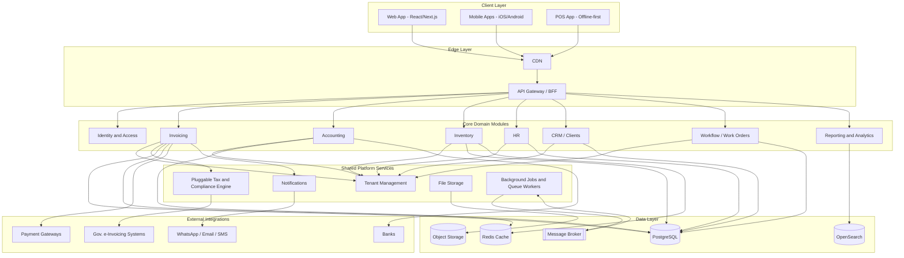
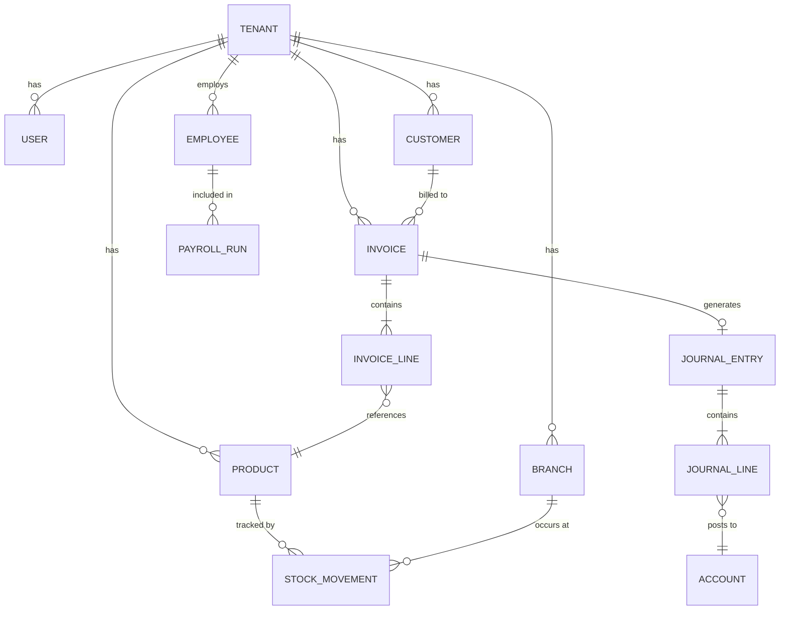

# دراسة تقنية معمارية لبناء منتج CPS
### نظام SaaS متكامل لإدارة الأعمال (على غرار دفترة – Daftra) بنطاق عالمي

| البند | التفاصيل |
|---|---|
| نوع الدراسة | دراسة تقنية (Architecture + MVP) |
| السوق المستهدف | عالمي (Global, multi-country, multi-language) |
| نطاق النسخة الأولى | كامل الوحدات على غرار دفترة |
| تاريخ الإعداد | سبتمبر 2026 |
| الحالة | مسودة للمراجعة الداخلية |

---

## 1. الملخص التنفيذي

CPS مشروع مقترح لبناء منصة SaaS متكاملة لإدارة الأعمال (Invoicing + Accounting + Inventory + HR + POS + CRM)، على غرار منتج **دفترة** الناجح في السوق العربي، لكن مصمم من الأساس لاستهداف **سوق عالمي متعدد الدول واللغات والعملات والأنظمة الضريبية**.

الفرق الجوهري بين استنساخ دفترة محليًا وبناء CPS لسوق عالمي هو أن معظم القرارات المعمارية (تعدد المستأجرين، محرك الضرائب، العملات، اللغة) يجب أن تُبنى كطبقات **قابلة للتوصيل (pluggable)** منذ اليوم الأول، بدل أن تكون مكتوبة بشكل ثابت لدولة واحدة كما تفعل غالبية أنظمة ERP الإقليمية.

هذه الدراسة تغطي: تحليل المنتج المرجعي، نطاق النسخة الأولى الكاملة، المعمارية التقنية المقترحة بالتفصيل، خارطة طريق التنفيذ، فريق العمل المطلوب، تقدير تقريبي للوقت والتكلفة، والمخاطر الرئيسية.

---

## 2. تحليل المنتج المرجعي: دفترة (Daftra)

### 2.1 نظرة عامة
دفترة هي منصة SaaS سحابية لإدارة الأعمال موجهة أساسًا للشركات الصغيرة والمتوسطة، وتُصنَّف كحل "عربي أولًا" (Arabic-first) مع تخصيص قوي للمستندات وقواعد الضرائب في دول الخليج ومصر والأردن. هذه النقطة بالذات هي الفجوة التي يفتح استهداف "سوق عالمي" الباب لسدّها.

### 2.2 خريطة الوحدات في دفترة
بناءً على صفحة الميزات الرسمية، تتوزع وحدات دفترة كالتالي:

| الفئة | الوحدات الفرعية |
|---|---|
| المبيعات | الفوترة، نقاط البيع (POS)، العروض، التقسيط، عمولات المبيعات، الفوترة الإلكترونية (السعودية، مصر، الأردن) |
| العملاء (CRM) | إدارة العملاء، المتابعة، نقاط الولاء، الأرصدة الائتمانية، العضويات |
| المخزون | إدارة المنتجات، المشتريات، دورة الشراء، الموردين، طلبات الشراء الداخلية، الجرد، التصنيع |
| المحاسبة | المصروفات، الحسابات العامة، دليل الحسابات، إدارة الأصول، مراكز التكلفة، دورة الشيكات، ضريبة القيمة المضافة (الإمارات) |
| الموارد البشرية | الهيكل التنظيمي، شؤون الموظفين، الحضور والانصراف، العقود، الرواتب، الطلبات |
| العمليات | أوامر العمل، إدارة الحجوزات، تأجير وإدارة الوحدات، تتبع الوقت، دورة العمل (Workflow)، عقود الإيجار، إدارة التصنيع |
| تطبيقات الجوال | تطبيق الأعمال، تطبيق نقاط البيع، تطبيق سطح المكتب للـ POS، ماسح المصروفات، بوابة الموظف الذاتية (ESS)، قارئ الفاتورة الإلكترونية، تطبيق الجرد |

### 2.3 منصة الامتثال الضريبي المحلي
دفترة تُدمج أنظمة الفوترة الإلكترونية الحكومية كوحدات منفصلة لكل دولة (السعودية، مصر، الأردن) بالإضافة إلى ضريبة القيمة المضافة الإماراتية كوحدة مستقلة. هذا يؤكد أن **الامتثال الضريبي في هذا النوع من المنتجات ليس ميزة عامة، بل مجموعة تكاملات محلية منفصلة لكل دولة** — وهو أمر يجب تعميمه كنمط معماري (pattern) وليس كحالات خاصة متفرقة في الكود.

### 2.4 منصة المطورين ومتجر التطبيقات
دفترة توفّر:
- **REST API (v1)** يغطي الفواتير، عروض الأسعار، إشعارات الدائن، إيصالات الاسترداد، العملاء، الباقات، ودورة العمل (Workflow) كـ endpoints عامة.
- **بوابة مطورين (Developers Portal)** تتيح لأطراف ثالثة بناء تطبيقات مدفوعة داخل النظام عبر: منشئ كيانات بيانات مخصصة (Entity Builder)، أزرار وسكربتات على الصفحات، تكاملات عبر Webhooks، ونشر التطبيقات في متجر تطبيقات (Apps Marketplace) بعد المراجعة، مع لوحة أرباح وسحب للمطورين.

هذه نقطة استراتيجية مهمة: دفترة لا تحاول تغطية كل حالة استخدام صناعية بنفسها، بل تفتح المنصة كـ **PaaS داخلي** ليبنى فوقها المطورون. هذا نمط يستحق أن يكون جزءًا من رؤية CPS منذ التخطيط المعماري، لا أن يُضاف لاحقًا كترقيع.

### 2.5 نموذج التخصيص حسب القطاع
دفترة تقدّم نفس النواة مع "تجربة مخصصة" حسب القطاع المختار عند التسجيل: نقاط البيع والتجزئة، الخدمات المهنية، الخدمات الطبية، اللوجستيات والشحن، السياحة والضيافة، اللياقة والعناية بالجسم، التعليم، والقطاع الآلي/السيارات. عمليًا هذا يعني أن الوحدات الأساسية عامة، لكن الواجهات والحقول والتقارير الافتراضية تتغيّر حسب القطاع (Industry Templates) فوق نفس الـ Schema.

### 2.6 الدروس المستفادة لصالح CPS
1. النواة يجب أن تكون عامة (Generic domain model) والتخصيص القطاعي يُبنى كطبقة "قوالب" (templates) فوقها، وليس كأنظمة منفصلة.
2. الامتثال الضريبي/الفوترة الإلكترونية يجب أن يكون **محرك قابل للتوصيل per-country** منذ التصميم الأول، خاصة مع استهداف سوق عالمي فيه عشرات الأنظمة الضريبية المختلفة.
3. فتح API + منصة تطبيقات مبكرًا يُسرّع تغطية حالات استخدام لا يستطيع فريق CPS بناءها بنفسه.
4. تطبيقات الجوال المتخصصة (POS منفصل، ماسح مصروفات، بوابة موظف ذاتية) أهم من "تطبيق واحد يفعل كل شيء" على الجوال.
5. الاعتماد على "Workflow" كوحدة عامة (أوامر عمل / دورة عمل) يسمح بتغطية قطاعات مختلفة (صيانة، خدمات، تصنيع) بمحرك واحد قابل للتهيئة بدل بناء وحدة لكل قطاع.

---

## 3. رؤية ونطاق CPS

### 3.1 رؤية المنتج
منصة SaaS واحدة تدير المبيعات والفوترة والمخزون والمحاسبة والموارد البشرية ونقاط البيع لأي شركة صغيرة أو متوسطة في أي دولة، بواجهة وتجربة مستخدم موحّدة، مع طبقة امتثال ضريبي ولغة وعملة قابلة للتوصيل بحسب دولة المستخدم.

### 3.2 تحديات استهداف سوق عالمي (بدل سوق واحد كدفترة)
| التحدي | الأثر المعماري |
|---|---|
| تعدد اللغات + الاتجاه (LTR/RTL) | يجب أن تكون كل الواجهات ونماذج البيانات النصية تدعم i18n وRTL منذ اليوم الأول، وليس كإضافة لاحقة |
| تعدد العملات وأسعار الصرف | كل مبلغ مالي يُخزَّن مع رمز العملة + سعر الصرف وقت العملية، لا تحويل حي فقط |
| تعدد الأنظمة الضريبية وقواعد الفوترة الإلكترونية | محرك ضرائب/امتثال قابل للتوصيل per-country (خطط، معدلات، صيغ الفاتورة، جهات الإرسال الحكومية) |
| تعدد بوابات الدفع المحلية | طبقة تجريد للدفع (Payment Abstraction Layer) بدل ربط مباشر بكل بوابة |
| قوانين حماية البيانات المختلفة (GDPR وغيرها) | خيار تحديد إقليم تخزين البيانات (Data Residency) لكل مستأجر |
| فروقات المناطق الزمنية | كل الطوابع الزمنية تُخزَّن UTC وتُعرض حسب منطقة المستخدم |

### 3.3 عوامل تمايز مقترحة عن دفترة
- منصة امتثال ضريبي قابلة للتوصيل (Compliance-as-a-Plugin) تسمح بإضافة دولة جديدة دون تعديل النواة.
- محرك "دورة عمل" (Workflow Engine) قابل للتهيئة البصرية (No-code) بدل شاشات صناعية جاهزة فقط.
- بنية API-first منذ البداية بدل إضافة API لاحقًا.
- دعم تعدد المناطق السحابية (Multi-region) لتلبية متطلبات إقامة البيانات الدولية.

---

## 4. المستخدمون المستهدفون وحالات الاستخدام

| الشخصية | الاحتياج الأساسي |
|---|---|
| صاحب عمل صغير/متوسط | نظرة شاملة على المبيعات والمصروفات والأرباح من مكان واحد |
| محاسب / مراقب مالي | دفتر أستاذ دقيق، تقارير ضريبية جاهزة، تسويات بنكية |
| كاشير / مسؤول مبيعات | نقطة بيع سريعة تعمل حتى بدون إنترنت (Offline-first) |
| مسؤول موارد بشرية | حضور وانصراف، عقود، رواتب، طلبات إجازات |
| مدير عمليات متعدد الفروع | رؤية موحّدة عبر الفروع مع صلاحيات منفصلة لكل فرع |
| مطوّر/شريك تكامل خارجي | API موثّق واضح + Webhooks لبناء تطبيقات إضافية |

---

## 5. نطاق النسخة الأولى (MVP) — كامل الوحدات

بما أن النطاق المطلوب هو نسخة أولى كاملة بكل الوحدات كدفترة، الجدول التالي يحدد الوظائف الأساسية (وليست كل التفاصيل) المطلوبة لكل وحدة حتى تُعتبر "قابلة للاستخدام تجاريًا":

| الوحدة | الوظائف الأساسية في MVP |
|---|---|
| الفوترة | فواتير/عروض أسعار/إشعارات دائن، قوالب متعددة اللغات، إرسال بالبريد/رابط عام، حالة الدفع |
| الفوترة الإلكترونية والامتثال | تكامل مع نظام حكومي واحد على الأقل عند الإطلاق + بنية قابلة لإضافة دول أخرى |
| المخزون والمشتريات | منتجات/خدمات، تتبع كميات متعدد المستودعات، طلبات شراء، موردين، جرد |
| المحاسبة العامة | دليل حسابات، قيود يومية تلقائية من الفواتير/المصروفات، مراكز تكلفة، تقارير مالية أساسية (ميزانية، دخل) |
| نقاط البيع (POS) | واجهة بيع سريعة، تعمل Offline وتزامن لاحق، طباعة/إيصال إلكتروني |
| إدارة العملاء (CRM) | ملفات عملاء، سجل تعاملات، متابعة، أرصدة ونقاط ولاء أساسية |
| الموارد البشرية | هيكل تنظيمي، بيانات موظفين، حضور وانصراف، رواتب أساسية، طلبات إجازة |
| الفروع | فروع متعددة بصلاحيات ومخزون ومحاسبة منفصلة قابلة للدمج في تقرير موحّد |
| دورة العمل / أوامر العمل | محرك حالات قابل للتهيئة (Draft → In Progress → Done) قابل للربط بأي وحدة |
| التقارير ولوحات التحكم | تقارير جاهزة لكل وحدة + لوحة تحكم عامة قابلة للتخصيص |
| الإعدادات العامة | تعدد اللغات، تعدد العملات، الصلاحيات (RBAC)، سجل تدقيق (Audit Log) |

---

## 6. الهيكلة التقنية (Architecture)

### 6.1 مبدأ الهيكلة العام
يُنصح بالبدء بـ **Modular Monolith** (وحدات منفصلة منطقيًا داخل قاعدة كود واحدة، بحدود واضحة بين الوحدات) بدل Microservices كاملة من اليوم الأول، للأسباب التالية:
- فريق ناشئ يبني MVP كامل بسرعة أكبر مع تعقيد تشغيلي أقل.
- الحدود بين الوحدات (Invoicing, Accounting, Inventory...) تُصمَّم كـ Domain Modules منفصلة بواجهات داخلية واضحة (Domain-Driven Design)، بحيث يسهل لاحقًا "فصل" أي وحدة إلى خدمة مستقلة (Microservice) عندما يبرر حجم الاستخدام ذلك (مثال متوقع: محرك الفوترة الإلكترونية، محرك التقارير/البحث، ومحرك الإشعارات هي أول مرشحين للفصل لاحقًا).

### 6.2 تعدد المستأجرين (Multi-tenancy)

| الاستراتيجية | الوصف | الأنسب لـ |
|---|---|---|
| قاعدة بيانات مشتركة + tenant_id | كل الجداول تحمل عمود tenant_id، عزل منطقي بمستوى الصف (Row-Level Security) | غالبية العملاء (صغار/متوسطين) — تكلفة تشغيل أقل بكثير |
| Schema منفصل لكل مستأجر | نفس قاعدة البيانات، Schema مستقل لكل عميل | عملاء متوسطين يحتاجون عزل أقوى دون تكلفة DB منفصلة |
| قاعدة بيانات منفصلة لكل مستأجر | عزل كامل | عملاء كبار/Enterprise أو متطلبات إقامة بيانات خاصة |

**التوصية:** نموذج هجين (Hybrid Pooling Model) — البداية بقاعدة بيانات مشتركة مع Row-Level Security وفهرسة على tenant_id لكل الجداول، مع بنية تسمح بـ"ترقية" أي مستأجر كبير إلى قاعدة بيانات مخصصة دون تغيير كود التطبيق (فقط تغيير طبقة الاتصال بقاعدة البيانات).

### 6.3 مخطط المعمارية العام

### 6.4 نموذج البيانات على المستوى المفاهيمي

### 6.5 المكدس التقني المقترح

| الطبقة | الخيار المقترح | ملاحظات |
|---|---|---|
| Backend | Node.js (NestJS) أو Laravel أو Go | NestJS يعطي بنية Modules/DI جاهزة تناسب Modular Monolith مباشرة |
| Frontend (Web) | React + Next.js | دعم جيد لـ i18n وRTL وSSR للأداء |
| تطبيقات الجوال | Flutter أو React Native | كود واحد لـ iOS/Android لتقليل تكلفة MVP |
| قاعدة البيانات الرئيسية | PostgreSQL | دعم قوي لـ Row-Level Security وJSONB للحقول المرنة حسب القطاع |
| التخزين المؤقت | Redis | جلسات، Cache، Rate limiting |
| البحث | OpenSearch / Elasticsearch | بحث سريع عبر الفواتير/المنتجات/العملاء |
| الطوابير والأحداث | RabbitMQ أو Kafka | معالجة غير متزامنة (فواتير إلكترونية، تقارير، إشعارات) |
| تخزين الملفات | S3 متوافق (AWS S3 / MinIO) | مرفقات، شعارات، تقارير PDF |
| البنية التحتية | Kubernetes + Docker + Terraform | يسمح بالانتشار متعدد المناطق (Multi-region) لاحقًا |

### 6.6 طبقة الـ API ومنصة التوسعة
- **REST API** موثّق (OpenAPI/Swagger) لكل الوحدات منذ MVP، على غرار ما تقدمه دفترة (فواتير، عملاء، مخزون، دورة عمل...) كنقطة انطلاق حتى لو كان أول مستهلك للـ API هو تطبيقات CPS نفسها (مبدأ API-first).
- **Webhooks** للأحداث الرئيسية (فاتورة جديدة، حالة دفع تغيرت، مخزون منخفض...).
- التخطيط لاحقًا (بعد استقرار MVP) لمنصة تطبيقات مشابهة لفكرة "Entity Builder" في دفترة، تسمح لشركاء خارجيين ببناء كيانات بيانات وحقول مخصصة دون تعديل النواة.

### 6.7 الأمان والصلاحيات والامتثال
- صلاحيات قائمة على الأدوار (RBAC) على مستوى الوحدة/الفرع/السجل.
- تشفير البيانات أثناء النقل (TLS) وأثناء التخزين للحقول الحساسة.
- سجل تدقيق (Audit Log) لكل عملية مالية أو تعديل صلاحيات.
- مصادقة ثنائية (2FA) ودعم SSO (SAML/OAuth) للعملاء المؤسسيين.
- خيار تحديد إقليم استضافة بيانات المستأجر (Data Residency) لتلبية متطلبات دول مثل الاتحاد الأوروبي.

### 6.8 التدويل والتوطين (i18n / l10n)
- كل نصوص الواجهة قابلة للترجمة من اليوم الأول (لا نصوص مكتوبة مباشرة بالكود).
- دعم اتجاه الكتابة RTL/LTR على مستوى كل مكوّن واجهة، لا كطبقة CSS مضافة لاحقًا.
- كل حقل مالي: `amount + currency_code + exchange_rate_at_transaction_time`.
- **محرك الضرائب والامتثال (Pluggable Tax & Compliance Engine):** كل دولة = "حزمة امتثال" (Compliance Plugin) تحدد: معدلات الضريبة، صيغة الفاتورة الرسمية، جهة الإرسال الحكومية (API)، وقواعد الأرشفة. إضافة دولة جديدة = إضافة حزمة جديدة دون لمس نواة الفوترة.

### 6.9 التكاملات الخارجية
| النوع | أمثلة |
|---|---|
| بوابات الدفع | Stripe، PayPal، وبوابات محلية إقليمية حسب الدولة |
| الفوترة الإلكترونية الحكومية | حسب الدولة (نموذج قابل للتوصيل كما في 6.8) |
| البنوك | تصدير كشوف حسابات، تسويات بنكية |
| قنوات التواصل | بريد إلكتروني، SMS، WhatsApp Business API |

### 6.10 الأداء وقابلية التوسع
- فصل القراءة عن الكتابة (Read Replicas) لتقارير المحاسبة الثقيلة.
- توليد الفواتير/التقارير الكبيرة كمهام خلفية غير متزامنة (Queue Workers) بدل حجب الطلب المباشر.
- CDN لكل الأصول الثابتة والواجهات.
- تخزين مؤقت (Cache) لصفحات لوحة التحكم والتقارير المتكررة.

### 6.11 DevOps والمراقبة
- CI/CD آلي لكل Module مع اختبارات تلقائية قبل النشر.
- بنية تحتية كـ كود (Terraform) لتكرار البيئة في أي منطقة سحابية جديدة بسهولة (مهم لدعم Data Residency لاحقًا).
- مراقبة وتتبع (Logging/Metrics/Tracing) موحّدة (مثل ELK أو Grafana/Prometheus) منذ MVP، لأن مشاكل الأداء في نظام محاسبي تُكتشف متأخرة جدًا بدون مراقبة جيدة.

---

## 7. خارطة طريق التنفيذ المقترحة

بما أن النطاق النهائي المطلوب هو نسخة كاملة بكل الوحدات، التوصية هي بناء **الأساس المعماري الكامل** (تعدد المستأجرين، الصلاحيات، محرك الضرائب، i18n) منذ المرحلة صفر، ثم إطلاق الوحدات تدريجيًا فوق نفس الأساس بدل بنائها كأنظمة منفصلة:

| المرحلة | المحتوى | الهدف |
|---|---|---|
| المرحلة صفر — الأساس | تعدد المستأجرين، الهوية والصلاحيات، i18n/RTL، محرك عملات، بنية تحتية أساسية | أساس معماري قابل للبناء عليه لكل الوحدات لاحقًا |
| المرحلة 1 — النواة التجارية | الفوترة + المخزون + المحاسبة العامة + إدارة العملاء | منتج قابل للبيع لأول عملاء (Sellable MVP) |
| المرحلة 2 — التشغيل اليومي | نقاط البيع (POS) + الفروع + التقارير الأساسية | تغطية الاستخدام اليومي للمتاجر والشركات الصغيرة |
| المرحلة 3 — الموارد البشرية والعمليات | الموارد البشرية + دورة العمل/أوامر العمل | توسيع النطاق لشركات الخدمات والفرق الأكبر |
| المرحلة 4 — التوسع والمنصة | تكامل ضريبي لدول إضافية + منصة تطبيقات ومطورين + تطبيقات جوال متخصصة | النمو الدولي وبناء نظام بيئي حول CPS |

---

## 8. الفريق المقترح

| الدور | العدد التقريبي (مرحلة MVP) |
|---|---|
| مدير منتج / Product Owner | 1 |
| مهندس معماري (Solutions Architect) | 1 |
| مطوّرو Backend | 3-5 |
| مطوّرو Frontend/Web | 2-3 |
| مطوّر تطبيقات جوال | 1-2 |
| مهندس DevOps/SRE | 1 |
| مهندس ضمان جودة (QA) | 1-2 |
| مصمم UX/UI | 1 |
| خبير امتثال ضريبي/محاسبي (استشاري) | حسب الحاجة لكل دولة |

---

## 9. تقدير تقريبي للوقت والجهد

> ⚠️ هذه أرقام استرشادية أولية بترتيب الحجم (order of magnitude) فقط، وليست عرض سعر. التقدير الدقيق يحتاج تفصيل Backlog كامل بعد اعتماد هذه الدراسة.

| المرحلة | مدة تقريبية |
|---|---|
| المرحلة صفر (الأساس المعماري) | 2-3 أشهر |
| المرحلة 1 (النواة التجارية) | 3-4 أشهر |
| المرحلة 2 (POS والفروع) | 2-3 أشهر |
| المرحلة 3 (HR ودورة العمل) | 2-3 أشهر |
| المرحلة 4 (التوسع الدولي والمنصة) | مستمرة بعد الإطلاق |

**الإجمالي التقريبي حتى نسخة كاملة قابلة للتسويق دوليًا: حوالي 10-13 شهرًا** بفريق بالحجم المذكور أعلاه، مع إمكانية تسريعها بزيادة عدد المطورين أو تقليل نطاق كل مرحلة.

---

## 10. المخاطر التقنية الرئيسية

| المخاطرة | الأثر | التخفيف |
|---|---|---|
| تعقيد الامتثال الضريبي متعدد الدول | تأخر الإطلاق أو أخطاء قانونية | بناء محرك امتثال قابل للتوصيل من البداية + استشاريين محليين لكل دولة عند التوسع |
| ضعف تصميم تعدد المستأجرين في البداية | إعادة هيكلة مكلفة لاحقًا | اعتماد Row-Level Security وفهرسة tenant_id من أول جدول يُبنى |
| منافسة منتج ناضج (دفترة وغيره) في السوق العربي | صعوبة الاستحواذ على عملاء بنفس السوق | التمايز بالتركيز الدولي ومنصة الامتثال القابلة للتوصيل بدل منافسته مباشرة محليًا |
| تعقيد مزامنة نقاط البيع Offline | فقدان بيانات أو تعارض عند العودة للاتصال | استراتيجية مزامنة واضحة (Conflict resolution) وتخزين محلي موثوق على جهاز الكاشير |
| نمو حجم البيانات المحاسبية بمرور الوقت | بطء التقارير | Read replicas + فهرسة + أرشفة البيانات القديمة |

---

## 11. التوصيات والخطوات التالية
1. اعتماد المرحلة صفر (الأساس المعماري) كأولوية قبل أي وحدة عمل، لأن تعدد المستأجرين وi18n ومحرك الضرائب مكلفة جدًا لو أُضيفت لاحقًا.
2. اختيار دولة أو دولتين "تجريبيتين" أولًا لبناء أول حزمة امتثال ضريبي حقيقية، بدل محاولة تغطية كل العالم من اليوم الأول.
3. البدء بـ Modular Monolith، وعدم الانتقال إلى Microservices إلا عند وجود مبرر حقيقي (حمل، فريق، استقلالية نشر).
4. توثيق الـ API منذ أول وحدة (Invoicing) لأن هذا يقلل تكلفة بناء تطبيقات الجوال ومنصة الشركاء لاحقًا.
5. تفصيل Backlog كامل بعد اعتماد هذه الدراسة للحصول على تقدير وقت/تكلفة أدق مبني على قصص مستخدم فعلية.

---

## 12. متطلبات البنية التحتية والأدوات للبدء في التنفيذ

هذا القسم يجيب عمليًا على سؤال: "ماذا نحتاج فعليًا (سيرفر، نظام تشغيل، قاعدة بيانات، تطبيقات) لنبدأ ببناء CPS اليوم؟" — مقسّم إلى بيئة التطوير أولًا، ثم بيئات التشغيل، ثم الأدوات المساندة.

### 12.1 متطلبات جهاز/بيئة التطوير لكل مطوّر
| العنصر | المتطلب المقترح |
|---|---|
| نظام التشغيل | Linux (Ubuntu 24.04/26.04) أو macOS، أو Windows 11 + WSL2 (لتفادي مشاكل توافق أدوات Linux/Docker) |
| المعالج والذاكرة (حد أدنى) | 4 أنوية CPU / 16GB RAM / تخزين SSD — ضروري لأن تشغيل كل الخدمات محليًا عبر Docker Compose (قاعدة بيانات + Redis + Queue) يستهلك ذاكرة أكبر من تطوير تطبيق عادي |
| الحاويات | Docker + Docker Compose لتشغيل كامل بيئة الخدمات محليًا بأمر واحد |
| Runtime الـ Backend | Node.js 22 أو 24 (إصدارات LTS الحالية) إن اختير Node/NestJS، أو المكافئ حسب اللغة المختارة |
| إدارة الكود | Git + حساب GitHub/GitLab |
| المحرر | VS Code مع إضافات ESLint/Prettier/Docker/GitLens |
| اختبار الـ API | Postman أو Insomnia |
| عميل قاعدة البيانات | DBeaver أو TablePlus أو pgAdmin |

### 12.2 بيئات التشغيل المطلوبة
| البيئة | الغرض |
|---|---|
| Development | بيئة مشتركة للمطورين لدمج الأعمال يوميًا (Continuous Integration) |
| Staging | نسخة طبق الأصل من الإنتاج لاختبار كل إصدار قبل نشره فعليًا |
| Production | البيئة الفعلية للعملاء، بمعايير أمان ومراقبة كاملة |

### 12.3 مواصفات السيرفرات المقترحة حسب مرحلة المشروع
> الأرقام هنا استرشادية لبداية التشغيل الفعلي (بعد انتهاء التطوير)، وتُراجع فعليًا بعد اختبار حِمل حقيقي (Load Testing).

| المكوّن | مرحلة الإطلاق (حتى ~300-500 مستأجر نشط) | مرحلة النمو |
|---|---|---|
| سيرفرات التطبيق (Backend/API) | نسختان للتوفر العالي، 2-4 vCPU / 4-8GB RAM لكل نسخة (أو Kubernetes Cluster بحجم مماثل) | توسّع أفقي تلقائي (Auto-scaling) عبر Kubernetes حسب الحمل |
| قاعدة بيانات PostgreSQL | سيرفر أساسي + نسخة احتياطية للقراءة (Replica)، 4 vCPU / 16GB RAM، تخزين 100-200GB SSD قابل للتوسع | سيرفر أقوى + عدة Read Replicas + فصل تخزين حسب حجم كل مستأجر |
| Redis / Valkey (تخزين مؤقت) | 1-2 vCPU / 2-4GB RAM | عقدة مخصصة بذاكرة أكبر عند زيادة عدد الجلسات المتزامنة |
| Message Broker (RabbitMQ/Kafka) | 2 vCPU / 4GB RAM | تجميع (Clustering) لضمان عدم فقدان المهام الخلفية |
| محرك البحث (OpenSearch) | يمكن تأجيله لما بعد MVP لتقليل التكلفة الأولية | عقد مستقلة عند تفعيل بحث/تقارير متقدمة |
| التخزين والـ CDN | تخزين كائنات مُدار (S3 أو مكافئ) + CDN | نفس الخدمة مع توزيع جغرافي أوسع |
| موازن الحمل | مُدار من مزود السحابة | متعدد المناطق (Multi-region) عند التوسع الدولي |

### 12.4 نظام التشغيل الموصى به للسيرفرات
- **Ubuntu Server 24.04 LTS أو 26.04 LTS** كنظام أساس (Container Host)، مع تشغيل كل الخدمات داخل حاويات Docker منسّقة عبر **Kubernetes مُدار** (AWS EKS / GCP GKE / Azure AKS / DigitalOcean Kubernetes) لتقليل عبء صيانة النظام مباشرة.
- ملاحظة: نسخة Ubuntu 26.04 LTS الحديثة أصبحت تشحن PostgreSQL 18 وValkey 9 (البديل مفتوح المصدر لـ Redis) كخيارات دعم طويل الأمد جاهزة، وهو خيار عملي إن أردتم الاعتماد على حزم النظام الرسمية بدل صور Docker مستقلة.

### 12.5 قواعد البيانات والإصدارات المقترحة (بحسب أحدث الإصدارات المستقرة حاليًا)
| قاعدة البيانات | الإصدار المقترح | الاستخدام |
|---|---|---|
| PostgreSQL | 17 أو 18 (الأحدث) | القاعدة الرئيسية للبيانات التشغيلية والمالية |
| Redis أو Valkey | Redis 7+ أو Valkey 9 | تخزين الجلسات، الـ Cache، Rate limiting |
| OpenSearch/Elasticsearch | أحدث إصدار مستقر | البحث والتقارير الثقيلة (اختياري في MVP الأول) |

**سياسة النسخ الاحتياطي:** نسخ احتياطي آلي يومي + الاحتفاظ لا يقل عن 30 يومًا + اختبار استعادة (Restore Test) دوري فعلي، لأن نظامًا محاسبيًا بلا اختبار استعادة موثّق هو مخاطرة عالية.

### 12.6 الأدوات والتطبيقات المساندة المطلوبة قبل بدء التنفيذ
| الفئة | الأداة المقترحة |
|---|---|
| استضافة الكود | GitHub أو GitLab |
| CI/CD | GitHub Actions أو GitLab CI |
| البنية التحتية كـ كود | Terraform |
| المراقبة والتنبيهات | Grafana + Prometheus، أو خدمة مُدارة مثل Datadog |
| تتبع الأخطاء (Error tracking) | Sentry |
| إدارة المشروع | Jira أو Linear |
| التصميم | Figma |
| التوثيق الداخلي | Notion أو Confluence |
| بوابة دفع (بيئة اختبار Sandbox) | Stripe + بوابة دفع محلية واحدة على الأقل حسب أول سوق مستهدف |
| قنوات الإشعارات | مزود بريد معاملاتي (مثل Postmark/SendGrid) + مزود SMS + حساب WhatsApp Business API اختباري |

### 12.7 متطلبات الشبكة والأمان قبل الإطلاق
- اسم نطاق (Domain) + إدارة DNS.
- شهادات SSL (Let's Encrypt آليًا، أو عبر مزود السحابة/موازن الحمل).
- CDN (مثل Cloudflare) لحماية إضافية (DDoS/WAF) وتسريع الأصول الثابتة.
- الوصول الإداري لقواعد البيانات والسيرفرات عبر VPN أو Bastion Host فقط، وليس عبر IP عام مباشر.

### 12.8 تقدير تقريبي جدًا لتكلفة البنية التحتية الشهرية في مرحلة الإطلاق
> ⚠️ رقم استرشادي فقط يعتمد بشدة على مزود السحابة والمنطقة الجغرافية وحجم الاستخدام الفعلي، وليس عرض سعر.

للمواصفات الموضحة في مرحلة الإطلاق (12.3) على سحابة عامة مُدارة، التكلفة الشهرية التقريبية غالبًا تقع في نطاق **300-800 دولار أمريكي شهريًا** (سيرفرات + قاعدة بيانات + تخزين + CDN)، بدون احتساب اشتراكات الأدوات المساندة (مراقبة، تتبع أخطاء، إلخ) التي قد تضيف بضع مئات أخرى حسب الخطط المختارة.

---

## المصادر
- صفحة ميزات دفترة الرسمية: https://www.daftra.com/en/features/all_features
- موقع دفترة الرئيسي (نظرة عامة، الوحدات، الصناعات): https://www.daftra.com/en/agencies/login
- بوابة مطوري دفترة (API v1 وEntity Builder): https://docs.daftara.dev
- ملخص المنتج على FitGap: https://us.fitgap.com/products/011484/daftra
- إصدارات PostgreSQL الحالية: https://www.postgresql.org
- تفاصيل إصدار Ubuntu Server 26.04 LTS: https://ubuntu.com/download/server
- جدول دعم إصدارات Node.js: https://github.com/msimerson/node-lts-versions
