# تقرير مطابقة الخطة #2 — الكود والواجهة مقابل الوثائق الملزمة (بعد سبرنت 6.5)

| البند | التفاصيل |
|---|---|
| التاريخ | 26 سبتمبر 2026 |
| النطاق | `docs/CPS_MASTER_PLAN.md` (v3.2) · `docs/BRAND.md` (v1.0) · `docs/SYSTEM_ANALYSIS.md` §3.18 + §4 (القواعد الثابتة) + §11 (سجل القرارات) · `docs/catalog/modules.json` · كل ما شُحن منذ التقرير #1 (24 سبتمبر): سبرنتات 6.1، 6.3، 6.4، 6.6، 6.7، 6.8، 6.9، 6.9.1، وسبرنت 6.5 كاملًا (كتل 6.5.0–6.5.5، 521/521 اختبارًا، commits `e2bfc15`→`2a0a61f`) |
| المنهجية | فحص مباشر للكود والوثائق (grep/read/git/pytest/curl) — لا افتراضات. نُفِّذ عبر ستة تكليفات بحثية متوازية (كل قسم أدناه) زائد فحص مباشر للـERD وقياس الأداء والاختبار البنيوي، ثم توليف يدوي في هذا الملف. لم يُعدَّل أي كود أو منطق تطبيق لإنتاج هذا التقرير — فقط استعلامات GET حقيقية على Fatma وتشغيلة `pytest` مؤقتة (حُذفت فور تسجيل نتائجها) لقياس أداء على مستأجر اختبار |
| لا يغطي | تدقيقًا تقنيًا عميقًا للصحة المحاسبية (ميزان، توازن قيود) — هذا مغطى بـ521 اختبارًا آليًا ناجحًا لا بهذا التقرير المستندي؛ ولا مراجعة مالية #2 (خارج نطاق هذا الملف، منفصلة) |

---

## (أ) `CPS_MASTER_PLAN.md` (v3.2) — §4 القواعد 1-23، §7 الهوية، §8 المرحلتان 0 و1، §12 القرارات

**تنبيه إصدار:** v3.2 (`docs/CPS_MASTER_PLAN.md:6`) تصف نفسها بأنها كُتبت "قبل تنفيذ 6.5" — وسبرنت 6.5 مغلق تقنيًا الآن (521/521، 6 commits، `docs/sprints/6.5-summary.md`) دون أن ينعكس ذلك في §1 أو صف 6.5 بجدول §8 (لا علامة ✅ ولا تاريخ إغلاق). فجوة توثيقية صرفة — مثل v3.2 نفسها التي أُنشئت خصيصًا لتسجيل إغلاق سبرنت 6، يلزم إصدار v3.3 يسجّل إغلاق 6.5.

### §4 القواعد الثابتة 1-23

| البند | المرجع | الحالة | الدليل | الفجوة | المقترح وتقدير الجهد (ساعات) |
|---|---|---|---|---|---|
| 1. عزل المستأجر | §4 ق1 | ✅ | `backend/tests/test_structural_isolation.py` — يمشي عبر `get_resolver()` نفسه؛ كل ViewSet مصنَّف؛ الآن يشمل `DepreciationScheduleViewSet`/`AssetDisposalViewSet` (سبرنت 6.5.1/6.5.4) في `TENANT_FILTER_EXEMPTIONS` بتحديث السبرنت الأخير. تفصيل كامل في الملحق | لا فجوة | — |
| 2. المبالغ خادميًا فقط | §4 ق2 | ✅ | نمط ثابت مستمر؛ `AssetDisposal.gain_loss`/`cost_share`/`accum_share` (6.5.4) محسوبة في الخدمة لا مُدخَلة، مطابقة للنمط | لا فحص شامل آلي لكل حقل مالي | 2 |
| 3. الكيان القانوني/عملة السطر | §4 ق3 | ✅ | ثابت منذ سبرنت 5؛ `AssetDisposal`/`AssetTransfer` (6.5) يحملان الكيان/مركز التكلفة على مستوى الحركة | لا فجوة | — |
| 4. توازن كل قيد | §4 ق4 | ✅ | `_require_fc_balance_if_single_currency` + محفّز Postgres؛ قيد الاستبعاد (6.5.4) يتوازن ببند "الفرق على DISPOSAL_GAIN_LOSS" محسوبًا | لا فجوة | — |
| 5. فترة مفتوحة قبل الحفظ | §4 ق5 | ✅ (تغيّر من ❌ في التقرير #1) | `backend/apps/accounting/periods.py:206::assert_open_period` مبنية ومطبَّقة على كل مسار ترحيل بما فيها `apps.assets.disposal._post_disposal_entry`/`apps.assets.transfer` | لا فجوة | — |
| 6. المستودع على السطر | §4 ق6 (سبرنت 7) | ✅ (بحكم عدم الاستحقاق) | لا موديل `Warehouse` بعد | لا فجوة الآن | — |
| 7. الأساسي ظاهر/المتقدم مطوي | §4 ق7 | ✅ | نمط `<details>/<summary>` مستمر؛ فورم النقل/الاستبعاد في تفاصيل الأصل (6.5.5) يتبع نفس البنية البسيطة | لم يُفحص شامل عبر كل الشاشات | 2 |
| 8. pytest لكل سبرنت | §4 ق8 | ✅ | تشغيلة نظيفة أخيرة: **521 اختبارًا** ضد Postgres حقيقي | لا فجوة | — |
| 9. توثيق الاختصارات (ديون README) | §4 ق9 | ✅ | `README.md` قسم الديون التقنية محدَّث حتى إغلاق 6.5.5 بخمسة بنود جديدة؛ تصنيف كامل في الملحق | بندان قديمان (إهلاك الأصول، BankStatement schema) لم يُشطبا رغم حلّهما فعليًا | 0.5 |
| 10. لا حذف بيانات/volume | §4 ق10 | ✅ | نمط ثابت مستمر؛ `archive_smoke_tenants` (6.9.1) يؤرشف (soft) لا يحذف | لا فجوة | — |
| 11. إصدارات مثبَّتة | §4 ق11 | ✅ | `backend/requirements.txt:1` → `Django==5.2.17` (بلا تغيير) | لا فجوة | — |
| 12. سؤال قبل الافتراض | §4 ق12 | ✅ | نمط مستمر؛ لم يظهر تعارض يستوجب توقفًا خلال تنفيذ 6.5 كتلةً بكتلة | لا فجوة | — |
| 13. القيد لا يُرحَّل إلا من POSTED | §4 ق13 | ✅ | `DocumentStateMixin`؛ قيد استبعاد الأصل (6.5.4) يُنشأ `POSTED` مباشرة كمسار نظامي (كإيصال الفاتورة)، لا عبر `create_manual_journal_entry` | لا فجوة | — |
| 14. AttachmentPanel على كل شاشة تفاصيل | §4 ق14 | ⚠️ | `/dashboard/assets/[id]` (شاشة جديدة كليًا، سبرنت 6.5.1) — لا مطابقة لـ`AttachmentPanel` في الملف؛ شاشة القائمة `assets/page.tsx` تحويه | شاشة تفاصيل أصل جديدة تفتقد المكوّن الإلزامي بالقاعدة 14 — نفس نوع الفجوة التي وُجدت وأُغلقت في `journal-entries/[id]` بالتقرير #1 | 1.5 |
| 15. سعر الصرف من ExchangeRate بتاريخ المستند | §4 ق15 | ✅ | `get_rate_with_warnings` مستخدمة الآن أيضًا في `apps.assets.depreciation.start_depreciation` لتجميد `cost_base`/`salvage_base` (6.5.0) | لا فجوة | — |
| 16. الضريبة عبر tax_code FK | §4 ق16 | ✅ | بلا تغيير | لا فجوة | — |
| 17. Drill-down في كل تقرير | §4 ق17 (سبرنت 10) | ✅ (بحكم عدم الاستحقاق) | تقرير سجل الأصول الثابتة الجديد (6.5.5) بلا حقل `drill` أيضًا، متوقَّع بالتصميم | لا فجوة الآن | — |
| 18. UAT بشري يغلق كل سبرنت محاسبي | §4 ق18 | ❌ (اتسعت الفجوة) | فحص مباشر لعمود "النتيجة" في كل `docs/UAT/*.md`: **sprint-4.md فقط** به نتائج مُدوَّنة (17 صفًا، عبر API لا محاسبًا بشريًا، مُسجَّل صراحةً كغير مُستوفٍ للقاعدة)؛ `sprint-5.md`/`sprint-5.5.md`/`sprint-6.md`/`sprint-6.0.1.md`/`sprint-6.5.md` كلها **صفر نتائج مُدوَّنة** | **لا سبرنت محاسبي واحد مغلق رسميًا حتى الآن** رغم البناء فوقه لأربعة سبرنتات كاملة إضافية منذ التقرير #1 (5.5، 6، 6.0.1، والآن 6.5) | 10 (خمس جلسات UAT حقيقية متبقية — إداري) |
| 19. مصطلحات المحاسب لا التقنية | §4 ق19 | ✅ (أُغلقت في 6.0.1) | `legalEntity` → "الشركة/الفرع" منذ commit `1f15f10`؛ لم يُفتح مصطلح تقني جديد في نماذج 6.5 (الإضافة/الاستبعاد/النقل تستخدم "تاريخ"، "مبلغ الإضافة"، والحقول التقنية مطوية في تبويب متقدم) | لا فجوة جديدة | — |
| 20. لا كود خاص بنشاط | §4 ق20 (سبرنت 6.2) | ✅ (بحكم عدم البناء) | `grep -rn "if industry =="` → لا نتائج | لا فجوة الآن | — |
| 21. الكتالوج مصدر وحيد | §4 ق21 | ⚠️ (بلا تغيير) | `grep -rn "catalog" frontend/src` → **0 نتيجة**؛ صف `assets` في `modules.json` حُدِّث (`notes`: "الإهلاك متاح من 6.5") لكن الفرونت-إند لا يقرأه | متوقَّع تمامًا (سبرنت 6.2 لم يبدأ) | — |
| 22. restart+smoke بعد كل commit | §4 ق22 | ✅ | نُفِّذ فعليًا بعد آخر commit لسبرنت 6.5: `docker compose restart backend celery_worker frontend` + `make smoke` → `ALL CHECKS PASSED` (ميزان 52802.59 على Fatma، بلا تغيير) | لا فجوة | — |
| 23. لا محتوى تسويقي غير حقيقي | §4 ق23 (سبرنت 6.2) | ✅ (بحكم عدم البناء) | لا موقع تسويقي مبني بعد | لا فجوة الآن | — |

### §7 الهوية البصرية

| البند | المرجع | الحالة | الدليل | الفجوة | المقترح |
|---|---|---|---|---|---|
| دقة وصف §7 لتوكنز الهوية | §7 | ✅ توثيقيًا | النص يصف تصميمًا مقصودًا لا حالة تنفيذ مُطالَبة كإنجاز — بخلاف فجوة §1 التي وجدها التقرير #1 (حُلّت في 6.0.1، `CPS_MASTER_PLAN.md:40` يصفها الآن بدقة "بانتظار مراجعة بصرية بالمتصفح من المالك") | التفصيل الكامل لتطبيق BRAND.md في قسم (ب) | — |

### §8 المرحلة 0 — إجراءات فورية إدارية

| البند | المرجع | الحالة | الدليل | الفجوة | المقترح وتقدير الجهد |
|---|---|---|---|---|---|
| 0.2 ريبو GitHub خاص + push | §8 P0.2 | ✅ (أُغلقت — كانت الفجوة #3 في التقرير #1) | `git remote -v` → `git@github.com:mateia924/CPS.git`؛ `git log` يُظهر الدفع حتى `2a0a61f`؛ الوثيقة نفسها تُقرّ بذلك (`CPS_MASTER_PLAN.md:251`) | لا فجوة كودية؛ يبقى خطر نسخة قاعدة البيانات خارج السيرفر | إداري (نسخة سحابية) |
| 0.1/0.3/0.4/0.5/0.8 (دومين، SSH، ZATCA/ETA، علامة تجارية، محاسب خارجي) | §8 P0.1-0.8 | غير قابل للتحقق من الكود | إجراءات إدارية/تعاقدية خارج الريبو، بلا تغيير عن التقرير #1 | — | إداري |
| 0.7 UAT بشري لسبرنت 4 | §8 P0.7 | ❌ (بلا تغيير) | مكرَّر من قاعدة 18 أعلاه | لا يزال مفتوحًا | ضمن الـ10 ساعات في ق18 |

### §8 المرحلة 1 — سبرنتات 5 → 6.5 + مراجعة#2 + تحصين

| البند | المرجع | الحالة | الدليل | الفجوة | المقترح وتقدير الجهد |
|---|---|---|---|---|---|
| سبرنت 5 / 5.5 | §8 صفوف 5/5.5 | ✅ كودًا / ❌ UAT | بلا تغيير عن التقرير #1 | إغلاق رسمي معلَّق على UAT | ضمن ق18 |
| سبرنت 6 (كامل بكتله 6.0-6.9.1) | §8 صف 6 | ✅ كودًا (تقنيًا) / ❌ UAT | `docs/sprints/6-summary.md` + commit `0b1e5a2` (6.9.1 إغلاق) — **جدول §8 نفسه لا يزال يصف 6.9.1 كخطوة معلّقة "قبل تنفيذ 6.5"** رغم أن 6.5 نُفِّذ وأُغلق فعليًا بعده | فجوة توثيقية — الجدول يحتاج تحديثًا يعكس أن 6.9.1 أُغلقت وأن 6.5 اكتمل أيضًا | 0.5 |
| سبرنت 6.5 (الإهلاك) | §8 صف 6.5 | ✅ كودًا (تقنيًا) / ❌ UAT | `docs/sprints/6.5-summary.md`: 521/521، commits `e2bfc15`→`2a0a61f`؛ `docs/UAT/sprint-6.5.md` مكتوب (11 خطوة) بعمود نتيجة فارغ بانتظار محاسب بشري | **الجدول في §8 لا يحمل أي علامة إتمام لسبرنت 6.5 إطلاقًا** — أكبر فجوة توثيقية في هذا القسم | 0.5 (تحديث الصف + رفع إصدار لـ v3.3) |
| مراجعة #2 + مالية #2 | §8 | ⏳ الآن مستحقة | هذا التقرير نفسه يفتح مراجعة #2 (تقنية)؛ لا ملف `CFO_REVIEW_2.md` بعد | مراجعة #2 قيد الإنشاء بهذا الملف؛ المالية #2 لم تبدأ | 8 (المالية #2) |
| تحصين (RLS، 2FA مستأجر، إنتاج) | §8 | ❌ (متوقَّع) | لا `ROW LEVEL SECURITY`؛ لا سيرفر إنتاج موثَّق — بلا تغيير | يعتمد على مراجعة #2 (هذا التقرير) | 24 |

### §12 القرارات المعتمدة (23 سبتمبر 2026) — لقطة مجمَّدة بالتصميم

| البند | المرجع | الحالة | الدليل | الفجوة | المقترح |
|---|---|---|---|---|---|
| §12 لقطة قرارات 23 سبتمبر فقط، لا قائمة متراكمة | §12 + السطر التمهيدي (`CPS_MASTER_PLAN.md:11`) | ✅ يعمل كما صُمِّم | `SYSTEM_ANALYSIS.md` §11 يحمل السجل الكامل المتراكم (يضم الآن قرارات 6.5 الـ17) — التوثيق يتبع المسار المعلن: القرار الجديد → §11 أولًا → §12 عند الإصدار التالي | لا فجوة تصميمية | — |
| قرار 8: القوائم المالية في 6، الإهلاك في 6.5 | §12.8 | ✅ منفَّذ بالكامل | كلا السبرنتين مغلقان تقنيًا الآن | لا فجوة | — |
| باقي القرارات 1-7، 9-12 | §12 | ✅ | مطابقة لحالتها في التقرير #1، بلا تغيير | — | — |

---

## (ب) `BRAND.md` §2-§5 — الهوية البصرية

**ملخص كمي: 8 من 8 بنود مطابقة بالكامل — لا تراجع رغم كل الشاشات المضافة منذ سبرنت 6.0.1 (بما فيها شاشات سبرنت 6.5 الجديدة). هذه الفجوة كانت الأعلى أثرًا في التقرير #1 (22 ساعة) وتبقى مغلقة بالكامل.**

| البند | المرجع | الحالة | الدليل | الفجوة | المقترح وتقدير الجهد |
|---|---|---|---|---|---|
| 1. وجود `tokens.css` واستيراده | BRAND.md §5.1 | ✅ | `./scripts/check-brand.sh` → "PASS: src/styles/tokens.css is an exact copy of docs/brand/tokens.css" | لا فجوة | — |
| 2. ألوان حرفية خارج tokens.css | BRAND.md §5.2 | ✅ | `check-brand.sh` → "PASS: zero literal colors outside src/styles/tokens.css" (شمل فحص شاشة تفاصيل الأصل وتقرير سجل الأصول الثابتة الجديدتين من سبرنت 6.5) | لا فجوة | — |
| 3. الخطوط (Tajawal / IBM Plex Sans Arabic) | BRAND.md §3 | ✅ | `src/app/layout.tsx:2` → `import { IBM_Plex_Sans_Arabic, Tajawal } from "next/font/google"`؛ `tokens.css` → `--font-display`/`--font-body` مُطبَّقان على `h1-h4`/`html` | لا فجوة | — |
| 4. الشعار في الشريط الجانبي/الرأس/الطباعة | BRAND.md §1 | ✅ | `dashboard/layout.tsx`، `login/page.tsx`، وكل صفحات الطباعة الثماني بما فيها الجديدتان من 6.5 (`print/reports/fixed-assets/page.tsx`، `print/reports/balance-sheet/page.tsx`) — `` | لا فجوة | — |
| 5. favicon | BRAND.md §1 | ✅ | `frontend/public/favicon.ico` في الجذر؛ `layout.tsx` يحوي مفتاح `icons` في `metadata` | لا فجوة | — |
| 6. StatusBadge (ألوان §2.5) | BRAND.md §2.5 + §5.3 | ✅ | `StatusBadge.tsx` — كل الحالات العشر (بما فيها `rejected`/`completed` من 6.3/6.4) تقرأ زوج نص/خلفية حصريًا من `var(--status-*)`؛ `reversed` (بنفسجي) متمايز فعليًا عن `cancelled`/`rejected` (أحمر) | لا فجوة | — |
| 7. لون الأزرار الرئيسية | BRAND.md §2.8 ق4 + §5.2 | ✅ | `contrast-check.mjs` → "color-on-primary on color-primary: 7.69:1 (#FFFFFF on #3A5286)" | لا فجوة | — |
| 8. الزوايا (12/16/999px) | BRAND.md §4 | ✅ | `tokens.css` → `--radius-sm:8px; --radius:12px; --radius-lg:16px; --radius-pill:999px` — مطابقة حرفيًا | لا فجوة | — |

**تباين WCAG AA (`node scripts/contrast-check.mjs`، شُغِّل فعليًا):** **25/25 زوجًا يعبر AA** (≥ 4.5:1) — 15 زوجًا للوضع الفاتح و10 أزواج للوضع الداكن (`@media (prefers-color-scheme: dark)` كامل، تحسين لم يكن مذكورًا في التقرير #1). لا زوج راسب واحد. لا دَين جديد أضافته شاشات سبرنت 6.5.

---

## (ج) `SYSTEM_ANALYSIS.md` §3.18 — خريطة الشاشات والقائمة الرئيسية

| البند | المرجع | الحالة | الدليل | الفجوة | المقترح وتقدير الجهد |
|---|---|---|---|---|---|
| لوحة التحكم: 4 بطاقات (نقدية/ذمم/مبيعات الشهر/تنبيهات) | §3.18 صف 1 | ✅ | `dashboard/page.tsx` + `apps/accounting/views.py::DashboardSummaryView` — الأربع مبنية فعليًا منذ 6.0.1-B | لا فجوة | — |
| المبيعات: العملاء · المنتجات · الفواتير | §3.18 صف 2 | ✅ | `layout.tsx` | لا فجوة | — |
| المشتريات (الموردون فقط) | §3.18 صف 3 | ✅ (متوقع) | `layout.tsx` | سبرنت 8 لم يُبنَ | — |
| الخزينة: كامل البنود + التسوية + أسعار الصرف | §3.18 صف 4 | ✅ | `layout.tsx` | لا فجوة | — |
| المحاسبة: دليل الحسابات/القيود اليدوية/الافتتاح/الدورية/الضريبة | §3.18 صف 5 | ✅ | `layout.tsx` | لا فجوة | — |
| المحاسبة: "الفترات المالية" موضعها | §3.18 صف 5 (يذكرها ضمن المحاسبة) | ⚠️ توثيقي/بنيوي بسيط | فعليًا تحت «الإعدادات» (`showFiscalYears`) لا تحت قسم المحاسبة | مكانها في الكود يخالف تعداد §3.18 النصي (لا يخالف أي قاعدة وظيفية) | 0.5 |
| المخزون (قسم كامل) | §3.18 صف 6 | ✅ (متوقع) | لا `showInventory` في `layout.tsx` | سبرنت 7 لم يُبنَ | — |
| الأصول: نص الوثيقة لا يزال "الإهلاك (مؤجل)" | §3.18 صف 7 | ❌ توثيقي حقيقي | `showAssets` + سبرنت 6.5 الكامل (إهلاك قسط ثابت/متناقص، إضافات، استبعاد جزئي/كلي، نقل) مبني ومختبر (521 اختبارًا) — نص §3.18 نفسه لم يُحدَّث منذ اعتماد 6.5 | **الوثيقة تصف ميزة منجزة بالكامل بأنها "مؤجَّلة"** — أخطر فجوة توثيقية في هذا القسم | 0.5 |
| الموارد البشرية: الموظفون فقط | §3.18 صف 8 | ✅ | يطابق النص حرفيًا | — | — |
| التقارير: ميزان المراجعة · قائمة الدخل · الميزانية العمومية · دفتر الأستاذ · أعمار الذمم · كشف حساب | §3.18 صف 9 | ✅ | `layout.tsx` | لا فجوة | — |
| التقارير: "سجل الأصول الثابتة" غائب من تعداد §3.18 النصي | §3.18 صف 9 | ⚠️ توثيقي | `fixedAssetsReportNav` — تقرير جديد كامل من سبرنت 6.5.5 غير مذكور في قائمة §3.18 | زيادة غير موثّقة (نمط "المنتجات"/"فترات الضريبة" من التقرير #1) | 0.25 |
| الإعدادات: كامل البنود + قواعد المرفقات + الفترات المالية | §3.18 صف 10 | ✅ | `layout.tsx` | لا فجوة وظيفية | — |
| صندوق الاعتماد — شرط الصلاحية لا يغطي صلاحيات الأصول الجديدة | §3.18 صف 11 | ⚠️ | `showApprovalInbox` يفحص `invoices.approve`/`vouchers.approve`/`accounting.manage`/`treasury.request_iban_change` فقط — **لا `assets.depreciate`** (صلاحية اعتماد جدول الإهلاك/الإضافة/الاستبعاد من سبرنت 6.5.1) | دور مخصَّص يحمل `assets.depreciate` فقط (بلا `accounting.manage`) لن يرى رابط الصندوق رغم وجود مستندات أصول بانتظار اعتماده؛ Owner/Accountant الافتراضيان غير متأثرين | 0.5 |

**القواعد الخمس العامة لكل شاشة:**

| القاعدة | الحالة | الدليل |
|---|---|---|
| 1. اسم عربي محاسبي مألوف | ✅ | عيّنة: العملاء، الموردون، البنوك، دليل الحسابات، سجل الأصول الثابتة |
| 2. AttachmentPanel + سجل تدقيق + ارتباطات | ❌ فجوة حقيقية جديدة | `assets/page.tsx` تحويه؛ **`assets/[id]/page.tsx` (شاشة تفاصيل الأصل الجديدة، سبرنت 6.5.1) لا تحويه إطلاقًا** — صفر نتائج لـ`grep -n "AttachmentPanel"` على الملف، رغم أن الشاشة القديمة (القائمة) تحويه. نفس البند في قسم (أ) قاعدة 14 |
| 3. الأساسي ظاهر والمتقدم مطوي | ✅ | `<details>/<summary>` في نماذج العملاء/الموردين؛ فورم بدء الإهلاك مكشوف بالكامل (مقبول لشاشة إجراء لا بيانات رئيسية) |
| 4. زر إضافة سريع من داخل مستند | ✅ | `invoices/page.tsx` — `showQuickAddCustomer` فعلي |
| 5. StatusBadge موحّد | ✅ | مستخدم في شاشات المستندات + `assets/[id]/page.tsx` لحالة جدول الإهلاك |

---

## (د) `docs/catalog/modules.json`

| البند | المرجع | الحالة | الدليل | الفجوة | المقترح وتقدير الجهد |
|---|---|---|---|---|---|
| القاعدة 21 — الكتالوج مصدر وحيد | القاعدة 21 | ⚠️ (مؤجَّل رسميًا) | `grep -rn "catalog" frontend/src` → **صفر نتائج** (لا تغيير عن التقرير #1) | سبرنت 6.2 لم يبدأ بعد (لا ملف `docs/sprints/6.2*`)؛ لا إجراء قبله | — |
| `credit_balances` — حالة `in_progress` لا تطابق تعريفها الحرفي في `_meta.status_values` | `docs/catalog/modules.json` (accounting) | ⚠️ | تعريف `in_progress` في الملف نفسه: "قيد البناء **في السبرنت الحالي**" — لا سبرنت نشط يبني هذه الوحدة الآن (البناء الجزئي ON_ACCOUNT كان سبرنت 5.3، والباقي مجدول لسبرنت 13) | التصنيف حرفيًا خاطئ رغم أن نص `notes` نفسه دقيق ويوضح الجزء المبني من غير المبني | 0.25 |
| `assets` — تحديث `notes` بعد إغلاق سبرنت 6.5 | `docs/catalog/modules.json` (accounting) | ✅ | `"notes": "الإهلاك متاح من 6.5"` — يطابق `apps/assets/depreciation.py`/`additions`/`disposal.py`/`transfer.py` الفعلية و521 اختبارًا ناجحًا | لا فجوة — حُدِّثت ضمن إغلاق 6.5 نفسه | — |
| `fiscal_periods`/`recurring`/`ledger_reports`/`financial_statements`/`aging_reports`/`bank_reconciliation`/`approvals`/`audit_trail`/`workflow` — كل الوحدات المتاحة منذ سبرنت ≤6 | `docs/catalog/modules.json` | ✅ | مطابقة تمامًا للكود الفعلي؛ `recurring.blurb_ar` ("نفس المحرك الذي يشغّل الإهلاك") أصبح دقيقًا فعليًا بعد 6.5 | لا فجوة | — |
| بقية الوحدات (`sprint` مستقبلي و`status` = `planned`/`later`) | `docs/catalog/modules.json` | ✅ | فحص شامل لكل الصفوف — لا صف بسبرنت مُغلَق (≤6.9.1 أو =6.5) وحالته أقل من `available` | لا فجوة | — |

---

## قائمة الفجوات الحقيقية مرتّبة بالأثر على أول عميل

هذه القائمة تستبعد العمل المجدول حسب الخطة نفسها (سبرنت 6.2، 7-13، RLS، إلخ) وتُركّز فقط على انحرافات فعلية عن ما هو مُلزَم *الآن*، بعد إغلاق سبرنت 6.5.

| # | الفجوة | الأثر على أول عميل | تقدير الجهد |
|---|---|---|---|
| 1 | **لا UAT بشري حقيقي على أي سبرنت محاسبي — امتدت الفجوة الآن لستة سبرنتات (4، 5، 5.5، 6، 6.0.1، 6.5)** | الأعلى خطورة دون تغيير عن التقرير #1: المنتج مُحاسبي بالكامل، ولم يتحقق أي محاسب بشري من صحة أي شاشة بعد، والبناء استمر فوقها لأربعة سبرنتات إضافية كاملة | 10 (إداري) |
| 2 | **وثائق الخطة (CPS_MASTER_PLAN.md §1/§8، SYSTEM_ANALYSIS.md §3.18 صف الأصول) لا تعكس إغلاق سبرنت 6.5** | يهدد موثوقية الوثائق كمرجع وحيد للفريق والمدقق الخارجي؛ §3.18 يصف ميزة منجزة بالكامل ومختبرة (521 اختبارًا) بأنها "مؤجَّلة" | 1.5 (تحديث + رفع إصدار v3.3) |
| 3 | **`/dashboard/assets/[id]` (شاشة تفاصيل الأصل الجديدة، سبرنت 6.5.1) بلا AttachmentPanel** | مخالفة مباشرة للقاعدة 14 على شاشة أُنشئت هذا السبرنت بالذات — نفس فئة الخطأ التي وُجدت وأُغلقت على `journal-entries/[id]` في التقرير #1، تكرّرت على شاشة جديدة | 1.5 |
| 4 | **صندوق الاعتماد لا يشمل `assets.depreciate` في شرط الظهور** | دور مخصَّص لموافق أصول فقط لن يرى مستندات بانتظار اعتماده فعليًا في الصندوق — ثغرة استخدام لا أمنية (الـAPI نفسه محمي) | 0.5 |
| 5 | **بندان في ديون README محلولان فعليًا غير مشطوبين (إهلاك الأصول، BankStatement schema)** | لا أثر مباشر على العميل، لكنه يُضعف موثوقية الوثائق كمرجع للفريق | 0.5 |
| 6 | **تصنيف `credit_balances` في modules.json (`in_progress`) يخالف تعريف الحالة نفسه في `_meta`** | لا أثر مباشر على العميل، دقة توثيقية فقط | 0.25 |
| 7 | **تقرير سجل الأصول الثابتة و"الفترات المالية" غير مذكورين/موضوعين بدقة في نص §3.18** | احتكاك بسيط بين الوثيقة والكود الفعلي، لا خطأ وظيفي | 0.75 |

**الإجمالي التقديري للفجوات القابلة للإصلاح الفوري:** ≈ 5 ساعات هندسية/توثيقية + 10 ساعات إدارية (UAT).

**السياق الأهم:** فجوتا الهوية البصرية (22 ساعة) وريبو GitHub (1 ساعة) — أعلى فجوتين هندسيتين في التقرير #1 — **مغلقتان بالكامل** ولم تتراجعا رغم كل الشاشات الجديدة. الفجوة الوحيدة المتبقية بأثر هندسي حقيقي (غير إداري) هي غياب `AttachmentPanel` عن شاشة واحدة جديدة.

---

*لم يُعدَّل أي كود أو منطق تطبيق لإنتاج هذا التقرير. المصدر: قراءة مباشرة لـ `CPS_MASTER_PLAN.md`، `BRAND.md`، `SYSTEM_ANALYSIS.md`، `modules.json`، `README.md`، `docs/sprints/*.md`، `docs/UAT/*.md`، `docs/UAT_LOG.md`، وفحص فعلي للكود عبر `grep`/`git log`/قراءة ملفات/`pytest`/`curl` (GET فقط على المستأجر الحي Fatma، لا كتابة).*

---

## ملحق — مدخلات المراجعة #2

### 1. ERD محدَّث — كل التطبيقات

```mermaid
erDiagram
    %% platform / tenants
    PLAN ||--o{ TENANT : "tenants"
    TENANT ||--|| TENANTFEATURES : "features"
    TENANT ||--o{ USER : "users"
    TENANT ||--o{ ROLE : "roles"
    TENANT ||--o{ LEGALENTITY : "legal_entities"
    TENANT ||--o{ COSTCENTER : "cost_centers"
    PLATFORMUSER ||--o{ PLATFORMBACKUPCODE : "backup_codes"

    %% access / accounts
    ROLE }o--o{ PERMISSION : "permissions"
    USER }o--o{ ROLE : "roles"
    USER ||--o{ USERENTITYACCESS : "entity_access"
    LEGALENTITY ||--o{ USERENTITYACCESS : "user_access"

    %% organization
    LEGALENTITY ||--o{ LEGALENTITY : "parent/children"
    COSTCENTER ||--o{ COSTCENTER : "parent/children"

    %% accounting core
    LEGALENTITY ||--o{ ACCOUNT : "chart of accounts"
    ACCOUNT ||--o{ ACCOUNT : "parent/children"
    ACCOUNT ||--o{ JOURNALLINE : "journal_lines"
    LEGALENTITY ||--o{ JOURNALENTRY : "journal_entries"
    JOURNALENTRY ||--o{ JOURNALLINE : "lines"
    JOURNALENTRY ||--o| JOURNALENTRY : "reverses"
    COSTCENTER ||--o{ JOURNALLINE : ""
    PARTY ||--o{ JOURNALLINE : ""

    %% fiscal periods
    TENANT ||--o{ FISCALYEAR : "fiscal_years"
    FISCALYEAR ||--o{ FISCALPERIOD : "periods"

    %% opening balances
    LEGALENTITY ||--o{ OPENINGBALANCEENTRY : ""
    OPENINGBALANCEENTRY ||--o{ OPENINGBALANCELINE : "lines"
    OPENINGBALANCEENTRY ||--o| JOURNALENTRY : "journal_entry"
    OPENINGBALANCELINE }o--|| ACCOUNT : ""
    OPENINGBALANCELINE }o--o| PARTY : ""

    %% recurring entries / depreciation engine (shared, sprint 6.4 + 6.5)
    LEGALENTITY ||--o{ RECURRINGENTRY : ""
    RECURRINGENTRY ||--o{ RECURRINGINSTALLMENT : "installments"
    RECURRINGINSTALLMENT ||--o| JOURNALENTRY : "journal_entry"
    RECURRINGENTRY }o--|| ACCOUNT : "from_account/to_account"
    FISCALPERIOD ||--o{ RECURRINGINSTALLMENT : ""

    %% tax
    TENANT ||--o{ TAXCODE : ""
    TAXCODE }o--|| ACCOUNT : ""
    LEGALENTITY ||--o{ TAXPERIOD : ""

    %% parties
    TENANT ||--o{ PARTY : ""
    PARTY ||--o{ PARTYROLE : "roles"
    PARTY }o--|| ACCOUNT : "gl_account"
    PARTYROLE }o--o| LEGALENTITY : ""

    %% sales
    TENANT ||--o{ PRODUCT : ""
    TENANT ||--o{ INVOICE : ""
    LEGALENTITY ||--o{ INVOICE : ""
    PARTY ||--o{ INVOICE : ""
    INVOICE ||--o{ INVOICELINE : "lines"
    INVOICELINE }o--|| PRODUCT : ""
    INVOICELINE }o--|| TAXCODE : ""

    %% vouchers
    LEGALENTITY ||--o{ VOUCHER : ""
    PARTY ||--o{ VOUCHER : ""
    VOUCHER ||--o{ VOUCHERLINE : "lines"
    VOUCHER ||--|| JOURNALENTRY : "journal_entry"
    VOUCHER ||--o| VOUCHER : "reversal_of"
    VOUCHERLINE }o--o| INVOICE : ""
    VOUCHERLINE }o--|| ACCOUNT : ""
    VOUCHERLINE ||--o| VOUCHERALLOCATION : "allocation"
    VOUCHERALLOCATION }o--|| INVOICE : ""

    %% treasury
    LEGALENTITY ||--o{ BANK : ""
    BANK }o--|| ACCOUNT : "gl_account"
    LEGALENTITY ||--o{ CASHBOX : ""
    CASHBOX }o--|| ACCOUNT : "gl_account"
    CASHBOX ||--o{ CASHCOUNT : "counts"
    LEGALENTITY ||--o{ CUSTODY : ""
    CUSTODY }o--|| ACCOUNT : "gl_account"
    CUSTODY }o--|| PARTY : "employee"
    TENANT ||--o{ EXCHANGERATE : ""
    BANK ||--o{ BANKSTATEMENT : "statements"
    BANKSTATEMENT ||--o{ BANKSTATEMENTLINE : "lines"
    BANKSTATEMENTLINE ||--o{ JOURNALLINE : "reconciled lines"
    TENANT ||--o{ IBANCHANGEREQUEST : "(GenericFK target: Bank/Party)"

    %% assets — sprint 3/3.5 registry + sprint 6.5 depreciation/additions/disposal/transfer
    LEGALENTITY ||--o{ ASSET : ""
    PARTY ||--o{ ASSET : "custodian"
    COSTCENTER ||--o{ ASSET : ""
    ASSET ||--o| RECURRINGENTRY : "depreciation_entry"
    ASSET ||--o{ ASSETADDITION : "additions"
    ASSET ||--o{ ASSETDISPOSAL : "disposals"
    ASSET ||--o{ ASSETTRANSFER : "transfers"
    ASSETADDITION }o--|| RECURRINGENTRY : "old_entry/new_entry"
    ASSETDISPOSAL }o--o| ACCOUNT : "proceeds_account"
    ASSETDISPOSAL }o--o| PARTY : "proceeds_party"
    ASSETDISPOSAL ||--o| JOURNALENTRY : "journal_entry"
    ASSETTRANSFER }o--|| LEGALENTITY : "from/to"
    ASSETTRANSFER }o--o| COSTCENTER : "from/to"

    %% approvals (generic engine — journal_entry, invoice, vouchers, iban_change, opening_balance, recurring_entry, asset_depreciation/addition/disposal)
    TENANT ||--o{ APPROVALRULE : ""
    APPROVALRULE }o--|| ROLE : "required_role"

    %% attachments (GenericFK target: any of the above documents)
    TENANT ||--o{ ATTACHMENT : "(GenericFK target)"
    ATTACHMENT }o--|| USER : "uploaded_by"
    TENANT ||--o{ ATTACHMENTRULE : ""

    %% numbering
    TENANT ||--o{ DOCUMENTNUMBERINGSETTING : ""
    TENANT ||--o{ DOCUMENTSEQUENCE : ""
```



ملاحظات على الرسم: `Attachment`/`IbanChangeRequest`/`CostCenter.linked_object` تستخدم `GenericForeignKey` (هدف متعدد الأنواع)، فهي مُمثَّلة كعلاقة نصية لا مفتاحًا خارجيًا حقيقيًا. `Voucher.journal_entry` و`VoucherAllocation.voucher_line` علاقتا `OneToOneField` حقيقيتان (`||--||` أدق من `||--o{` المستخدمة أعلاه لتبسيط الرسم). `RecurringEntry` هو المحرك المشترك الوحيد بين القيود الدورية (سبرنت 6.4) وكل أنواع جدول الإهلاك (سبرنت 6.5) — لا نموذج ثانٍ.

### 2. الاختبار البنيوي للعزل — النتيجة الكمية

```
tests/test_structural_isolation.py::test_every_registered_view_is_classified            PASSED
tests/test_structural_isolation.py::test_every_tenant_scoped_view_enables_has_module_permission_when_mapped   PASSED
tests/test_structural_isolation.py::test_every_tenant_data_view_is_tenant_scoped_or_exempted_with_a_reason    PASSED
```

| المقياس | العدد |
|---|---|
| مسارات URL الكلية المسجَّلة فعليًا (`get_resolver()`) | **581** |
| كلاسات View فريدة تغطيها هذه المسارات | **60** |
| منها Subclass مباشر من `TenantScopedViewSet` (عزل تلقائي بالوراثة) | 21 |
| استثناءات موثَّقة بسبب فعلي في الكود (عزل يدوي بـ`request.user.tenant`) | 29 |
| مصنَّفة "ليست بيانات مستأجر" (منصّة/دخول/تحديث توكن) | 11 |
| كلاسات غير مصنَّفة (يجب أن تكون صفرًا ليعبر الاختبار) | **0** |

النتيجة: **صفر View غير مصنَّف** عبر كل الـ581 مسارًا — الاختبار يفحص الكود المسجَّل فعليًا لا قائمة يدوية، فأي ViewSet جديد (كما حدث مرتين هذا السبرنت: `DepreciationScheduleViewSet` في 6.5.1 و`AssetDisposalViewSet` في 6.5.4) يُكتشف تلقائيًا ويفشل الاختبار حتى يُصنَّف — وهذا ما حدث فعليًا أثناء بناء 6.5.1 (أُضيف للاستثناءات بسبب موثَّق قبل أي commit).

### 3. قياس أداء بسيط

**GET فقط، حقيقي، على المستأجر الحي `fatma` (بيانات صغيرة حقيقية — ميزان 52,802.59):**

| التقرير | الاستجابة | الزمن |
|---|---|---|
| ميزان المراجعة (`GET /api/journal-entries/trial_balance/`) | 200 | 0.056s (وتكرارًا: 0.060s، 0.044s، 0.045s) |
| قائمة الدخل (`GET /api/reports/income-statement/`) | 200 | 0.081s |
| الميزانية العمومية (`GET /api/reports/balance-sheet/`) | 200 | 0.080s |

**على مستأجر اختبار داخل `pytest` (قاعدة الاختبار المعزولة، لا القاعدة الحية) — 5,000 قيد مرحَّل (10,000 سطر) مولَّدة بـ`bulk_create`:**

| العملية | الزمن |
|---|---|
| إنشاء 5,000 قيد + 10,000 سطر (`bulk_create`، ليست جزءًا من القياس نفسه) | 2.262s |
| `compute_trial_balance()` | **0.076s** |
| `income_statement()` | **0.062s** |
| `balance_sheet()` | **0.119s** |

**الخلاصة:** الثلاثة استعلامات (`account_balances()` مصدرها الموحَّد) تبقى تحت 120 ملي ثانية حتى مع 5,000 قيد — لا مؤشر بطء حالي يستدعي فهرسة إضافية أو تخزينًا مؤقتًا قبل نطاق العميل الأول (خدمي بسيط). القياس نُفِّذ عبر ملف اختبار مؤقت (`tests/_bench_scratch.py`، خارج بادئة `test_` فلم يدخل التشغيلة العادية) وحُذف فور تسجيل هذه الأرقام — لا أثر باقٍ على الريبو.

### 4. الديون التقنية الحالية (README) — مصنَّفة بالفئة وتقدير الجهد

| البند | الفئة | تقدير الجهد (ساعات) | ملاحظة |
|---|---|---|---|
| Django admin/دخول بلا subdomain: تفرّد بريد المشرف اتفاقية تشغيلية لا قيد DB | أمني | 3 | يحتاج قيد `unique` فعلي على مستوى القاعدة |
| صلاحيات أدوار المنصة (SUPER_ADMIN/SUPPORT/BILLING) غير متمايزة | أمني | 12 | تصميم RBAC منصة منفصل عن RBAC العميل |
| تغيير IBAN المورّد بلا اعتماد (بخلاف IBAN البنك عبر `IbanChangeRequest`) | أمني | 6 | نفس محرك الاعتماد الموجود فعليًا، توسيع فقط |
| تجاوز VOID بعد التسليم (`sales.void_delivered_invoice`) مؤقت | أمني | 2 | يُزال عند بناء CreditNote في سبرنت 9 |
| **إجمالي الفئة الأمنية (4 بنود)** | | **23** | |
| ميزان المراجعة أداة UAT لا تقرير كامل (بلا drill-down/فلاتر) | محاسبي | 6 | |
| سند بثلاث عملات في معاملة واحدة غير مدعوم | محاسبي | 8 | |
| لا مقاصة بين حساب العميل وحساب المورّد لنفس الطرف | محاسبي | 6 | |
| لا قيد إقفال سنة فعلي (بديل "نتيجة الفترات غير المقفلة") | محاسبي | 10 | تصميم محاسبي كامل + ترحيل |
| أعمار ذمم الموردين غير مبنية | محاسبي | 4 | |
| سنة مالية واحدة لكل مستأجر لا لكل شركة داخله | محاسبي | 16 | تغيير نموذج جوهري |
| فواتير مسودة عالقة في فترة أُقفلت لاحقًا بلا نقل آلي | محاسبي | 4 | |
| شراء/إضافة الأصل الثابت قيد يدوي منفصل حتى سبرنت 8 | محاسبي | 6 | سطر فاتورة مشتريات نوع "أصل" يُنشئ السجل تلقائيًا |
| النقل بين شركتين قانونيتين غير مدعوم حتى سبرنت 12 | محاسبي | 10 | يتطلب قيدًا بينيًا حقيقيًا |
| فاتورة بيع الأصل الضريبية يدوية حتى سبرنت 9 | محاسبي | 4 | |
| الإقرار الضريبي/الزكوي على الإهلاك خارج النطاق حتى سبرنت 10 | محاسبي | 8 | |
| الجداول الطويلة تُنشئ سنوات مالية تلقائيًا — مراجعة سياسة فقط | محاسبي | 2 | لا كود إضافي، قرار سياسة في سبرنت 10 |
| **إجمالي الفئة المحاسبية (12 بندًا)** | | **84** | |
| CAMT.053 غير مدعوم في استيراد الكشوفات | تشغيلي | 6 | معلَّق على توفر ملف حقيقي للاختبار |
| سطر قيد واحد لا يُطابَق بأكثر من سطر كشف (قرار معماري) | تشغيلي | 4 | أولوية منخفضة |
| نافذة المطابقة التلقائية ثابتة بيومين لا إعداد لكل مستأجر | تشغيلي | 2 | |
| `PAST_DUE`: وصول كامل أثناء فترة السماح، تنبيه بصري فقط | تشغيلي | 4 | |
| `gunicorn --reload` غير موثوق بالكامل في dev | تشغيلي | 2 | |
| ترجمة i18n للـ backend بلا أتمتة لرسائل جديدة | تشغيلي | 3 | |
| `sales.Customer`/`/api/customers/` كود ميت غير مُستخدَم | تشغيلي | 2 | |
| صندوق الاعتماد يحتاج ربطًا يدويًا لكل نوع مستند جديد | تشغيلي | 6 | |
| روابط S3 المباشرة (presigned) معطَّلة عمدًا | تشغيلي | 5 | تحت حمل إنتاج كبير فقط |
| `celery_beat` غير منفصل عن `celery_worker` | تشغيلي | 3 | يمنع Scale-out حقيقي |
| بريد الاعتماد اليومي على `console` backend لا SMTP فعلي | تشغيلي | 2 | |
| لا توقيت خاص بالمستأجر للرسائل المجدولة (UTC ثابت) | تشغيلي | 5 | |
| **إجمالي الفئة التشغيلية (12 بندًا)** | | **44** | |
| عدم تزامن Tree/DataTable في Organization/CostCenters | واجهة | 2 | |
| لا واجهة لإدارة الباقات (فقط Django admin) | واجهة | 6 | |
| "مندوب المبيعات"/"المدير المباشر" نص حر لا FK حقيقية | واجهة | 8 | |
| لا حقول رصيد افتتاحي/حساب الدليل في شاشات البنوك/الصناديق/العُهد | واجهة | 4 | |
| شاشات تفاصيل [id] للعميل والموظف فقط — بقية البيانات الرئيسية بلا شاشة | واجهة | 10 | |
| حقل عنوان الطرف (`Party.address`) بلا فورم إدخال | واجهة | 3 | |
| الوضع الداكن بلا مفتاح تبديل في الواجهة | واجهة | 2 | `tokens.css` جاهز، يحتاج زر فقط |
| `ChangeHistoryTab` غير مركَّب على الموردين/الشركات الشقيقة وغيرها | واجهة | 4 | |
| لا Drill-down من القوائم المالية لقسط إهلاك بعينه | واجهة | 6 | جزء من عمل Drill-down الشامل في سبرنت 10 |
| **إجمالي الفئة الواجهية (9 بنود)** | | **45** | |

**الإجمالي العام: 37 بندًا، 196 ساعة هندسية تقديرية** (23 أمني + 84 محاسبي + 44 تشغيلي + 45 واجهة). **ملاحظة جانبية:** وُجد بندان قديمان في قسم الديون **لم يُشطبا رغم حلّهما فعليًا** ("لا إهلاك للأصول الثابتة" — حُلّ بالكامل في 6.5؛ و"`BankStatement`/`BankStatementLine` Schema فقط" — حُلّ في 5.5) — مُستبعَدان من الجدول أعلاه لأنهما ليسا ديونًا فعلية، ومُدرَجان كفجوة توثيقية في القائمة المرتّبة أعلاه (#5).

### 5. قائمة migrations البيانات منذ سبرنت 5 ونسخها الاحتياطية

**نطاق الفحص:** كل migration تحوي `RunPython` حقيقيًا (استُبعدت المهاجرات الشكلية البحتة: `AddField`/`CreateModel`/`AlterField` بلا منطق). قاعدة §11 ("`backup.sh` قبل كل migration بيانات") سُنَّت في 2026-09-24 بعد انحراف فعلي — المهاجرات الأقدم من ذلك التاريخ مُعلَّمة "غير منطبق" لا "غير ممتثلة".

| Migration (app/file) | نوع | يمس مستأجرين قائمين؟ | نسخة احتياطية مذكورة؟ | ملاحظة |
|---|---|---|---|---|
| `access/0013_seed_iban_change_permission.py` | صلاحية إضافية | نعم | غير منطبق (2026-09-22، قبل سنّ القاعدة) | idempotent |
| `access/0014_seed_reconcile_permission.py` | صلاحية إضافية | نعم | غير منطبق (2026-09-22) | idempotent |
| `access/0015_seed_count_cash_permission.py` | صلاحية إضافية | نعم | غير منطبق (2026-09-22) | idempotent |
| `approvals/0005_seed_iban_change_rule.py` | قاعدة اعتماد ثابتة لكل مستأجر | نعم | غير منطبق (2026-09-23) | idempotent |
| `parties/0003_backfill_party_iban_from_role_details.py` | نقل بيانات فعلي (IBAN) | **نعم** | غير منطبق (2026-09-23) — موثَّق كموافقة مالك في الكود وملخص 5.5 | idempotent فعليًا (نسخ حرفي) |
| `approvals/0007_seed_opening_balance_rule.py` | قاعدة اعتماد ثابتة | نعم | غير منطبق (2026-09-23) | idempotent |
| `approvals/0009_seed_default_recurring_entry_rule.py` | قاعدة اعتماد افتراضية | نعم | غير منطبق (2026-09-23) | idempotent |
| `accounting/0022_backfill_cash_count_variance_account.py` | حساب نظام إضافي | نعم | غير منطبق (2026-09-23) | idempotent |
| `access/0016_seed_fiscal_period_permissions.py` | صلاحيات إضافية | نعم | ❌ لا ذِكر مباشر — ضمن نفس commit الذي وُجد فيه الانحراف الموثَّق (0024) | idempotent |
| `access/0017_seed_accounting_post_permission.py` | صلاحية إضافية | نعم | نفس commit 6.1 | idempotent |
| `access/0018_seed_void_delivered_invoice_permission.py` | صلاحية إضافية | نعم | نفس commit 6.1 | idempotent |
| `accounting/0024_backfill_fiscal_years.py` | **بيانات فعلية (سنوات/فترات مالية لكل مستأجر)** | **نعم — 14 مستأجرًا** | ✅ لكن **بعد الحدث لا قبله** — موثَّق في §11 (2026-09-24)، عولج تعويضيًا (backup + تحقق 14/14) | **هذا الانحراف هو أصل القاعدة نفسها** |
| `access/0019_seed_asset_depreciation_permissions.py` | صلاحيات إضافية | نعم | ✅ سبرنت 6.5.0، backup قبلها | idempotent |
| `accounting/0027_backfill_fixed_asset_accounts.py` | حسابات نظام إضافية | نعم | ✅ سبرنت 6.5.0 | idempotent، مُختبَر |
| `approvals/0011_seed_default_asset_depreciation_rule.py` | قاعدة اعتماد افتراضية | نعم | ✅ سبرنت 6.5.1 | idempotent |
| `approvals/0013_seed_default_asset_addition_rule.py` | قاعدة اعتماد افتراضية | نعم | ✅ سبرنت 6.5.3 | idempotent |
| `approvals/0015_seed_default_asset_disposal_rule.py` | قاعدة اعتماد افتراضية | نعم | ✅ سبرنت 6.5.4 | idempotent |
| `parties/0005_backfill_credit_limit_from_role_details.py` | **بيانات فعلية (حد ائتمان)** | **نعم — أثر حقيقي على عميل حي واحد (Nile Retail، 5000.00)** | ✅ الحالة الأفضل توثيقًا في القائمة — backup أولًا، **ثم سُئل المالك فعليًا ووافق صراحة** (§11، 2026-09-24) | idempotent فعليًا |

**الخلاصة:** 18 migration بيانات فعلية منذ سبرنت 5. من الـ8 اللاحقة لسنّ قاعدة §11، **7/8 موثَّقة بنسخة احتياطية قبل التنفيذ**، والثامنة (`0024_backfill_fiscal_years`) هي الانحراف الذي أدّى إلى سنّ القاعدة نفسها. أول تطبيق حرفي كامل للقاعدة (backup + سؤال المالك) كان `parties/0005` في سبرنت 6.8. لا فجوة توثيقية أخرى بعد ذلك التاريخ. النسخ الاحتياطية في `/opt/cps-backups/` تُظهر نمطًا يوميًا تلقائيًا (03:00) بالإضافة إلى نسخة يدوية قبل كل migration بيانات — خمس نسخ منها فقط سُجِّلت خلال جلسة سبرنت 6.5 (17:09–20:16، 26 سبتمبر) تطابق الكتل الخمس التي لمست مهاجرات بيانات.
